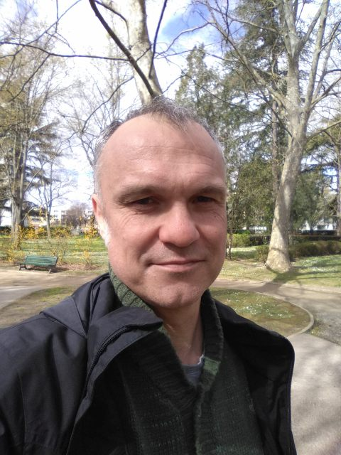

<!--Header-->
<table class="header_table">
    <tr>
        <td class="header_image">
            
        </td>
        <td class="header_paragraph">
            <h1>Scheduling seminar</h1>
            Objective of a virtual seminar on scheduling research and applications is to discuss both the field's newest
            advancements and survey traditional areas. Seminars take place typically on every second Wednesday through
            three different time zones
            (Europe, the Middle East & Africa,
            North America & South America, and
            Asia, Australia & Oceania).
             
            &nbsp;
            

                <!--                
-->
                <!--                    <a href='https://www.youtube.com/channel/UCUoCNnaAfw5NAntItILFn4A' style="margin-right: 5px">-->
                <!--                        -->
                <!--                    </a>-->

                <!--                    <a href='https://list.iid.ciirc.cvut.cz/mailman3/lists/schedulingseminar.rtime.felk.cvut.cz/'-->
                <!--                       style="margin-right: 5px">-->
                <!--                        -->
                <!--                    </a>-->

                <!--                    <a href='https://twitter.com/ZHanzalek' style="margin-right: 5px">-->
                <!--                        -->
                <!--                    </a>-->

                <!--                    <a href='https://www.linkedin.com/groups/9047074/' style="margin-right: 5px">-->
                <!--                        -->
                <!--                    </a>-->
                <!--                
-->
                

                    <!--<a href="https://list.iid.ciirc.cvut.cz/mailman3/lists/schedulingseminar.rtime.felk.cvut.cz/"-->
                    <!--class="button3" style="font-weight: bold">Newsletter</a>-->
                    <a href='#PC_co-chairs' class="button3">PC co-chairs</a>
                    <a href='#Program_committee' class="button3">Program committee</a>
                    <a href='#Calendar' class="button3">Calendar</a>
                    <a href='#Feedback' class="button3">Feedback</a>
                

            

        </td>
    </tr>
</table>

<!--Buttons-->

<!--If any problem should occur-->
<!--<h2>Due to unforeseen technical problems, problem reason... <a-->
<!--        href="https://cesnet.zoom.us/j/98579414742?pwd=enQxM2wveUowQ3BZenB1QURKVStadz09">https://cesnet.zoom.us/j/98579414742?pwd=enQxM2wveUowQ3BZenB1QURKVStadz09</a>-->
<!--</h2>-->

    <a href="https://www.youtube.com/channel/UCUoCNnaAfw5NAntItILFn4A/live">
        <h3 class="external_headings">Join us on Youtube</h3>
    </a>
    

        
    

    <a href="https://list.iid.ciirc.cvut.cz/mailman3/lists/schedulingseminar.rtime.felk.cvut.cz/">
        <h3 class="external_headings">Subscribe to mailing list</h3>
    </a>
    

        
    

<!--
-->
<!--    <h2 id="join_us">Join us online</h2>-->
<!--    
-->
<!--        <a href="https://www.youtube.com/channel/UCUoCNnaAfw5NAntItILFn4A/live" class="button3">Youtube Live Stream</a>-->
<!--        &lt;!&ndash;TODO MB will be used in future&ndash;&gt;-->
<!--        &lt;!&ndash;<a href="zoom_information.html" class="button3">Zoom Conference</a>&ndash;&gt;-->
<!--    
-->
<!--
-->

    <a href='https://www.linkedin.com/groups/9047074/'>
        <h3 class="external_headings">Subscribe to LinkedIn group</h3>
    </a>
    

        
    

    <a href='https://twitter.com/ZHanzalek'>
        <h3 class="external_headings">Follow us on Twitter</h3>
    </a>
    

        
    

<!--------------------------------------------------------------------------------------------------------------------->
<!--Talks-->

    <h2>Upcoming talks</h2>

    <table>
        <tbody>
        <!--Pause-->
        <!--        <i>Currently, new talks are being planned, and the seminar will start again in September 2021. Consider-->
        <!--            subscribing to the mailing list-->
        <!--            <a href='https://list.iid.ciirc.cvut.cz/mailman3/lists/schedulingseminar.rtime.felk.cvut.cz/'-->
        <!--               style="margin-left: 5px; margin-right: 5px">-->
        <!--                -->
        <!--            </a> and Youtube channel <a href='https://www.youtube.com/channel/UCUoCNnaAfw5NAntItILFn4A'-->
        <!--                                        style="margin-left: 5px; margin-right: 5px">-->
        <!--                -->
        <!--            </a> to never miss out on new upcoming seminars.</i>-->

        <!--        &lt;!&ndash;Spacing-&ndash;&gt;-->
        <!--        <table style="margin: 30px 0 0 0 !important;">-->
        <!--            <tr>-->
        <!--                <td colspan="100%"></td>-->
        <!--            </tr>-->
        <!--        </table>-->

        <!--Single talk------------------------------------------------------------------------------------------------>
        <table style="padding-bottom: 12px;" class="america">
            <!--Title/Abstract/PDF-->
            <tr>
                <td colspan="3">
                    <h2 class="talk_title"><b>Tabu search for the time-dependent vehicle routing problem with time
                        windows on a road network</b> </h2>
                    <input type="checkbox" id="abstract_id_14" style="display:none;">
                    <label for="abstract_id_14" class="label_abstract"><a>Abstract</a></label>
                    

                        

                        Travel times inside cities often vary quite a lot during a day and significantly impact the
                        duration of delivery routes. Some authors have proposed time-dependent (TD) variants of several
                        vehicle routing problems (VRPs), including the VRP with time windows (VRPTW). In most papers,
                        time-dependency is defined on customer-based graphs. Thus, a major impact of travel time
                        variations is missed: in an urban environment, not only do travel times change, but also the
                        paths used to travel from one customer to another. To address this issue, we work directly with
                        the road network and consider travel time (or travel speed) variations on each road segment. We
                        present a solution approach, based on tabu search, for a TDVRPTW in which travel speeds are
                        associated with segments in the road network. Computational results on instances with up to 200
                        nodes and 580 arcs are reported and assessed.

                        (Joint work with Maha Gmira, Andrea Lodi, and Jean-Yves Potvin)

                        

                    

                    <!--                    <a href="" class="label_abstract" download>-->
                    <!--                        Download PDF-->
                    <!--                    </a>-->
                    <!--Keywords: routing, time windows, time-dependent travel times, road network, tabu search-->
                </td>
            </tr>

            <!--Data--->
            <tr>
                <td class="presenter_image_container">
                    

                         
                    

                </td>
                <td class="information_upcoming_container">
                    <b>[Presenter]</b> 
                    <a href="https://www.polymtl.ca/expertises/en/gendreau-michel">Michel Gendreau</a> 
                    (Polytech Montréal)  
                    <b>[Invited by]</b> 
                    <a href="https://rtime.ciirc.cvut.cz/~hanzalek/">Zdeněk Hanzálek</a> 
                    (CTU in Prague)
                </td>
                <td class="time_zones_container">
                    <table class="time_table">
                        <tbody>
                        <tr class="utc">
                            <td>UTC</td>
                            <td>Nov 24, 14:00 Wed</td>
                        </tr>
                        <tr class="europe">
                            <td>Prague</td>
                            <td>Nov 24, 15:00 Wed</td>
                        </tr>
                        <tr class="america">
                            <td>New York</td>
                            <td>Nov 24, 09:00 Wed</td>
                        </tr>
                        <tr class="asia">
                            <td>Shanghai</td>
                            <td>Nov 24, 22:00 Wed</td>
                        </tr>
                        </tbody>
                    </table>
                </td>
            </tr>
        </table>

        <!--Spacing-->
        <table style="margin: 0 0 0 0 !important;">
            <tr>
                <td colspan="100%"></td>
            </tr>
        </table>

        <!--Single talk------------------------------------------------------------------------------------------------>
        <table style="padding-bottom: 12px;" class="europe">
            <!--Title/Abstract/PDF-->
            <tr>
                <td colspan="3">
                    <h2 class="talk_title"><b>Three models for scheduling under explorable uncertainty</b> </h2>
                    <input type="checkbox" id="abstract_id_15" style="display:none;">
                    <label for="abstract_id_15" class="label_abstract"><a>Abstract</a></label>
                    

                        

                        We consider a single machine scheduling problem, where every job has a
                        processing time and a priority weight and the objective is to minimize the
                        total weighted sum of completion times.   The novelty is that the job
                        characteristics are initially given in an imprecise manner to the algorithm.
                        Tests can be performed for chosen jobs to learn their precise values,
                        allowing for a better ordering of the jobs in the schedule. These tests
                        however take some time, delaying the subsequent schedule.  The algorithm
                        needs to produce a schedule consisting of executions of all jobs and tests of
                        some jobs.  We will present three different models that have been studied in
                        this context, as well as the results obtained for each of them.

                        The talk covers papers authored by Levi, Magnanti and Shaposhnik, by C.D.,
                        Thomas Erlebach, Nicole Megow, Julie Meißner, and by Fanny Dufossé, C.D.,
                        Noël Nadal, Denis Trystram and Óscar C. Vásquez.

                        

                    

                    <a href="./presentations/SchedulingSeminar_Michel%20Gendreau.pdf" class="label_abstract" download>
                        Download PDF
                    </a>
                    <!--Keywords: TODO-->
                </td>
            </tr>

            <!--Data--->
            <tr>
                <td class="presenter_image_container">
                    

                         
                    

                </td>
                <td class="information_upcoming_container">
                    <b>[Presenter]</b> 
                    <a href="http://www.lip6.fr/Christoph.Durr">Christoph Dürr</a> 
                    (Sorbonne Uni)  
                    <b>[Invited by]</b> 
                    <a href="https://rtime.ciirc.cvut.cz/~hanzalek/">Zdeněk Hanzálek</a> 
                    (CTU in Prague)
                </td>
                <td class="time_zones_container">
                    <table class="time_table">
                        <tbody>
                        <tr class="utc">
                            <td>UTC</td>
                            <td>Dec 8, 14:00 Wed</td>
                        </tr>
                        <tr class="europe">
                            <td>Prague</td>
                            <td>Dec 8, 15:00 Wed</td>
                        </tr>
                        <tr class="america">
                            <td>New York</td>
                            <td>Dec 8, 09:00 Wed</td>
                        </tr>
                        <tr class="asia">
                            <td>Shanghai</td>
                            <td>Dec 8, 22:00 Wed</td>
                        </tr>
                        </tbody>
                    </table>
                </td>
            </tr>
        </table>

        <!--Spacing-->
        <table style="margin: 0 0 0 0 !important;">
            <tr>
                <td colspan="100%"></td>
            </tr>
        </table>

        <!--Single talk------------------------------------------------------------------------------------------------>
        <table style="padding-bottom: 12px;" class="europe">
            <!--Title/Abstract/PDF-->
            <tr>
                <td colspan="3">
                    <h2 class="talk_title"><b>State-of-the-art flowshop scheduling heuristics: Dos and Don'ts</b> </h2>
                    <input type="checkbox" id="abstract_id_16" style="display:none;">
                    <label for="abstract_id_16" class="label_abstract"><a>Abstract</a></label>
                    

                        

                        Many scheduling problems are simply too hard to be solved exactly, especially for instances of
                        medium or large size or when realistic constraints are present. As a result, the literature on
                        heuristics and metaheuristics for scheduling is extensive. More often than not, metaheuristics
                        are capable of generating solutions close to optimality or to tight lower bounds for instances
                        of realistic size in a matter of minutes. Metaheuristics have been refined over the years and
                        there are literally hundreds of papers published every year with applications to most domains in
                        many different journals. Most regrettably, some of these methods are complex in the sense that
                        they have many parameters that affect performance and hence need careful calibration.
                        Furthermore, many times published results are hard to reproduce due to specific speed-ups being
                        used or complicated software constructs. These complex methods are difficult to transfer to
                        industries in the case of scheduling problems. Another important concern is the recently
                        recognized “tsunami” of novel metaheuristics that mimic the most bizarre natural or human
                        processes, as for example intelligent water drops, harmony search, firefly algorithms and the
                        like. See K. Sörensen “Metaheuristics—The Metaphor exposed” (2015), ITOR 22(1):3-18.

                        In this presentation, we briefly review different flowshop problems and variants. From the basic
                        flowshop problem with makespan minimization to other objectives like flowtime minimization,
                        flowshops with sequence-dependent setup times, no-idle flowshops, all the way up to complex
                        hybrid flexible flowline problems. We will show how simple Iterated Greedy (IG) algorithms often
                        outperform much more complex approaches. IG methods are inherently simple with very few
                        parameters. They are easy to code and results are easy to reproduce. We will show that for all
                        tested problems so far they show state-of-the-art performance despite their simplicity. As a
                        result, we will defend the choice of simpler, yet good performing approaches over complicated
                        metaphor-based algorithms.

                        

                    

                    <!--                    <a href="" class="label_abstract" download>-->
                    <!--                        Download PDF-->
                    <!--                    </a>-->
                    <!--Keywords: scheduling, flowshop, heuristics, metaheuristics, iterated greedy-->
                </td>
            </tr>

            <!--Data--->
            <tr>
                <td class="presenter_image_container">
                    

                         
                    

                </td>
                <td class="information_upcoming_container">
                    <b>[Presenter]</b> 
                    <a href="http://soa.iti.es/rruiz">Rubén Ruiz</a> 
                    (UP de València)  
                    <b>[Invited by]</b> 
                    <a href="https://www.kuleuven.be/wieiswie/nl/person/00053376">G. Vanden Berghe</a> 
                    (KU Leuven)
                </td>
                <td class="time_zones_container">
                    <table class="time_table">
                        <tbody>
                        <tr class="utc">
                            <td>UTC</td>
                            <td>Dec 22, 14:00 Wed</td>
                        </tr>
                        <tr class="europe">
                            <td>Prague</td>
                            <td>Dec 22, 15:00 Wed</td>
                        </tr>
                        <tr class="america">
                            <td>New York</td>
                            <td>Dec 22, 09:00 Wed</td>
                        </tr>
                        <tr class="asia">
                            <td>Shanghai</td>
                            <td>Dec 22, 22:00 Wed</td>
                        </tr>
                        </tbody>
                    </table>
                </td>
            </tr>
        </table>

        <!--Dual talk-------------------------------------------------------------------------------------------------->
        <!--        <table style="padding-bottom: 12px;" class="europe">-->
        <!--            &lt;!&ndash;Title/Abstract-&ndash;&gt;-->
        <!--            <tr class="europe">-->
        <!--                <td colspan="3">-->
        <!--                    <h2 class="talk_title"><b>Elements of Scheduling</b> </h2>-->
        <!--                    <input type="checkbox" id="abstract_id_1" style="display:none;">-->
        <!--                    <label for="abstract_id_1" class="label_abstract"><a>Abstract</a></label>-->
        <!--                    
-->
        <!--                        
-->
        <!--                        During the 1970’s, the area of scheduling developed from a hodge-podge of isolated results into-->
        <!--                        a unified theory. Over the past decades, it has grown to a mature and lively area, which is a-->
        <!--                        meeting point of operations research, mathematics and computer science, and at the same time a-->
        <!--                        sound basis for the allocation of scarce resources to activities over time in many practical-->
        <!--                        situations. We will sketch the early development of scheduling theory, and also discuss the-->
        <!--                        integration of ideas from online analysis, stochastic models, and machine learning in response-->
        <!--                        to the needs of a changing society.-->
        <!--                        
-->
        <!--                    
-->
        <!--                </td>-->
        <!--            </tr>-->

        <!--            &lt;!&ndash;Data-&ndash;&gt;-->
        <!--            <tr>-->
        <!--                <td class="presenter_image_container">-->
        <!--                    
-->
        <!--                        <a href="https://www.cwi.nl/people/jan-karel-lenstra">-->
        <!--                            -->
        <!--                        </a> -->
        <!--                    
-->
        <!--                    
-->
        <!--                        <a href="https://people.orie.cornell.edu/shmoys/">-->
        <!--                            -->
        <!--                        </a> -->
        <!--                    
-->
        <!--                </td>-->
        <!--                <td class="information_upcoming_container">-->
        <!--                    <b>[Presenters] </b>  -->
        <!--                    <a href="https://www.cwi.nl/people/jan-karel-lenstra">Jan Karel Lenstra</a> -->
        <!--                    (CWI) -->
        <!--                    <a href="https://people.orie.cornell.edu/shmoys/">David Shmoys</a>  -->
        <!--                    (Cornell University)  -->
        <!--                    &lt;!&ndash;                    <b>[Panelists]</b>  &ndash;&gt;-->
        <!--                    &lt;!&ndash;<a href="">Name Surname</a> (Affiliation) &ndash;&gt;-->
        <!--                    &lt;!&ndash;                    <a href="">Name Surname</a> (Affiliation)  &ndash;&gt;-->
        <!--                    <b>[Invited by]</b>  -->
        <!--                    <a href="https://www.stern.nyu.edu/faculty/bio/michael-pinedo">Michael Pinedo</a> -->
        <!--                    (New York University)-->
        <!--                </td>-->
        <!--                <td class="time_zones_container">-->
        <!--                    <table class="time_table">-->
        <!--                        <tbody>-->
        <!--                        <tr class="utc">-->
        <!--                            <td>UTC</td>-->
        <!--                            <td>Mar 31, 13:00 Wed</td>-->
        <!--                        </tr>-->
        <!--                        <tr class="europe">-->
        <!--                            <td>Prague</td>-->
        <!--                            <td>Mar 31, 15:00 Wed</td>-->
        <!--                        </tr>-->
        <!--                        <tr class="america">-->
        <!--                            <td>New York</td>-->
        <!--                            <td>Mar 31, 09:00 Wed</td>-->
        <!--                        </tr>-->
        <!--                        <tr class="asia">-->
        <!--                            <td>Shanghai</td>-->
        <!--                            <td>Mar 31, 21:00 Wed</td>-->
        <!--                        </tr>-->
        <!--                        </tbody>-->
        <!--                    </table>-->
        <!--                </td>-->
        <!--            </tr>-->
        <!--        </table>-->

        </tbody>
    </table>

<!--Separate upcoming and past talks if different resolution results in one column only-->

    &nbsp;
    

<!--Past talks-->

    <h2>Past talks (13)</h2>
    <table class="past_talk_table">
        <tbody>

        <!--Single talk------------------------------------------------------------------------------------------------>
        <table style="padding-bottom: 12px;" class="europe">
            <!--Title/Abstract/PDF-->
            <tr>
                <td colspan="3">
                    <h2 class="talk_title"><b>Train Scheduling: Models, decomposition methods and practice</b> </h2>
                    <input type="checkbox" id="abstract_id_13" style="display:none;">
                    <label for="abstract_id_13" class="label_abstract"><a>Abstract</a></label>
                    

                        

                        Train scheduling is one of the most critical planning tasks required to run a railway, with most
                        rail operators and managers having large departments devoted to this task.
                        Depending on the time scale, we have two main scheduling problems. At the strategic and tactical
                        levels, the train timetabling problem consists in finding feasible, robust schedules that are
                        usable for months or years into the future. At the operational level, we have the train
                        re-scheduling problem, where one wants to schedule trains in real-time in order to tackle
                        deviations from the original timetable, minimizing delays and knock-on effects.
                        Both problems share a common core-model, which is a job-shop scheduling model with no-wait and
                        blocking constraints. The core problem can be modeled as a disjunctive program.
                        After an illustration of the train scheduling application, I will present a basic MILP
                        formulation for the disjunctive program. It turns out, however, that even small to medium size
                        real-life instances cannot be solved by simply instantiating this formulation and invoking a
                        state-of-the-art MILP solver. Next, therefore, I will go through two recent reformulations,
                        which allow us to significantly increase the size of tractable instances. The first is obtained
                        from the classical Benders' reformulation by strengthening its standard constraints. The second
                        is often referred to as "Logic Benders' Reformulation" and exploits a natural, spatial
                        decomposition of the railway network. I will finally show the strong link between these
                        reformulations.
                        I will conclude the talk by presenting a practical application of the described approaches to a
                        traffic management system controlling trains in the greater Oslo region network. The system is
                        currently undergoing a field-test campaign at Oslo control center.

                        

                    

                    <a href="./presentations/SchedulingSeminar_CarloMannino.pdf" class="label_abstract" download>
                        Download PDF
                    </a>
                    <!--Keywords: train scheduling, job-shop scheduling, combinatorial optimization, integer programming, decomposition methods-->
                </td>
            </tr>

            <!--Photo and video-->
            <tr>
                <td class="presenter_image_container">
                    

                         
                    

                </td>

                <td colspan="2">
                    

                        <iframe width="400" height="250" src="https://www.youtube.com/embed/5UUYdg0l-v0"
                                allow="accelerometer; autoplay; clipboard-write; encrypted-media; gyroscope; picture-in-picture"
                                allowfullscreen></iframe>
                    

                </td>
            </tr>

            <!--Text description-->
            <tr>
                <td class="presenter_past_info_container"></td>
                <td>
                    <table class="panelists_past_container_single">
                        <tr>
                            <td colspan="2"><b>[Presenter]</b>  </td>
                            <td><b>[Invited by]</b>  </td>
                        </tr>
                        <tr>
                            <td>
                                <a href="https://www.mn.uio.no/math/english/people/aca/carloman/">Carlo Mannino</a> 
                                (SINTEF & Oslo Uni.) 
                            </td>
                            <td></td>
                            <td>
                                <a href="https://www3.diism.unisi.it/~agnetis/">Alessandro Agnetis</a> 
                                (University of Siena)
                            </td>
                        </tr>
                    </table>
                </td>
            </tr>
        </table>

        <!--Spacing--->
        <table style="margin: 0 0 0 0 !important;">
            <tr>
                <td colspan="100%"></td>
            </tr>
        </table>

        <!--Single talk------------------------------------------------------------------------------------------------>
        <table style="padding-bottom: 12px;" class="america">
            <!--Title/Abstract/PDF-->
            <tr>
                <td colspan="3">
                    <h2 class="talk_title"><b>Machine Learning for Scheduling</b>&nbsp;&nbsp;&nbsp;&nbsp;&nbsp;&nbsp;&nbsp;&nbsp;&nbsp;&nbsp;&nbsp;&nbsp;&nbsp;&nbsp;&nbsp;&nbsp;&nbsp;&nbsp;&nbsp;&nbsp;&nbsp;&nbsp;&nbsp;&nbsp;&nbsp;&nbsp;&nbsp;&nbsp;&nbsp;&nbsp;&nbsp;&nbsp;&nbsp;&nbsp;&nbsp;&nbsp;&nbsp;&nbsp; 
                    </h2>
                    <input type="checkbox" id="abstract_id_12" style="display:none;">
                    <label for="abstract_id_12" class="label_abstract"><a>Abstract</a></label>
                    

                        

                        This talk will discuss a model for augmenting algorithms with useful
                        predictions that go beyond worst-case bounds on the algorithm
                        performance. The model ensures predictions are formally learnable and
                        instance robust. Learnability guarantees that predictions can be
                        efficiently constructed from past data. Instance robustness formally
                        ensures a prediction is robust to modest changes in the problem input.
                        This talk will discuss predictions that satisfy these properties for
                        scheduling and resource augmentation. Algorithms developed break
                        through worst-case barriers with accurate predictions and have a
                        graceful degradation in performance when the error in the predictions
                        grows.
                        

                    

                    <a href="./presentations/SchedulingSeminar_BenjaminMoseley.pdf" class="label_abstract" download>
                        Download PDF
                    </a>
                    <!--Keywords: scheduling, learning augmented, optimization, sample complexity, robustness, error, competitive, approximation-->
                </td>
            </tr>

            <!--Photo and video-->
            <tr>
                <td class="presenter_image_container">
                    

                         
                    

                </td>

                <td colspan="2">
                    

                        <iframe width="400" height="250" src="https://www.youtube.com/embed/TQ2sF0BMTHo"
                                allow="accelerometer; autoplay; clipboard-write; encrypted-media; gyroscope; picture-in-picture"
                                allowfullscreen></iframe>
                    

                </td>
            </tr>

            <!--Text description-->
            <tr>
                <td class="presenter_past_info_container"></td>
                <td>
                    <table class="panelists_past_container_single">
                        <tr>
                            <td colspan="2"><b>[Presenter]</b>  </td>
                            <td><b>[Invited by]</b>  </td>
                        </tr>
                        <tr>
                            <td>
                                <a href="http://www.andrew.cmu.edu/user/moseleyb/  ">Benjamin
                                    Moseley</a> 
                                (Carnegie Mellon) 
                            </td>
                            <td></td>
                            <td>
                                <a href="https://www.ieor.columbia.edu/faculty/clifford-stein">Clifford Stein</a>  
                                (Columbia Uni)
                            </td>
                        </tr>
                    </table>
                </td>
            </tr>
        </table>

        <!--Spacing--->
        <table style="margin: 0 0 0 0 !important;">
            <tr>
                <td colspan="100%"></td>
            </tr>
        </table>

        <!--Single talk------------------------------------------------------------------------------------------------>
        <table style="padding-bottom: 12px;" class="europe">
            <!--Title/Abstract/PDF-->
            <tr>
                <td colspan="3">
                    <h2 class="talk_title"><b>The Longest Processing Time Rule for Identical Parallel Machines
                        Revisited</b> </h2>
                    <input type="checkbox" id="abstract_id_11" style="display:none;">
                    <label for="abstract_id_11" class="label_abstract"><a>Abstract</a></label>
                    

                        

                        We consider the P||Cmax scheduling problem where the goal is to schedule n jobs on m identical
                        parallel machines to minimize makespan. We revisit the famous Longest Processing Time (LPT) rule
                        proposed by Graham in 1969. LPT requires sorting jobs in non-ascending order of processing times
                        and then assigning one job at a time to the machine whose load is smallest so far. We provide
                        new insights into LPT and discuss the approximation ratio of a modification of LPT that improves
                        Graham’s bound. We use linear programming to analyze the approximation ratio of our approach.
                        This performance analysis can be seen as a valid alternative to formal proofs based on
                        analytical derivation. Also, we derive from the proposed approach an O(n log n) time complexity
                        heuristic called SLACK.
                        The heuristic splits the sorted job set in tuples of m consecutive jobs (1,...,m; m+1,...,2m;
                        etc.) and sorts the tuples in non-increasing order of the difference (SLACK) between the largest
                        and smallest job in the tuple. Given this new ordering of the job set, list scheduling is
                        applied. This approach strongly outperforms LPT on benchmark literature instances and is
                        competitive with more involved approaches such as COMBINE and LDM.
                        

                    

                    <a href="./presentations/SchedulingSeminar_FedericoDellaCroce.pdf" class="label_abstract" download>
                        Download PDF
                    </a>
                    <!--Keywords: identical parallel machine scheduling; LPT rule; linear programming;  approximation-->
                </td>
            </tr>

            <!--Photo and video-->
            <tr>
                <td class="presenter_image_container">
                    

                         
                    

                </td>

                <td colspan="2">
                    

                        <iframe width="400" height="250" src="https://www.youtube.com/embed/Lp4K6rptmfY"
                                allow="accelerometer; autoplay; clipboard-write; encrypted-media; gyroscope; picture-in-picture"
                                allowfullscreen></iframe>
                    

                </td>
            </tr>

            <!--Text description-->
            <tr>
                <td class="presenter_past_info_container"></td>
                <td>
                    <table class="panelists_past_container_single">
                        <tr>
                            <td colspan="2"><b>[Presenter]</b>  </td>
                            <td><b>[Invited by]</b>  </td>
                        </tr>
                        <tr>
                            <td>
                                <a href="https://www.digep.polito.it/en/personale/scheda/(nominativo)/federico.dellacroce">Federico
                                    Della Croce</a> 
                                (DIGEP - Polito.it) 
                            </td>
                            <td></td>
                            <td>
                                <a href="https://www.univ-tours.fr/annuaire/m-vincent-tkindt">Vincent T’kindt</a> 
                                (Uni de Tours)
                            </td>
                        </tr>
                    </table>
                </td>
            </tr>
        </table>

        <!--Spacing--->
        <table style="margin: 0 0 0 0 !important;">
            <tr>
                <td colspan="100%"></td>
            </tr>
        </table>

        <!--Single talk------------------------------------------------------------------------------------------------>
        <table style="padding-bottom: 12px;" class="europe">
            <!--Title/Abstract-->
            <tr>
                <td colspan="3">
                    <h2 class="talk_title"><b>The Benefit of Preemption&nbsp;&nbsp;&nbsp;&nbsp;&nbsp;&nbsp;&nbsp;&nbsp;&nbsp;&nbsp;&nbsp;&nbsp;&nbsp;&nbsp;&nbsp;&nbsp;&nbsp;&nbsp;&nbsp;&nbsp;&nbsp;&nbsp;&nbsp;&nbsp;&nbsp;&nbsp;&nbsp;&nbsp;&nbsp;&nbsp;&nbsp;&nbsp;&nbsp;&nbsp;&nbsp;&nbsp;&nbsp;&nbsp;&nbsp;&nbsp;&nbsp;&nbsp;&nbsp;&nbsp;&nbsp;&nbsp;&nbsp;&nbsp;&nbsp;&nbsp;&nbsp;&nbsp;</b> 
                    </h2>
                    <input type="checkbox" id="abstract_id_10" style="display:none;">
                    <label for="abstract_id_10" class="label_abstract"><a>Abstract</a></label>
                    

                        

                        Given an input of a scheduling problem, any non-preemptive solution for it can be used as a
                        preemptive solution. Thus, the optimal cost of a preemptive solution is not larger than that of
                        an optimal non-preemptive solution. As preemption comes at a cost in real-life applications, it
                        is of interest to find the worst-case ratio between the two costs. For a given problem, the
                        supremum ratio over all possible inputs of the ratio between the two costs (of an optimal
                        solution without preemption and an optimal solution that possibly uses preemption) is called the
                        power or benefit of preemption. While many scheduling variants can be studied with respect to
                        this measure, we will focus on the cases of a single machine, parallel identical machines, and
                        uniformly related machines, and we will discuss the objectives of makespan and total (weighted)
                        completion time. We will exhibit how one can benefit from preemption, and we will analyze the
                        resulting worst case ratios for several basic models.
                        

                    

                    <a href="./presentations/SchedulingSeminar_LeahEpstein.pdf" class="label_abstract" download>
                        Download PDF
                    </a>
                    <!--Keywords: preemptive scheduling, uniformly related machines, total completion time, makespan-->
                </td>
            </tr>

            <!--Photo and video-->
            <tr>
                <td class="presenter_image_container">
                    

                         
                    

                </td>

                <td colspan="2">
                    

                        <iframe width="400" height="250" src="https://www.youtube.com/embed/Ik7106Ul9Uw"
                                allow="accelerometer; autoplay; clipboard-write; encrypted-media; gyroscope; picture-in-picture"
                                allowfullscreen></iframe>
                    

                </td>
            </tr>

            <!--Text description-->
            <tr>
                <td class="presenter_past_info_container"></td>
                <td>
                    <table class="panelists_past_container_single">
                        <tr>
                            <td colspan="2"><b>[Presenter]</b>  </td>
                            <td><b>[Invited by]</b>  </td>
                        </tr>
                        <tr>
                            <td>
                                <a href="http://math.haifa.ac.il/lea/">Leah Epstein</a> 
                                (University of Haifa) 
                            </td>
                            <td></td>
                            <td>
                                <a href="https://in.bgu.ac.il/en/engn/iem/pages/staff/Dvir-Shabtay.aspx">Dvir
                                    Shabtay</a>  
                                (Ben Gurion Uni)
                            </td>
                        </tr>
                    </table>
                </td>
            </tr>
        </table>

        <!--Spacing--->
        <table style="margin: 0 0 0 0 !important;">
            <tr>
                <td colspan="100%"></td>
            </tr>
        </table>

        <!--Single talk------------------------------------------------------------------------------------------------>
        <table style="padding-bottom: 12px;" class="america">
            <!--Title/Abstract-->
            <tr>
                <td colspan="3">
                    <!--REMOVE nbsp hackaround-->
                    <h2 class="talk_title"><b>Dynamic Opponent Choice in Tournaments&nbsp;&nbsp;&nbsp;&nbsp;&nbsp;&nbsp;&nbsp;&nbsp;&nbsp;&nbsp;&nbsp;&nbsp;&nbsp;&nbsp;&nbsp;&nbsp;&nbsp;&nbsp;&nbsp;&nbsp;</b> 
                    </h2>
                    <input type="checkbox" id="abstract_id_9" style="display:none;">
                    <label for="abstract_id_9" class="label_abstract"><a>Abstract</a></label>
                    

                        

                        We propose an alternative design for tournaments that use a preliminary stage, followed by
                        several rounds of single elimination play. Most U.S. major sports, for example, are organized in
                        this way. However, the conventional "bracket" design of these tournaments suffers from several
                        deficiencies. First, top ranked players randomly incur unfortunate matchups against other
                        players, which introduces an unnecessary element of luck. Second, as documented in the
                        tournament design literature, various reasonable criteria such as stronger ranked players having
                        a higher probability of winning, are not satisfied. Third, the probability that the top two
                        players meet is not maximized. Fourth, there is the widely observed issue of shirking at the
                        preliminary stage, where a player loses deliberately to obtain an easier path through the
                        tournament. Finally, the use of a conventional fixed bracket fails to allow players to consider
                        information that develops during the tournament, such as injuries to other players. To address
                        all these issues, we allow higher ranked players at the single elimination stage to choose their
                        next opponent at each round. We allow each player's ranking either to remain static, or to
                        improve from beating a higher ranked player. Using data from 1,902 men's professional tennis
                        tournaments from 2001-2016, we demonstrate the reasonableness of the results obtained. We also
                        perform sensitivity analysis for the effect of increasing irregularity in the pairwise win
                        probability matrix on three traditional performance measures. Finally, we show that our opponent
                        choice design reduces shirking, and could have eliminated it in some notorious situations. In
                        summary, compared with the conventional design, the opponent choice design provides higher
                        probabilities that the best player wins and also that the two best players meet, reduces
                        shirking, and performs well for preservation of ranking.
                        

                    

                    <a href="presentations/SchedulingSeminar_NicholasHall.pdf" class="label_abstract" download>
                        Download PDF
                    </a>
                    <!--Keywords: multiple round sports tournament, choice of opponent, performance criteria, professional tennis-->
                </td>
            </tr>

            <!--Photo and video-->
            <tr>
                <td class="presenter_image_container">
                    

                         
                    

                </td>

                <td colspan="2">
                    

                        <iframe width="400" height="250" src="https://www.youtube.com/embed/h_wXHo83in0"
                                allow="accelerometer; autoplay; clipboard-write; encrypted-media; gyroscope; picture-in-picture"
                                allowfullscreen></iframe>
                    

                </td>
            </tr>

            <!--Text description-->
            <tr>
                <td class="presenter_past_info_container"></td>
                <td>
                    <table class="panelists_past_container_single">
                        <tr>
                            <td colspan="2"><b>[Presenter]</b>  </td>
                            <td><b>[Invited by]</b>  </td>
                        </tr>
                        <tr>
                            <td>
                                <a href="">Nicholas G. Hall</a> 
                                (The Ohio State Uni) 
                            </td>
                            <td></td>
                            <td>
                                <a href="https://www.or-as.be">Mario Vanhoucke</a>  
                                (Ghent University)
                            </td>
                        </tr>
                    </table>
                </td>
            </tr>
        </table>

        <!--Spacing--->
        <table style="margin: 0 0 0 0 !important;">
            <tr>
                <td colspan="100%"></td>
            </tr>
        </table>

        <!--Single talk------------------------------------------------------------------------------------------------>
        <table style="padding-bottom: 12px;" class="europe">
            <!--Title/Abstract-->
            <tr>
                <td colspan="3">
                    <h2 class="talk_title"><b>Educational Timetabling: Problems, Benchmarks, Algorithms, and Practical
                        Issues</b> </h2>
                    <input type="checkbox" id="abstract_id_8" style="display:none;">
                    <label for="abstract_id_8" class="label_abstract"><a>Abstract</a></label>
                    

                        

                        Educational timetabling problems consist in scheduling a
                        sequence of events (lectures, seminars, or exams) involving teachers and
                        students in a prefixed period of time, satisfying a set of constraints
                        of various types. In this talk, we critically review different
                        formulations, public datasets, and search methods. In particular, we
                        illustrate local search methods, their parameter tuning procedure, and
                        their results. Finally, we discuss practical issues involved in the
                        actual solution of timetabling problems.
                        

                    

                    <a href="presentations/SchedulingSeminar_AndreaSchaerf.pdf" class="label_abstract" download>
                        Download PDF
                    </a>
                    <!--Keywords: Timetabling, Scheduling, Optimization, Metaheuristics, Local Search-->
                </td>
            </tr>

            <!--Photo and video-->
            <tr>
                <td class="presenter_image_container">
                    

                         
                    

                </td>

                <td colspan="2">
                    

                        <iframe width="400" height="250" src="https://www.youtube.com/embed/GLZ_X1i51Vk"
                                allow="accelerometer; autoplay; clipboard-write; encrypted-media; gyroscope; picture-in-picture"
                                allowfullscreen></iframe>
                    

                </td>
            </tr>

            <!--Text description-->
            <tr>
                <td class="presenter_past_info_container"></td>
                <td>
                    <table class="panelists_past_container_single">
                        <tr>
                            <td colspan="2"><b>[Presenter]</b>  </td>
                            <td><b>[Invited by]</b>  </td>
                        </tr>
                        <tr>
                            <td>
                                <a href="http://www.dpia.uniud.it/schaerf/">Andrea Schaerf</a> 
                                (Uni of Udine) 
                            </td>
                            <td></td>
                            <td>
                                <a href="https://rtime.ciirc.cvut.cz/~hanzalek/">Zdeněk Hanzálek</a>  
                                (CTU in Prague)
                            </td>
                        </tr>
                    </table>
                </td>
            </tr>
        </table>

        <!--Spacing--->
        <table style="margin: 0 0 0 0 !important;">
            <tr>
                <td colspan="100%"></td>
            </tr>
        </table>

        <!--Single talk------------------------------------------------------------------------------------------------>
        <table style="padding-bottom: 12px;" class="america">
            <!--Title/Abstract-->
            <tr>
                <td colspan="3">
                    <!--REMOVE NBSP HACKAROUND-->
                    <h2 class="talk_title"><b>Challenges in Healthcare Scheduling Applications&nbsp;&nbsp;&nbsp;&nbsp;&nbsp;&nbsp;&nbsp;&nbsp;</b> 
                    </h2>
                    <input type="checkbox" id="abstract_id_7" style="display:none;">
                    <label for="abstract_id_7" class="label_abstract"><a>Abstract</a></label>
                    

                        

                        In the immortal words of Monty Python, “… and now for something completely different!”
                        Over the past three decades, I have spent much of my time working on practical healthcare
                        applications.
                        Typically, the projects are done with healthcare collaborators. Virtually all of the scheduling
                        problems are
                        highly stochastic, and scheduling approaches focus on managing variability. In this talk, I will
                        describe
                        several healthcare applications including: diagnostic imaging, cancer treatment (chemotherapy
                        and radiation),
                        nurse/physician scheduling, surgical scheduling, 911 call centres, home care routing, medical
                        resident
                        scheduling and primary care appointments (e.g. advanced access). In each case, I will describe
                        the underlying
                        uncertainties and briefly review recent approaches.
                        

                    

                    <a href="./presentations/SchedulingSeminar_MichaelCarter.pdf" class="label_abstract" download>
                        Download PDF
                    </a>
                    <!--Keywords: healthcare scheduling applications, diagnostic imaging, cancer treatment (chemotherapy and-->
                    <!--radiation),-->
                    <!--nurse/physician scheduling, surgical scheduling, 911 call centres, home-->
                    <!--care routing, medical resident scheduling and primary care appointments-->
                </td>
            </tr>

            <!--Photo and video-->
            <tr>
                <td class="presenter_image_container">
                    

                         
                    

                </td>

                <td colspan="2">
                    

                        <iframe width="400" height="250" src="https://www.youtube.com/embed/QtjRK465S28"
                                allow="accelerometer; autoplay; clipboard-write; encrypted-media; gyroscope; picture-in-picture"
                                allowfullscreen></iframe>
                    

                </td>
            </tr>

            <!--Text description-->
            <tr>
                <td class="presenter_past_info_container"></td>
                <td>
                    <table class="panelists_past_container_single">
                        <tr>
                            <td colspan="2"><b>[Presenter]</b>  </td>
                            <td><b>[Invited by]</b>  </td>
                        </tr>
                        <tr>
                            <td>
                                <a href="https://che.utoronto.ca/professor-michael-w-carter/">Michael Carter</a> 
                                (Uni of Toronto) 
                            </td>
                            <td></td>
                            <td>
                                <a href="https://www.stern.nyu.edu/faculty/bio/michael-pinedo">Michael Pinedo</a>  
                                (New York University)
                            </td>
                        </tr>
                    </table>
                </td>
            </tr>
        </table>

        <!--Spacing--->
        <table style="margin: 0 0 0 0 !important;">
            <tr>
                <td colspan="100%"></td>
            </tr>
        </table>

        <!--Single talk------------------------------------------------------------------------------------------------>
        <table style="padding-bottom: 12px;" class="asia">
            <!--Title/Abstract-->
            <tr>
                <td colspan="3">
                    <h2 class="talk_title"><b>Updated complexity results in single-machine primary-secondary sched.
                        for min. two regular criteria</b> </h2>
                    <input type="checkbox" id="abstract_id_6" style="display:none;">
                    <label for="abstract_id_6" class="label_abstract"><a>Abstract</a></label>
                    

                        

                        In the primary-secondary scheduling problem, we have a primary scheduling criterion and a
                        secondary scheduling criterion. The goal of the problem is to find a schedule which minimizes
                        the second criterion, subject to the restriction that the primary criterion is minimized. Lee
                        and Vairaktarakis [LV1993] presented a comprehensive review for the computational complexity of
                        the single-machine primary-secondary scheduling problems, where all the jobs are released at
                        time zero. When both of the two criteria are regular, more than twenty problems were posed as
                        open in [LV1993]. This talk will report the research progress of these open problems.
                        

                    

                    <!--Keywords: Single-machine scheduling; Promary-secondary criteria; Computational complexity.-->

                    <input type="checkbox" id="bio_id_7" style="display:none;">
                    <label for="bio_id_7" class="label_abstract"><a>Biography</a></label>
                    

                        

                        Jinjiang Yuan (J.J. Yuan) is a Professor in the School of Mathematics and Statistics, Zhengzhou
                        University, Zhengzhou, Henan, The People's Republic of China. He received his doctorate in
                        science from Sichuan University in 1995. His principal research interests include Scheduling,
                        Graph Theory, and Combinatorial Optimization. He has published more than 200 papers in
                        Mathematical Programming, European Journal of Operational Research, Journal of Scheduling,
                        Journal of Graph Theory, Operations Research Letters, and other journals. He has presided over 8
                        projects of National Natural Science Foundation of China.
                        

                    

                    <a href="./presentations/SchedulingSeminar_JinjiangYuan.pdf" class="label_abstract" download>
                        Download PDF
                    </a>
                </td>
            </tr>

            <!--Photo and video-->
            <tr>
                <td class="presenter_image_container">
                    

                         
                    

                </td>

                <td colspan="2">
                    

                        <iframe width="400" height="250" src="https://www.youtube.com/embed/H3WGVooUmqA"
                                allow="accelerometer; autoplay; clipboard-write; encrypted-media; gyroscope; picture-in-picture"
                                allowfullscreen></iframe>
                    

                </td>
            </tr>

            <!--Text description-->
            <tr>
                <td class="presenter_past_info_container"></td>
                <td>
                    <table class="panelists_past_container_single">
                        <tr>
                            <td colspan="2"><b>[Presenter]</b>  </td>
                            <td><b>[Invited by]</b>  </td>
                        </tr>
                        <tr>
                            <td>
                                <a href="https://www.researchgate.net/profile/Jinjiang-Yuan">Jinjiang Yuan</a> 
                                (Zhengzhou Univ.) 
                            </td>
                            <td></td>
                            <td>
                                <a href="http://www.acem.sjtu.edu.cn/en/faculty/wanguohua.html">Guohua Wan</a> 
                                (Shanghai Jiao Tong)
                            </td>
                        </tr>
                    </table>
                </td>
            </tr>
        </table>

        <!--Spacing--->
        <table style="margin: 0 0 0 0 !important;">
            <tr>
                <td colspan="100%"></td>
            </tr>
        </table>

        <!--Single talk------------------------------------------------------------------------------------------------>
        <table style="padding-bottom: 12px;" class="europe">
            <!--Title/Abstract-->
            <tr>
                <td colspan="3">
                    <h2 class="talk_title"><b>On the State of the Art in Proactive/Reactive Project Scheduling
                    </b> </h2>
                    <input type="checkbox" id="abstract_id_5" style="display:none;">
                    <label for="abstract_id_5" class="label_abstract"><a>Abstract</a></label>
                    

                        

                        The majority of publications in the extensive literature on resource-constrained project
                        scheduling focus on a static deterministic setting for which a so-called baseline schedule is
                        computed prior to project execution. In the real world, however, a project may be subject to
                        considerable uncertainty. During the actual execution of a project, the baseline schedule may
                        indeed suffer from disruptive events, causing the actually realized activity start times to
                        deviate from the predicted baseline start times. This presentation focuses on robust project
                        scheduling, in particular the development of effective and efficient proactive and reactive
                        scheduling procedures. Proactive scheduling aims at generating robust baseline schedules that
                        carry sufficient protection against possible schedule disruptions that may occur during project
                        execution. Reactive scheduling procedures aim at repairing the baseline schedule when the
                        built-in protection fails during the execution of the project. We discuss the fundamentals of
                        state of the art proactive/reactive project scheduling approaches and discuss key directions for
                        future research.
                        

                    

                    <a href="./presentations/SchedulingSeminar_ErikDemeulemeester.pdf" class="label_abstract" download>
                        Download PDF
                    </a>

                </td>
            </tr>

            <!--Photo and video-->
            <tr>
                <td class="presenter_image_container">
                    

                         
                    

                </td>

                <td colspan="2">
                    

                        <iframe width="400" height="250" src="https://www.youtube.com/embed/yUfvCgNTe08"
                                allow="accelerometer; autoplay; clipboard-write; encrypted-media; gyroscope; picture-in-picture"
                                allowfullscreen></iframe>
                    

                </td>
            </tr>

            <!--Text description-->
            <tr>
                <td class="presenter_past_info_container"></td>
                <td>
                    <table class="panelists_past_container_single">
                        <tr>
                            <td colspan="2"><b>[Presenter]</b>  </td>
                            <td><b>[Invited by]</b>  </td>
                        </tr>
                        <tr>
                            <td>
                                <a href="https://www.kuleuven.be/wieiswie/en/person/00008606">Erik
                                    Demeulemeester</a> 
                                (FEB-KBI, KU Leuven) 
                            </td>
                            <td></td>
                            <td>
                                <a href="https://rtime.ciirc.cvut.cz/~hanzalek/">Zdeněk Hanzálek</a>  
                                (CTU in Prague)
                            </td>
                        </tr>
                    </table>
                </td>
            </tr>
        </table>

        <!--Spacing--->
        <table style="margin: 0 0 0 0 !important;">
            <tr>
                <td colspan="100%"></td>
            </tr>
        </table>

        <!--Single talk------------------------------------------------------------------------------------------------>
        <table style="padding-bottom: 12px;" class="europe">
            <!--Title/Abstract-->
            <tr>
                <td colspan="3">
                    <h2 class="talk_title"><b>Efficient Algorithms and Provably Good Solutions for NP-hard Scheduling
                        Problems</b> </h2>
                    <input type="checkbox" id="abstract_id_4" style="display:none;">
                    <label for="abstract_id_4" class="label_abstract"><a>Abstract</a></label>
                    

                        

                        Machine scheduling problems are among the first optimization problems for which approximation
                        algorithms have been analyzed. An approximation algorithm is a polynomial-time algorithm which
                        always finds a feasible solution whose objective function value is within an a priori known
                        factor (performance ratio) of the optimum solution value. In this talk we focus on identical
                        parallel machine scheduling with total weighted completion time objective. We present, among
                        other things, a refined analysis of the performance ratio for the weighted shortest processing
                        time first (WSPT) rule. This is joint work with Sven Jäger.
                        

                    

                    <a href="./presentations/SchedulingSeminar_MartinSkutella.pdf" class="label_abstract" download>
                        Download PDF
                    </a>
                </td>
            </tr>

            <!--Photo and video-->
            <tr>
                <!--Can be copied whole-->
                <td class="presenter_image_container">
                    

                         
                    

                </td>

                <!--Just add link-->
                <td colspan="2">
                    

                        <iframe width="400" height="250" src="https://www.youtube.com/embed/4JQ2nSHiwlc"
                                allow="accelerometer; autoplay; clipboard-write; encrypted-media; gyroscope; picture-in-picture"
                                allowfullscreen></iframe>
                    

                </td>
            </tr>

            <!--Text description-->
            <tr>
                <td class="presenter_past_info_container"></td>
                <td>
                    <table class="panelists_past_container_single">
                        <tr>
                            <td colspan="2"><b>[Presenter]</b>  </td>
                            <td><b>[Invited by]</b>  </td>
                        </tr>
                        <tr>
                            <!--Only this gets edited-->
                            <td>
                                <a href="https://www.coga.tu-berlin.de/v_menue/mitarbeitende/prof_dr_martin_skutella/prof_dr_martin_skutella/parameter/en/">Martin
                                    Skutella</a> 
                                (TU Berlin) 
                            </td>
                            <td></td>
                            <td>
                                <a href="https://rtime.ciirc.cvut.cz/~hanzalek/">Zdeněk Hanzálek</a>  
                                (CTU in Prague)
                            </td>
                        </tr>
                    </table>
                </td>
            </tr>
        </table>

        <!--Spacing--->
        <table style="margin: 0 0 0 0 !important;">
            <tr>
                <td colspan="100%"></td>
            </tr>
        </table>

        <!--Single talk------------------------------------------------------------------------------------------------>
        <table style="padding-bottom: 12px;" class="asia">
            <!--Title/Abstract-->
            <tr class="asia">
                <td colspan="3">
                    <h2 class="talk_title"><b>Data Analytics and Optimization for Production, Logistics and Energy
                        Scheduling</b> </h2>
                    <input type="checkbox" id="abstract_id_3" style="display:none;">
                    <label for="abstract_id_3" class="label_abstract"><a>Abstract</a></label>
                    

                        

                        This talk discusses some interesting topics on scheduling and data analytics of production,
                        logistics and energy in the steel industry, including: 1) production batching and scheduling in
                        steelmaking/continuous casting, and hot/cold rolling operations; 2) logistics scheduling in
                        storage/stowage, shuffling, transportation and (un)loading operations; 3) energy optimization
                        including energy allocation, coordinated planning and scheduling of production and energy; 4)
                        data based analytics, including dynamic analytics of BOF steelmaking process based on
                        multi-stage modeling; temperature prediction of blast furnace; temperature prediction of molten
                        iron in transportation process; energy analytics for estimation, prediction of generation and
                        consumption, diagnosis and benchmarking; temperature prediction of reheat furnace based on
                        mechanism and data; strip quality analytics of continuous annealing based on multi-objective
                        ensemble learning; process monitoring and diagnosis of continuous annealing based on mechanism
                        and data.
                        

                    

                    <a href="./presentations/SchedulingSeminar_LixinTang.pdf" class="label_abstract" download>
                        Download PDF
                    </a>

                    <input type="checkbox" id="biography_id_3" style="display:none;">
                    <label for="biography_id_3" class="label_abstract"><a>Biography</a></label>
                    

                        

                        Professor Lixin Tang is the Vice President of Northeastern University, China, a member of
                        Chinese Academy of Engineering, the Director of Key Laboratory of Data Analytics and
                        Optimization for Smart Industry, Ministry of Education, China, the Head of Centre for Artificial
                        Intelligence and Data Science, and the Chair Professor of Centre for Industrial Intelligence
                        and Systems Optimization. He is also a member of the discipline review group of the State
                        Council for Control Science & Engineering, a member of review group of National Natural Science
                        Foundation, the Vice President of Operations Research Society of China (ORSC), and the Founding
                        Director of Data Analytics and Optimization Society for Smart Industry for ORSC.
                        

                    

                </td>
            </tr>

            <!--Photo and video-->
            <tr class="asia">
                <td class="presenter_image_container">
                    

                         
                    

                </td>
                <td colspan="2">
                    

                        <iframe width="400" height="250" src="https://www.youtube.com/embed/E9m0AZqJRTw"
                                allow="accelerometer; autoplay; clipboard-write; encrypted-media; gyroscope; picture-in-picture"
                                allowfullscreen></iframe>
                    

                </td>
            </tr>

            <tr>
                <td class="presenter_past_info_container"></td>
                <td>
                    <table class="panelists_past_container_single">
                        <tr>
                            <td colspan="2"><b>[Presenter]</b>  </td>
                            <td><b>[Invited by]</b>  </td>
                        </tr>
                        <tr>
                            <!--                    Only this gets edited-->
                            <td>
                                <a href="http://dao.neu.edu.cn/">Lixin Tang</a> 
                                (North. Uni, Shenyang) 
                            </td>
                            <td></td>
                            <td>
                                <a href="http://www.acem.sjtu.edu.cn/en/faculty/wanguohua.html">Guohua Wan</a> 
                                (Shanghai Jiao Tong)
                            </td>
                        </tr>
                    </table>
                </td>
            </tr>
        </table>

        <!--Spacing--->
        <table style="margin: 0 0 0 0 !important;">
            <tr>
                <td colspan="100%"></td>
            </tr>
        </table>

        <!--Single talk------------------------------------------------------------------------------------------------>
        <table style="padding-bottom: 12px;" class="america">
            <!--Title/Abstract-->
            <tr class="america">
                <td colspan="3">
                    <h2 class="talk_title"><b>Recent Breakthroughs in Stochastic Scheduling Theory</b> </h2>
                    <input type="checkbox" id="abstract_id_2" style="display:none;">
                    <label for="abstract_id_2" class="label_abstract"><a>Abstract</a></label>
                    

                        

                        This talk considers stochastic scheduling, where job sizes and arrival times are drawn from a
                        distribution. As empirical job size variability has skyrocketed, stochastic scheduling research
                        has grown increasingly important. What scheduling policies should we use to keep response times
                        low? How should we schedule when job sizes are unknown or only partially known? What scheduling
                        policies should we use in a multi-server (M/G/k) setting, as compared with a single-server
                        (M/G/1) setting? How can we analyze the response times of scheduling policies in single-server
                        and multi-server settings? In this talk, we discuss recent breakthroughs over the last 3 years
                        in the area of stochastic scheduling. These include:
                        (1) The SOAP scheduling framework, which greatly expands the class of scheduling policies whose
                        response times we can now analyze in the M/G/1 setting.
                        (2) The first response time analysis of common scheduling policies in the M/G/k.
                        (3) Asymptotically optimal scheduling in the M/G/k.

                        Joint work with: Ziv Scully, Isaac Grosof
                        

                    

                    <a href="/presentations/SchedulingSeminar_HarcholBalter.pdf" class="label_abstract" download>
                        Download PDF
                    </a>
                </td>
            </tr>

            <!--Photo and video-->
            <tr>
                <td class="presenter_image_container">
                    

                         
                    

                </td>

                <td colspan="2">
                    

                        <iframe width="400" height="250" src="https://www.youtube.com/embed/Fwa4y3R0-wo"
                                allow="accelerometer; autoplay; clipboard-write; encrypted-media; gyroscope; picture-in-picture"
                                allowfullscreen></iframe>
                    

                </td>
            </tr>

            <!--Text description-->
            <tr>
                <td class="presenter_past_info_container">
                </td>
                <td>
                    <table class="panelists_past_container_single">
                        <tr>
                            <td colspan="2"><b>[Presenter]</b>  </td>
                            <td><b>[Invited by]</b>  </td>
                        </tr>
                        <tr>
                            <td>
                                <a href="http://www.cs.cmu.edu/~harchol/">Mor Harchol-Balter</a> 
                                (CMU) 
                            </td>
                            <td></td>
                            <td>
                                <a href="https://www.stern.nyu.edu/faculty/bio/michael-pinedo">Michael Pinedo</a> 
                                (New York University)
                            </td>
                        </tr>
                    </table>
                </td>
            </tr>
        </table>

        <!--Spacing--->
        <table style="margin: 0 0 0 0 !important;">
            <tr>
                <td colspan="100%"></td>
            </tr>
        </table>

        <!--Dual talk-------------------------------------------------------------------------------------------------->
        <table style="padding-bottom: 12px;" class="europe">
            <tr class="europe">
                <td colspan="3">
                    <h2 class="talk_title"><b>Elements of Scheduling</b> </h2>
                    <input type="checkbox" id="abstract_id_1" style="display:none;">
                    <label for="abstract_id_1" class="label_abstract"><a>Abstract</a></label>
                    

                        

                        During the 1970’s, the area of scheduling developed from a hodge-podge of isolated results into
                        a unified theory. Over the past decades, it has grown to a mature and lively area, which is a
                        meeting point of operations research, mathematics and computer science, and at the same time a
                        sound basis for the allocation of scarce resources to activities over time in many practical
                        situations. We will sketch the early development of scheduling theory, and also discuss the
                        integration of ideas from online analysis, stochastic models, and machine learning in response
                        to the needs of a changing society.
                        

                    

                    <a href="/presentations/SchedulingSeminar_ElementsofScheduling-JKLDBS.pdf" class="label_abstract"
                       download>
                        Download PDF
                    </a>
                </td>
            </tr>

            <!--Photo and video-->
            <tr>
                <td class="presenter_image_container">
                    

                         
                    

                    

                         
                    

                </td>
                <td colspan="2">
                    

                        <iframe width="400" height="250" src="https://www.youtube.com/embed/dSX3rmXSLlo"
                                allow="accelerometer; autoplay; clipboard-write; encrypted-media; gyroscope; picture-in-picture"
                                allowfullscreen></iframe>
                    

                </td>
            </tr>

            <!--Text description-->
            <tr>
                <td class="presenter_past_info_container">
                </td>
                <td>
                    <table class="panelists_past_container_double">
                        <tr>
                            <td colspan="2"><b>[Presenters]</b>  </td>
                            <td><b>[Invited by]</b>  </td>
                        </tr>
                        <tr>
                            <td><a href="https://www.cwi.nl/people/jan-karel-lenstra">Jan Karel Lenstra</a> 
                                (CWI) </td>
                            <td>
                                <a href="https://people.orie.cornell.edu/shmoys/">David Shmoys</a>  
                                (Cornell University) </td>
                            <td><a href="https://www.stern.nyu.edu/faculty/bio/michael-pinedo">Michael Pinedo</a> 
                                (New York University)
                            </td>
                        </tr>
                    </table>
                </td>
            </tr>
        </table>

        <!--Spacing--->
        <table style="margin: 0 0 0 0 !important;">
            <tr>
                <td colspan="100%"></td>
            </tr>
        </table>

        </tbody>
    </table>

<!--Clear both columns-->

<!--------------------------------------------------------------------------------------------------------------------->
<!--PC co-chairs-->
&nbsp;

    <h2>PC co-chairs</h2>
    <table class="people_table">
        <tbody>
        <tr>
            <!--Person-->
            <td class="europe" style="margin: 0 10px 0 0;">
                <a href="https://rtime.ciirc.cvut.cz/~hanzalek/">
                     
                    Zdeněk Hanzálek 
                    CTU in Prague</a>
            </td>

            <!--Person-->
            <td class="america" style="margin: 0 10px 0 0;">
                <a href="https://www.stern.nyu.edu/faculty/bio/michael-pinedo">
                     
                    Michael Pinedo 
                    New York University </a>
            </td>

            <!--Person-->
            <td class="asia">
                <a href="http://www.acem.sjtu.edu.cn/en/faculty/wanguohua.html">
                     
                    Guohua Wan 
                    Shanghai Jiao Tong</a>
            </td>
        </tr>
        </tbody>
    </table>

<!--Program committee-->
&nbsp;

    <h2>Program committee</h2>
    <table class="people_table">
        <tbody>
        <tr>
            <!--Alessandro Agnetis-->
            <td>
                <a href="https://www3.diism.unisi.it/~agnetis/">
                     
                    Alessandro Agnetis 
                    University of Siena</a>
            </td>

            <!--M. Selim Akturk-->
            <td>
                <a href="//akturk.bilkent.edu.tr">
                     
                    M. Selim Akturk 
                    Bilkent University</a>
            </td>

            <!--Christian Artigues-->
            <td>
                <a href="https://homepages.laas.fr/artigues/drupal/node/11">
                     
                    Christian Artigues 
                    LAAS - CNRS</a>
            </td>

            <!--Sanjoy Baruah-->
            <td>
                <a href="https://engineering.wustl.edu/faculty/Sanjoy-Baruah.html ">
                     
                    Sanjoy Baruah 
                    Washington U, STL</a>
            </td>

            <!--Edmund Burke-->
            <td>
                <a href="https://le.ac.uk/about/senior-management/profiles/deputy-vice-chancellor">
                     
                    Edmund Burke 
                    Uni of Leicester</a>
            </td>

            <!--Zhi-Long Chen-->
            <td>
                <a href="https://scholar.google.com/citations?hl=en&user=AWOfe_QAAAAJ&view_op=list_works&sortby=pubdate">
                     
                    Zhi-Long Chen 
                    Uni of Maryland</a>
            </td>

            <!--Liang Gao-->
            <td>
                <a href="https://scholar.google.com/citations?user=NqIi8_8AAAAJ&hl=en">
                     
                    Liang Gao 
                    HUST, Wuhan</a>
            </td>

            <!--Nicholas G. Hall-->
            <td>
                <a href="https://fisher.osu.edu/people/hall.33">
                     
                    Nicholas G. Hall 
                    The Ohio State Uni</a>
            </td>

            <!--Claire Hanen-->
            <td>
                <a href="https://ufr-segmi.parisnanterre.fr/organisation-et-contacts/espace-reserve-enseignants/site-des-enseignants/les-enseignants-de-segmi/hanen-claire/hanen-claire-93518.kjsp">
                     
                    Claire Hanen 
                    Sorbonne Uni</a>
            </td>

            <!--Sigrid Knust-->
            <td>
                <a href="https://www.informatik.uni-osnabrueck.de/knust/">
                     
                    Sigrid Knust 
                    Uni of Osnabrück</a>
            </td>

            <!--Rainer Kolisch-->
            <td>
                <a href="https://www.professors.wi.tum.de/om/team/prof-dr-rainer-kolisch/">
                     
                    Rainer Kolisch 
                    TU Munich</a>
            </td>

            <!--Mikhail Kovalyov-->
            <td>
                <a href="http://uiip.bas-net.by/eng/contacts.php">
                     
                    Mikhail Kovalyov 
                    UIIP NAS Belarus</a>
            </td>

            <!--KANGBOK LEE-->
            <td>
                <a href="https://sites.google.com/site/kangbokstudy/">
                     
                    Kangbok Lee 
                    POSTECH</a>
            </td>

            <!--Chung-Lun Li-->
            <td>
                <a href="https://lms.polyu.edu.hk/people/academic-staff/prof-chung-lun-li/">
                     
                    Chung-Lun Li 
                    Hong Kong PolyU</a>
            </td>

            <!--Bertrand Lin-->
            <td>
                <a href="https://www.iim.nctu.edu.tw/en/teacher/Lin-Bertrand%20M.T.">
                     
                    Bertrand Lin 
                    NCTU, Taiwan</a>
            </td>

            <!--TODO-->
            <!--            &lt;!&ndash;Xiwen Lun&ndash;&gt;-->
            <!--            <td>-->
            <!--                <a href="https://www.iim.nctu.edu.tw/en/teacher/Lin-Bertrand%20M.T.">-->
            <!--                     -->
            <!--                    Xiwen Lu -->
            <!--                    East China U. of Sci. & Tech</a>-->
            <!--            </td>-->

            <!--Hirofumi Matsuo-->
            <td>
                <a href="https://scholar.google.com/citations?user=VQwcdN4AAAAJ&hl=en">
                     
                    Hirofumi Matsuo 
                    TIU, Tokyo</a>
            </td>

            <!--Erwin Pesch-->
            <td>
                <a href="https://www.wiwi.uni-siegen.de/mis/team/">
                     
                    Erwin Pesch 
                    Uni of Siegen</a>
            </td>

            <!--Marc E. Posner-->
            <td>
                <a href="">
                     
                    Marc Posner 
                    The Ohio State Uni</a>
            </td>

            <!--Chris Potts-->
            <td>
                <a href="https://www.southampton.ac.uk/maths/about/staff/cnp1.page">
                     
                    Chris Potts 
                    Southhampton Uni</a>
            </td>

            <!-- Xiangtong Qi-->
            <td>
                <a href="https://seng.ust.hk/about/people/faculty/xiangtong-qi">
                     
                    Xiangtong Qi 
                    HKUST</a>
            </td>

            <!--Rhonda Righter-->
            <td>
                <a href="https://rrighter.ieor.berkeley.edu/">
                     
                    Rhonda Righter 
                    UC Berkeley</a>
            </td>

            <!--Rubén Ruiz García-->
            <td>
                <a href="http://soa.iti.es/rruiz">
                     
                    Rubén Ruiz 
                    UP València</a>
            </td>

            <!--Andrea Schaerf-->
            <td>
                <a href="http://www.dpia.uniud.it/schaerf/">
                     
                    Andrea Schaerf 
                    Uni of Udine</a>
            </td>

            <!--Dvir Shabtay-->
            <td>
                <a href="https://in.bgu.ac.il/en/engn/iem/pages/staff/Dvir-Shabtay.aspx">
                     
                    Dvir Shabtay 
                    Ben Gurion Uni</a>
            </td>

            <!--Roman Słowiński-->
            <td>
                <a href="http://idss.cs.put.poznan.pl/site/rslowinski.html">
                     
                    Roman Słowiński 
                    Poznań Uni Tech.</a>
            </td>

            <!--Stephen F. Smith-->
            <td>
                <a href="https://www.ri.cmu.edu/ri-faculty/stephen-smith/">
                     
                    Stephen Smith 
                    CMU</a>
            </td>

            <!--Clifford Stein-->
            <td>
                <a href="https://www.ieor.columbia.edu/faculty/clifford-stein">
                     
                    Clifford Stein 
                    Columbia Uni</a>
            </td>

            <!--Přemysl Šůcha-->
            <td>
                <a href="http://people.ciirc.cvut.cz/~suchap/">
                     
                    Přemysl Šůcha 
                    CTU in Prague</a>
            </td>

            <!--Vincent T'kindt-->
            <td>
                <a href="https://www.univ-tours.fr/annuaire/m-vincent-tkindt">
                     
                    Vincent T'kindt 
                    Uni de Tours</a>
            </td>

            <!--Li-Xin Tang-->
            <td>
                <a href="http://dao.neu.edu.cn/">
                     
                    Li-Xin Tang 
                    NEU, Shenyang</a>
            </td>

            <!--Reza Tavakkoli-Moghaddam-->
            <td>
                <a href="https://scholar.google.com/citations?user=gqVUx4cAAAAJ&hl=en">
                     
                    Reza Tavakkoli 
                    Uni of Tehran</a>
            </td>

            <!--Marc Uetz-->
            <td>
                <a href="https://people.utwente.nl/m.uetz">
                     
                    Marc Uetz 
                    Uni of Twente</a>
            </td>

            <!--Greet Vanden Berghe-->
            <td>
                <a href="https://www.kuleuven.be/wieiswie/nl/person/00053376">
                     
                    G. Vanden Berghe 
                    KU Leuven</a>
            </td>

            <!--Mario Vanhoucke-->
            <td>
                <a href="https://www.or-as.be">
                     
                    Mario Vanhoucke 
                    Ghent University</a>
            </td>

            <!--Yakov Zinder-->
            <td>
                <a href="https://profiles.uts.edu.au/Yakov.Zinder">
                     
                    Yakov Zinder 
                    UT Sydney</a>
            </td>

            <!--            &lt;!&ndash;Person&ndash;&gt;-->
            <!--            <td>-->
            <!--                <a href="https://schedulingseminar.com/">-->
            <!--                     -->
            <!--                    Name Surname Affiliation</a>-->
            <!--            </td>-->

        </tr>
        </tbody>
    </table>

<!--------------------------------------------------------------------------------------------------------------------->
<!--Calendar-->
&nbsp;

    <h2>Calendar (time zone conversion)</h2>
    <i>Might not work properly if location is unrecognized or VPN is used.</i>
    

        <iframe src="https://calendar.google.com/calendar/embed?height=600&amp;wkst=2&amp;bgcolor=%234285F4&amp;ctz=Europe%2FPrague&amp;src=Mml0YXVjNmdhZGZsNjRsZWZxdDhiczgzZmtAZ3JvdXAuY2FsZW5kYXIuZ29vZ2xlLmNvbQ&amp;color=%23039BE5&amp;showTitle=0&amp;showNav=1&amp;showDate=1&amp;showPrint=1&amp;showTabs=0&amp;showCalendars=0&amp;mode=AGENDA"
                style="border:solid 1px #777" width="100%" height="400" frameborder="0" scrolling="no"></iframe>
    

<!--Separate calendar and feedback if different resolution results in one column only-->

    &nbsp;
    

<!--Google form-->

    <h2>Feedback form</h2>
    

        <iframe src="https://docs.google.com/forms/d/e/1FAIpQLSfRk8Nv2J7RvGk-z7Gl5KLWMO5hoZC1Sd-ZFDvgzI97mZe6nw/viewform?embedded=true"
                width="100%" height="430" frameborder="0" marginheight="0" marginwidth="0">Loading…
        </iframe>
    

<!--------------------------------------------------------------------------------------------------------------------->
<!--Footer-->
&nbsp;

<footer id="Subscribe">
    <!--    
-->
    <!--        Subscribe to our <a href="https://list.iid.ciirc.cvut.cz/mailman3/lists/schedulingseminar.rtime.felk.cvut.cz/">-->
    <!--        <b>mailing list</b></a> and <a href="https://www.youtube.com/channel/UCUoCNnaAfw5NAntItILFn4A">-->
    <!--        <b>youtube channel</b></a>-->
    <!--        to never miss new interesting seminars.-->
    <!--         -->
    <!--    
-->
    <!--    
-->

    

        

        

        

        
    

    

    

        <a href="https://schedseminar.github.io">schedulingseminar.com</a> is maintained by
        <a href="https://iid.ciirc.cvut.cz/">CTU in Prague</a>.
    

</footer>
