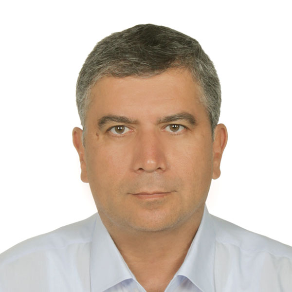
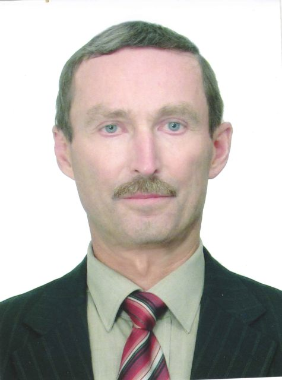
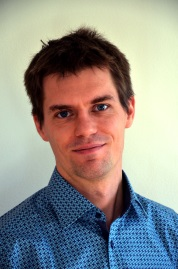
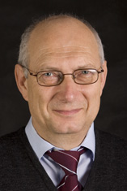

<!--Header-->
<table class="header_table">
    <tr>
        <td class="header_image">
        </td>
        <td class="header_paragraph">
            <h1>Scheduling seminar</h1>
            Objective of a virtual seminar on scheduling research and applications is to discuss both the field's newest
            advancements and survey traditional areas. Seminars take place typically on every second Wednesday through
            three different time zones
            (Europe, the Middle East & Africa,
            North America & South America, and
            Asia, Australia & Oceania).
             
            &nbsp;
            

                <a href='#PC_co-chairs' class="button3">PC co-chairs</a>
                <a href='#Program_committee' class="button3">Program committee</a>
                <a href='#Calendar' class="button3">Calendar</a>
                <a href='#Feedback' class="button3">Feedback</a>
            

        </td>
    </tr>
</table>

<!--Buttons-->

<h2 id="join_us">Join us online</h2>

    <a href="https://www.youtube.com/channel/UCUoCNnaAfw5NAntItILFn4A/live" class="button3">Youtube Live Stream</a>

    <!--TODO MB will be used in future-->
    <!--<a href="zoom_information.html" class="button3">Zoom Conference</a>-->

<!--------------------------------------------------------------------------------------------------------------------->
<!--Talks-->

    <h2>Upcoming talks</h2>

    <table>
        <tbody>
        <!--Dual talk-------------------------------------------------------------------------------------------------->
        <table style="padding-bottom: 12px;" class="europe">
            <!--Title/Abstract--->
            <tr class="europe">
                <td colspan="3">
                    <h2 class="talk_title"><b>Elements of Scheduling</b> </h2>
                    <input type="checkbox" id="my_checkbox_1" style="display:none;">
                    <label for="my_checkbox_1" class="label_abstract"><a>Abstract</a></label>
                    

                        

                    During the 1970’s, the area of scheduling developed from a hodge-podge of isolated results into a unified theory. Over the past decades, it has grown to a mature and lively area, which is a meeting point of operations research, mathematics and computer science, and at the same time a sound basis for the allocation of scarce resources to activities over time in many practical situations. We will sketch the early development of scheduling theory, and also discuss the integration of ideas from online analysis, stochastic models, and machine learning in response to the needs of a changing society.
                        

                    

                </td>
            </tr>

            <!--Data--->
            <tr>
                <td class="presenter_image_container">
                    

                         
                    

                    

                         
                    

                </td>
                <td class="information_upcoming_container">
                    <b>[Presenters] </b>  
                    <a href="https://www.cwi.nl/people/jan-karel-lenstra">Jan Karel Lenstra</a> 
                    (CWI) 
                    <a href="https://people.orie.cornell.edu/shmoys/">David Shmoys</a>  
                    (Cornell University)  
<!--                    <b>[Panelists]</b>  -->
                    <!--<a href="">Name Surname</a> (Affiliation) -->
<!--                    <a href="">Name Surname</a> (Affiliation)  -->
                    <b>[Invited by]</b>  
                    <a href="https://www.stern.nyu.edu/faculty/bio/michael-pinedo">Michael Pinedo</a> 
                    (New York University)
                </td>
                <td class="time_zones_container">
                    <table class="time_table">
                        <tbody>
                        <tr class="utc">
                            <td>UTC</td>
                            <td>Mar 31, 13:00 Wed</td>
                        </tr>
                        <tr class="europe">
                            <td>Prague</td>
                            <td>Mar 31, 15:00 Wed</td>
                        </tr>
                        <tr class="america">
                            <td>New York</td>
                            <td>Mar 31, 09:00 Wed</td>
                        </tr>
                        <tr class="asia">
                            <td>Shanghai</td>
                            <td>Mar 31, 21:00 Wed</td>
                        </tr>
                        </tbody>
                    </table>
                </td>
            </tr>
        </table>

        <!--Spacing--->
        <table style="margin: 0 0 0 0 !important;">
            <tr>
                <td colspan="100%"></td>
            </tr>
        </table>

        <!--Single talk------------------------------------------------------------------------------------------------>
        <table style="padding-bottom: 12px;" class="america">

            <!--Title/Abstract-->
            <tr class="america">
                <td colspan="3">
                    <h2 class="talk_title"><b>Recent Breakthroughs in Stochastic Scheduling Analysis</b> </h2>
                    <input type="checkbox" id="my_checkbox_2" style="display:none;">
                    <label for="my_checkbox_2" class="label_abstract"><a>Abstract</a></label>
                    

                        

                        The talk would start with a little motivation on where stochastic scheduling comes up, showing
                        some
                        workloads at Google from 2020.
                        I would then discuss the SOAP scheduling framework from 2018, which allows the first mean
                        response
                        time analysis of a wide class of scheduling policies in the M/G/1 setting, including Gittins and
                        SERPT in the M/G/1.
                        Finally, I would move on to talking about scheduling in multi-server systems, presenting the
                        first
                        stochastic response time analysis for SRPT in the M/G/k (2018) and Gittins in the M/G/k (2021).
                        

                    

                </td>
            </tr>

            <!--Data--->
            <tr class="america">
                <td class="presenter_image_container">
                    

                         
                    

                </td>
                <td class="information_upcoming_container">
                    <b>[Presenter] </b>  
                    <a href="http://www.cs.cmu.edu/~harchol/">Mor Harchol-Balter</a> 
                    (CMU)  
<!--                    <b>[Panelists]</b>  -->
                    <!--                <a href="">Name Surname</a> (Affiliation) -->
<!--                    <a href="">Name Surname</a> (Affiliation)  -->
                    <b>[Invited by]</b>  
                    <a href="https://www.stern.nyu.edu/faculty/bio/michael-pinedo">Michael Pinedo</a>  
                    (New York University)
                </td>
                <td class="time_zones_container">
                    <table class="time_table">
                        <tbody>
                        <tr class="utc">
                            <td>UTC</td>
                            <td>Apr 14, 13:00 Wed</td>
                        </tr>
                        <tr class="europe">
                            <td>Prague</td>
                            <td>Apr 14, 15:00 Wed</td>
                        </tr>
                        <tr class="america">
                            <td>New York</td>
                            <td>Apr 14, 09:00 Wed</td>
                        </tr>
                        <tr class="asia">
                            <td>Shanghai</td>
                            <td>Apr 14, 21:00 Thu</td>
                        </tr>
                        </tbody>
                    </table>
                </td>
            </tr>

            <!--Bibliongraphy--->
            <!--        Bibliography hidden for now-->
            <!--        <tr class="america">-->
            <!--            <td colspan="3">-->
            <!--                <input type="checkbox" id="person" style="display:none;">-->
            <!--                <label for="person" class="label_abstract"><a>Bibliography</a></label>-->
            <!--                
-->
            <!--                    
-->
            <!--                    Ref 1: Some article name... -->
            <!--                    Ref 2: Some article name... -->
            <!--                    Ref 3: Some article name... -->
            <!--                    Ref 4: Some article name... -->
            <!--                    
-->
            <!--                
-->
            <!--            </td>-->
            <!--        </tr>-->
        </table>

        <!--Spacing--->
        <table style="margin: 0 0 0 0 !important;">
            <tr>
                <td colspan="100%"></td>
            </tr>
        </table>

        <!--Single talk------------------------------------------------------------------------------------------------>
        <table style="padding-bottom: 12px;" class="asia">
            <!--Title/Abstract-->
            <tr class="asia">
                <td colspan="3">
                    <h2 class="talk_title"><b>Scheduling Applications in the Process Industries</b> </h2>
                </td>
            </tr>

            <!--Data--->
            <tr class="asia">
                <td class="presenter_image_container">
                    

                         
                    

                </td>
                <td class="information_upcoming_container">
                    <b>[Presenter] </b>  
                    <a href="">Lixin Tang</a> 
                    (Northeastern Uni, Shenyang)  
<!--                    <b>[Panelists]</b>  -->
                    <!--                <a href="">Name Surname</a> (Affiliation) -->
<!--                    <a href="">Name Surname</a> (Affiliation)  -->
                    <b>[Invited by]</b>  
                    <a href="http://www.acem.sjtu.edu.cn/en/faculty/wanguohua.html">Guohua Wan</a>  
                    (Shanghai Jiao Tong)
                </td>
                <td class="time_zones_container">
                    <table class="time_table">
                        <tbody>
                        <tr class="utc">
                            <td>UTC</td>
                            <td>Apr 28, 13:00 Wed</td>
                        </tr>
                        <tr class="europe">
                            <td>Prague</td>
                            <td>Apr 28, 15:00 Wed</td>
                        </tr>
                        <tr class="america">
                            <td>New York</td>
                            <td>Apr 28, 09:00 Wed</td>
                        </tr>
                        <tr class="asia">
                            <td>Shanghai</td>
                            <td>Apr 28, 21:00 Wed</td>
                        </tr>
                        </tbody>
                    </table>
                </td>
            </tr>
        </table>

        </tbody>
    </table>

<!--Separate upcoming and past talks if different resolution results in one column only-->

    &nbsp;
    

<!--Past talks-->

    <h2>Past talks</h2>
    <table class="past_talk_table">
        <tbody>

<!--        &lt;!&ndash;Single talk&#45;&#45;&#45;&#45;&#45;&#45;&#45;&#45;&#45;&#45;&#45;&#45;&#45;&#45;&#45;&#45;&#45;&#45;&#45;&#45;&#45;&#45;&#45;&#45;&#45;&#45;&#45;&#45;&#45;&#45;&#45;&#45;&#45;&#45;&#45;&#45;&#45;&#45;&#45;&#45;&#45;&#45;&#45;&#45;&#45;&#45;&#45;&#45;&#45;&#45;&#45;&#45;&#45;&#45;&#45;&#45;&#45;&#45;&#45;&#45;&#45;&#45;&#45;&#45;&#45;&#45;&#45;&#45;&#45;&#45;&#45;&#45;&#45;&#45;&#45;&#45;&#45;&#45;&#45;&#45;&#45;&#45;&#45;&#45;&#45;&#45;&#45;&#45;&#45;&#45;&#45;&#45;&#45;&#45;&ndash;&gt;-->
<!--        <table style="padding-bottom: 12px;" class="europe">-->
<!--            &lt;!&ndash;Photo and video&ndash;&gt;-->
<!--            <tr class="europe">-->
<!--                <td class="presenter_image_container">-->
<!--                    
-->
<!--                        <a href="https://schedulingseminar.com/">-->
<!--                            
<!--                                 alt="person_photo"/>-->
<!--                        </a> -->
<!--                    
-->
<!--                </td>-->
<!--                <td colspan="2">-->
<!--                    
-->
<!--                        <iframe width="400" height="250" src="https://www.youtube.com/embed/SC5CX8drAtU" frameborder="0"-->
<!--                                allow="accelerometer; autoplay; clipboard-write; encrypted-media; gyroscope; picture-in-picture"-->
<!--                                allowfullscreen></iframe>-->
<!--                    
-->
<!--                </td>-->
<!--            </tr>-->

<!--            &lt;!&ndash;Text description&ndash;&gt;-->
<!--            <tr class="europe">-->
<!--                <td class="presenter_past_info_container">-->
<!--                    <b>[Presenter]</b> -->
<!--                    <a href="">Name Surname</a> -->
<!--                    (Affiliation) -->
<!--                     -->
<!--                </td>-->
<!--                <td>-->
<!--                    <table class="panelists_past_container">-->
<!--                        <tr>-->
<!--                            <td colspan="2"><b>[Panelists]</b>  </td>-->
<!--                            <td><b>[Invited by]</b>  </td>-->
<!--                        </tr>-->
<!--                        <tr>-->
<!--                            <td><a href="">Name Surname</a> (Affiliation) </td>-->
<!--                            <td><a href="">Name Surname</a> (Affiliation)</td>-->
<!--                            <td><a href="">Name Surname</a>  (Affiliation)</td>-->
<!--                        </tr>-->
<!--                    </table>-->
<!--                </td>-->
<!--            </tr>-->
<!--        </table>-->

<!--        &lt;!&ndash;Spacing-&ndash;&gt;-->
<!--        <table style="margin: 0 0 0 0 !important;">-->
<!--            <tr>-->
<!--                <td colspan="100%"></td>-->
<!--            </tr>-->
<!--        </table>-->

<!--        &lt;!&ndash;Dual talk&#45;&#45;&#45;&#45;&#45;&#45;&#45;&#45;&#45;&#45;&#45;&#45;&#45;&#45;&#45;&#45;&#45;&#45;&#45;&#45;&#45;&#45;&#45;&#45;&#45;&#45;&#45;&#45;&#45;&#45;&#45;&#45;&#45;&#45;&#45;&#45;&#45;&#45;&#45;&#45;&#45;&#45;&#45;&#45;&#45;&#45;&#45;&#45;&#45;&#45;&#45;&#45;&#45;&#45;&#45;&#45;&#45;&#45;&#45;&#45;&#45;&#45;&#45;&#45;&#45;&#45;&#45;&#45;&#45;&#45;&#45;&#45;&#45;&#45;&#45;&#45;&#45;&#45;&#45;&#45;&#45;&#45;&#45;&#45;&#45;&#45;&#45;&#45;&#45;&#45;&#45;&#45;&#45;&#45;&#45;&#45;&ndash;&gt;-->
<!--        <table style="padding-bottom: 12px;" class="asia">-->
<!--            &lt;!&ndash;Photo and video&ndash;&gt;-->
<!--            <tr class="asia">-->
<!--                <td class="presenter_image_container">-->
<!--                    
-->
<!--                        <a href="https://schedulingseminar.com/">-->
<!--                            
<!--                                 alt="person_photo"/>-->
<!--                             </a>-->
<!--                    
-->
<!--                    
-->
<!--                        <a href="https://schedulingseminar.com/">-->
<!--                            
<!--                                 alt="person_photo"/>-->
<!--                             </a>-->
<!--                    
-->
<!--                </td>-->
<!--                <td colspan="2">-->
<!--                    
-->
<!--                        <iframe width="400" height="250" src="https://www.youtube.com/embed/SC5CX8drAtU" frameborder="0"-->
<!--                                allow="accelerometer; autoplay; clipboard-write; encrypted-media; gyroscope; picture-in-picture"-->
<!--                                allowfullscreen></iframe>-->
<!--                    
-->
<!--                </td>-->
<!--            </tr>-->

<!--            &lt;!&ndash;Text description&ndash;&gt;-->
<!--            <tr class="asia">-->
<!--                <td class="presenter_past_info_container">-->
<!--                    <b>[Presenters]</b> -->
<!--                    <a href="">Name Surname</a> -->
<!--                    (Affiliation) -->
<!--                    <a href="">Name Surname</a> -->
<!--                    (Affiliation) -->
<!--                     -->
<!--                </td>-->
<!--                <td>-->
<!--                    <table class="panelists_past_container">-->
<!--                        <tr>-->
<!--                            <td colspan="2"><b>[Panelists]</b>  </td>-->
<!--                            <td><b>[Invited by]</b>  </td>-->
<!--                        </tr>-->
<!--                        <tr>-->
<!--                            <td><a href="">Name Surname</a> (Affiliation) </td>-->
<!--                            <td><a href="">Name Surname</a> (Affiliation)</td>-->
<!--                            <td><a href="">Name Surname</a>  (Affiliation)</td>-->
<!--                        </tr>-->
<!--                    </table>-->
<!--                </td>-->
<!--            </tr>-->
<!--        </table>-->

<!--        &lt;!&ndash;Spacing-&ndash;&gt;-->
<!--        <table style="margin: 0 0 0 0 !important;">-->
<!--            <tr>-->
<!--                <td colspan="100%"></td>-->
<!--            </tr>-->
<!--        </table>-->

<!--        &lt;!&ndash;Single talk&#45;&#45;&#45;&#45;&#45;&#45;&#45;&#45;&#45;&#45;&#45;&#45;&#45;&#45;&#45;&#45;&#45;&#45;&#45;&#45;&#45;&#45;&#45;&#45;&#45;&#45;&#45;&#45;&#45;&#45;&#45;&#45;&#45;&#45;&#45;&#45;&#45;&#45;&#45;&#45;&#45;&#45;&#45;&#45;&#45;&#45;&#45;&#45;&#45;&#45;&#45;&#45;&#45;&#45;&#45;&#45;&#45;&#45;&#45;&#45;&#45;&#45;&#45;&#45;&#45;&#45;&#45;&#45;&#45;&#45;&#45;&#45;&#45;&#45;&#45;&#45;&#45;&#45;&#45;&#45;&#45;&#45;&#45;&#45;&#45;&#45;&#45;&#45;&#45;&#45;&#45;&#45;&#45;&#45;&ndash;&gt;-->
<!--        <table style="padding-bottom: 12px;" class="america">-->
<!--            &lt;!&ndash;Photo and video&ndash;&gt;-->
<!--            <tr class="america">-->
<!--                <td class="presenter_image_container">-->
<!--                    
-->
<!--                        <a href="https://schedulingseminar.com/">-->
<!--                            
<!--                                 alt="person_photo"/>-->
<!--                        </a> -->
<!--                    
-->
<!--                </td>-->
<!--                <td colspan="2">-->
<!--                    
-->
<!--                        <iframe width="400" height="250" src="https://www.youtube.com/embed/SC5CX8drAtU" frameborder="0"-->
<!--                                allow="accelerometer; autoplay; clipboard-write; encrypted-media; gyroscope; picture-in-picture"-->
<!--                                allowfullscreen></iframe>-->
<!--                    
-->
<!--                </td>-->
<!--            </tr>-->

<!--            &lt;!&ndash;Text description&ndash;&gt;-->
<!--            <tr class="america">-->
<!--                <td class="presenter_past_info_container">-->
<!--                    <b>[Presenter]</b> -->
<!--                    <a href="">Name Surname</a> -->
<!--                    (Affiliation) -->
<!--                     -->
<!--                </td>-->
<!--                <td>-->
<!--                    <table class="panelists_past_container">-->
<!--                        <tr>-->
<!--                            <td colspan="2"><b>[Panelists]</b>  </td>-->
<!--                            <td><b>[Invited by]</b>  </td>-->
<!--                        </tr>-->
<!--                        <tr>-->
<!--                            <td><a href="">Name Surname</a> (Affiliation) </td>-->
<!--                            <td><a href="">Name Surname</a> (Affiliation)</td>-->
<!--                            <td><a href="">Name Surname</a>  (Affiliation)</td>-->
<!--                        </tr>-->
<!--                    </table>-->
<!--                </td>-->
<!--            </tr>-->
<!--        </table>-->

        </tbody>
    </table>

<!--------------------------------------------------------------------------------------------------------------------->
<!--PC co-chairs-->
&nbsp;

    <h2>PC co-chairs</h2>
    <table class="people_table">
        <tbody>
        <tr>
            <!--Person-->
            <td>
                <a href="https://rtime.ciirc.cvut.cz/~hanzalek/">
                     
                    Zdeněk Hanzálek 
                    CTU in Prague</a>
            </td>

            <!--Person-->
            <td>
                <a href="https://www.stern.nyu.edu/faculty/bio/michael-pinedo">
                     
                    Michael Pinedo 
                    New York University </a>
            </td>

            <!--Person-->
            <td>
                <a href="http://www.acem.sjtu.edu.cn/en/faculty/wanguohua.html">
                     
                    Guohua Wan 
                    Shanghai Jiao Tong</a>
            </td>
        </tr>
        </tbody>
    </table>

<!--Program committee-->
&nbsp;

    <h2>Program committee</h2>
    <table class="people_table">
        <tbody>
        <tr>
            <!--Alessandro Agnetis-->
            <td>
                <a href="https://www3.diism.unisi.it/~agnetis/">
                     
                    Alessandro Agnetis 
                    University of Siena</a>
            </td>

            <!--M. Selim Akturk-->
            <td>
                <a href="//akturk.bilkent.edu.tr">
                     
                    M. Selim Akturk 
                    Bilkent University</a>
            </td>

            <!--Christian Artigues-->
            <td>
                <a href="https://homepages.laas.fr/artigues/drupal/node/11">
                     
                    Christian Artigues 
                    LAAS - CNRS</a>
            </td>

            <!--Edmund Burke-->
            <td>
                <a href="https://le.ac.uk/about/senior-management/profiles/deputy-vice-chancellor">
                     
                    Edmund Burke 
                    Uni of Leicester</a>
            </td>

            <!--Zhi-Long Chen-->
            <td>
                <a href="https://scholar.google.com/citations?hl=en&user=AWOfe_QAAAAJ&view_op=list_works&sortby=pubdate">
                     
                    Zhi-Long Chen 
                    Uni of Maryland</a>
            </td>

            <!--Nicholas G. Hall-->
            <td>
                <a href="https://fisher.osu.edu/people/hall.33">
                     
                    Nicholas G. Hall 
                    The Ohio State Uni</a>
            </td>

            <!--Claire Hanen-->
            <td>
                <a href="https://ufr-segmi.parisnanterre.fr/organisation-et-contacts/espace-reserve-enseignants/site-des-enseignants/les-enseignants-de-segmi/hanen-claire/hanen-claire-93518.kjsp">
                     
                    Claire Hanen 
                    Sorbonne Uni</a>
            </td>

            <!--Sigrid Knust-->
            <td>
                <a href="https://www.informatik.uni-osnabrueck.de/knust/">
                     
                    Sigrid Knust 
                    Uni of Osnabrück</a>
            </td>

            <!--Mikhail Kovalyov-->
            <td>
                <a href="http://uiip.bas-net.by/eng/contacts.php">
                     
                    Mikhail Kovalyov 
                    UIIP NAS Belarus</a>
            </td>

            <!--Erwin Pesch-->
            <td>
                <a href="https://www.wiwi.uni-siegen.de/mis/team/">
                     
                    Erwin Pesch 
                    Uni of Siegen</a>
            </td>

            <!--Marc E. Posner-->
            <td>
                <a href="">
                     
                    Marc Posner 
                    The Ohio State Uni</a>
            </td>

            <!--Rhonda Righter-->
            <td>
                <a href="https://rrighter.ieor.berkeley.edu/">
                     
                    Rhonda Righter 
                    UC Berkeley</a>
            </td>

            <!--Rubén Ruiz García-->
            <td>
                <a href="http://soa.iti.es/rruiz">
                     
                    Rubén Ruiz 
                    UP València</a>
            </td>

            <!--Andrea Schaerf-->
            <td>
                <a href="http://www.dpia.uniud.it/schaerf/">
                     
                    Andrea Schaerf 
                    University of Udine</a>
            </td>

            <!--Dvir Shabtay-->
            <td>
                <a href="https://in.bgu.ac.il/en/engn/iem/pages/staff/Dvir-Shabtay.aspx">
                     
                    Dvir Shabtay 
                    Ben Gurion Uni</a>
            </td>

            <!--Roman Słowiński-->
            <td>
                <a href="http://idss.cs.put.poznan.pl/site/rslowinski.html">
                     
                    Roman Słowiński 
                    Poznań Uni Tech.</a>
            </td>

            <!--Stephen F. Smith-->
            <td>
                <a href="https://www.ri.cmu.edu/ri-faculty/stephen-smith/">
                     
                    Stephen Smith 
                    CMU</a>
            </td>

            <!--Přemysl Šůcha-->
            <td>
                <a href="http://people.ciirc.cvut.cz/~suchap/">
                     
                    Přemysl Šůcha 
                    CTU in Prague</a>
            </td>

            <!--Vincent T'kindt-->
            <td>
                <a href="https://www.univ-tours.fr/annuaire/m-vincent-tkindt">
                     
                    Vincent T'kindt 
                    Uni de Tours</a>
            </td>

            <!--Marc Uetz-->
            <td>
                <a href="https://people.utwente.nl/m.uetz">
                     
                    Marc Uetz 
                    Uni of Twente</a>
            </td>

            <!--Greet Vanden Berghe-->
            <td>
                <a href="https://www.kuleuven.be/wieiswie/nl/person/00053376">
                     
                    G. Vanden Berghe 
                    KU Leuven</a>
            </td>

            <!--Mario Vanhoucke-->
            <td>
                <a href="https://www.or-as.be">
                     
                    Mario Vanhoucke 
                    Ghent University</a>
            </td>

            <!--Yakov Zinder-->
            <td>
                <a href="https://profiles.uts.edu.au/Yakov.Zinder">
                     
                    Yakov Zinder 
                    UT Sydney</a>
            </td>

<!--            &lt;!&ndash;Person&ndash;&gt;-->
<!--            <td>-->
<!--                <a href="https://schedulingseminar.com/">-->
<!--                     -->
<!--                    Name Surname Affiliation</a>-->
<!--            </td>-->

        </tr>
        </tbody>
    </table>

<!--------------------------------------------------------------------------------------------------------------------->
<!--Calendar-->
&nbsp;

    <h2>Calendar (time zone conversion)</h2>
    <i>Might not work properly if location is unrecognized or VPN is used.</i>
    

        <iframe src="https://calendar.google.com/calendar/embed?height=600&amp;wkst=2&amp;bgcolor=%234285F4&amp;ctz=Europe%2FPrague&amp;src=Mml0YXVjNmdhZGZsNjRsZWZxdDhiczgzZmtAZ3JvdXAuY2FsZW5kYXIuZ29vZ2xlLmNvbQ&amp;color=%23039BE5&amp;showTitle=0&amp;showNav=1&amp;showDate=1&amp;showPrint=1&amp;showTabs=0&amp;showCalendars=0&amp;mode=AGENDA"
                style="border:solid 1px #777" width="100%" height="400" frameborder="0" scrolling="no"></iframe>
    

<!--Separate calendar and feedback if different resolution results in one column only-->

    &nbsp;
    

<!--Google form-->

    <h2>Feedback form</h2>
    

        <iframe src="https://docs.google.com/forms/d/e/1FAIpQLSfRk8Nv2J7RvGk-z7Gl5KLWMO5hoZC1Sd-ZFDvgzI97mZe6nw/viewform?embedded=true"
                width="100%" height="500" frameborder="0" marginheight="0" marginwidth="0">Loading…
        </iframe>
    

<!--------------------------------------------------------------------------------------------------------------------->
<!--Footer-->
&nbsp;

<footer>
    

        <a href="https://schedseminar.github.io">schedulingseminar.com</a> is maintained by
        <a href="https://iid.ciirc.cvut.cz/">CTU in Prague</a>.
    

</footer>
