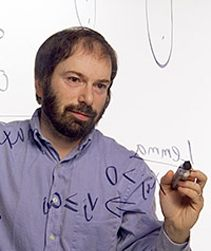

<!--Header-->
<table class="header_table">
    <tr>
        <td class="header_image">
        </td>
        <td class="header_paragraph">
            <h1>Scheduling seminar</h1>
            Objective of a virtual seminar on scheduling research and applications is to discuss both the field's newest
            advancements and survey traditional areas. Seminars take place typically on every second Wednesday through
            three different time zones
            (Europe,
            America, and
            Asia & Oceania).
             
            &nbsp;
            

                <a href='#PC_co-chairs' class="button3">PC co-chairs</a>
                <a href='#Program_committee' class="button3">Program committee</a>
                <a href='#Calendar' class="button3">Calendar</a>
                <a href='#Feedback' class="button3">Feedback</a>
            

        </td>
    </tr>
</table>

<!--Buttons-->

<h2 id="join_us">Join us online</h2>

    <a href="https://youtu.be/add-link" class="button3">Youtube Live Stream</a>

    <!--TODO MB will be used in future-->
    <!--<a href="zoom_information.html" class="button3">Zoom Conference</a>-->

<!--------------------------------------------------------------------------------------------------------------------->
<!--Talks-->

    <h2>Upcoming talks</h2>

    <table class="upcoming_table">
        <tbody>
        <!--Dual talk-------------------------------------------------------------------------------------------------->
        <!--Title/Abstract--->
        <tr class="america">
            <td colspan="3">
                <h2 class="talk_title"><b>Elements of Scheduling</b> </h2>
            </td>
        </tr>

        <!--Data--->
        <tr class="america">
            <td class="presenter_picture">
                 
                 
            </td>
            <td class="information_upcoming">
                <b>[Presenters] </b>  
                <a href="https://www.cwi.nl/people/jan-karel-lenstra">Jan Karel Lenstra</a> (CWI) 
                <a href="https://people.orie.cornell.edu/shmoys/">David Shmoys</a> ()  
                <b>[Panelists]</b>  
                <!--<a href="">Name Surname</a> (Affiliation) -->
                <a href="">Name Surname</a> (Affiliation)  
                <b>[Invited by]</b>  
                <a href="https://www.stern.nyu.edu/faculty/bio/michael-pinedo">Michael Pinedo</a> (New York University)
            </td>

            <td class="time_zones">
                <table class="time_table">
                    <tbody>
                    <tr class="utc">
                        <td>UTC</td>
                        <td>Mar 31, 14:00 Wed</td>
                    </tr>
                    <tr class="europe">
                        <td>Prague</td>
                        <td>Mar 31, 15:00 Wed</td>
                    </tr>
                    <tr class="america">
                        <td>New York</td>
                        <td>Mar 31, 09:00 Wed</td>
                    </tr>
                    <tr class="asia">
                        <td>Shanghai</td>
                        <td>Mar 31, 22:00 Wed</td>
                    </tr>
                    </tbody>
                </table>
            </td>
        </tr>

        <!--Spacing--->
        <tr style="margin: 0px 0px 0px 0px !important">
            <td colspan="100%"></td>
        </tr>
        <!--<tr class="america"><td colspan="100%">
</td></tr>-->

        <!--Single talk------------------------------------------------------------------------------------------------>
        <!--Title/Abstract-->
        <tr class="america">
            <td colspan="3">
                <h2 class="talk_title"><b>Recent breakthroughs in stochastic scheduling analysis</b> </h2>
                <input type="checkbox" id="my_checkbox" style="display:none;">
                <label for="my_checkbox" class="label_abstract"><a>Abstract</a></label>
                

                    

                    The talk would start with a little motivation on where stochastic scheduling comes up, showing some
                    workloads at Google from 2020.
                    I would then discuss the SOAP scheduling framework from 2018, which allows the first mean response
                    time analysis of a wide class of scheduling policies in the M/G/1 setting, including Gittins and
                    SERPT in the M/G/1.
                    Finally, I would move on to talking about scheduling in multi-server systems, presenting the first
                    stochastic response time analysis for SRPT in the M/G/k (2018) and Gittins in the M/G/k (2021).
                    

                

            </td>
        </tr>

        <!--Data--->
        <tr class="america">
            <td class="presenter_picture">
                 
            </td>
            <td class="information_upcoming">
                <b>[Presenter] </b>  
                <a href="http://www.cs.cmu.edu/~harchol/">Mor Harchol-Balter</a> (CMU)  
                <b>[Panelists]</b>  
                <!--                <a href="">Name Surname</a> (Affiliation) -->
                <a href="">Name Surname</a> (Affiliation)  
                <b>[Invited by]</b>  
                <a href="https://www.stern.nyu.edu/faculty/bio/michael-pinedo">Michael Pinedo</a> (New York University)
            </td>

            <td class="time_zones">
                <table class="time_table">
                    <tbody>
                    <tr class="utc">
                        <td>UTC</td>
                        <td>Apr 14, 14:00 Wed</td>
                    </tr>
                    <tr class="europe">
                        <td>Prague</td>
                        <td>Apr 14, 15:00 Wed</td>
                    </tr>
                    <tr class="america">
                        <td>New York</td>
                        <td>Apr 14, 09:00 Wed</td>
                    </tr>
                    <tr class="asia">
                        <td>Shanghai</td>
                        <td>Apr 14, 22:00 Thu</td>
                    </tr>
                    </tbody>
                </table>
            </td>
        </tr>

        <!--Bibliongraphy--->
        <!--        Bibliography hidden for now-->
        <!--        <tr class="america">-->
        <!--            <td colspan="3">-->
        <!--                <input type="checkbox" id="person" style="display:none;">-->
        <!--                <label for="person" class="label_abstract"><a>Bibliography</a></label>-->
        <!--                
-->
        <!--                    
-->
        <!--                    Ref 1: Some article name... -->
        <!--                    Ref 2: Some article name... -->
        <!--                    Ref 3: Some article name... -->
        <!--                    Ref 4: Some article name... -->
        <!--                    
-->
        <!--                
-->
        <!--            </td>-->
        <!--        </tr>-->

        <!--Spacing--->
        <tr style="margin: 0px 0px 0px 0px !important">
            <td colspan="100%"></td>
        </tr>

        <!--Single talk------------------------------------------------------------------------------------------------>
        <!--Title/Abstract-->
        <tr class="asia">
            <td colspan="3">
                <h2 class="talk_title"><b>Some interesting scheduling topic</b> </h2>
            </td>
        </tr>

        <!--Data--->
        <tr class="asia">
            <td class="presenter_picture">
                 
            </td>
            <td class="information_upcoming">
                <b>[Presenter] </b>  
                <a href="http://lixintang.weebly.com/">Lixin Tang</a> (Northeastern Univ., Shenyang)  
                <b>[Panelists]</b>  
                <!--                <a href="">Name Surname</a> (Affiliation) -->
                <a href="">Name Surname</a> (Affiliation)  
                <b>[Invited by]</b>  
                <a href="http://www.acem.sjtu.edu.cn/en/faculty/wanguohua.html">Guohua Wan</a> (Shanghai Jiao Tong)
            </td>

            <td class="time_zones">
                <table class="time_table">
                    <tbody>
                    <tr class="utc">
                        <td>UTC</td>
                        <td>Apr 28, 13:00 Wed</td>
                    </tr>
                    <tr class="europe">
                        <td>Prague</td>
                        <td>Apr 28, 14:00 Wed</td>
                    </tr>
                    <tr class="america">
                        <td>New York</td>
                        <td>Apr 28, 08:00 Wed</td>
                    </tr>
                    <tr class="asia">
                        <td>Shanghai</td>
                        <td>Apr 28, 21:00 Wed</td>
                    </tr>
                    </tbody>
                </table>
            </td>
        </tr>

        </tbody>
    </table>

<!--Past talks-->

    <h2>Past talks</h2>
    <table class="past_talk_table">
        <tbody>

        <!--Single talk------------------------------------------------------------------------------------------------>
        <!--Photo and video-->
        <tr class="europe">
            <td class="presenter_picture">
                 
            </td>
            <td colspan="2">
                

                    <iframe width="400" height="250" src="https://www.youtube.com/embed/SC5CX8drAtU" frameborder="0"
                            allow="accelerometer; autoplay; clipboard-write; encrypted-media; gyroscope; picture-in-picture"
                            allowfullscreen></iframe>
                

            </td>
        </tr>

        <!--Text description-->
        <tr class="europe">
            <td class="presenter_past">
                <b>[Presenter]</b> 
                <a href="">Name Surname</a> 
                (Affiliation) 
                 
            </td>
            <td>
                <table class="panelists_past">
                    <tr>
                        <td colspan="2"><b>[Panelists]</b>  </td>
                        <td><b>[Invited by]</b>  </td>
                    </tr>
                    <tr>
                        <td><a href="">Name Surname</a> (Affiliation) </td>
                        <td><a href="">Name Surname</a> (Affiliation)</td>
                        <td><a href="">Name Surname</a>  (Affiliation)</td>
                    </tr>
                </table>
            </td>
        </tr>

        <!--Dual talk-------------------------------------------------------------------------------------------------->
        <!--Photo and video-->
        <tr class="asia">
            <td class="presenter_picture">
                 
            </td>
            <td colspan="2">
                

                    <iframe width="400" height="250" src="https://www.youtube.com/embed/SC5CX8drAtU" frameborder="0"
                            allow="accelerometer; autoplay; clipboard-write; encrypted-media; gyroscope; picture-in-picture"
                            allowfullscreen></iframe>
                

            </td>
        </tr>

        <!--Text description-->
        <tr class="asia">
            <td class="presenter_past">
                <b>[Presenters]</b> 
                <a href="">Name Surname</a> 
                (Affiliation) 
                <a href="">Name Surname</a> 
                (Affiliation) 
                 
            </td>
            <td>
                <table class="panelists_past">
                    <tr>
                        <td colspan="2"><b>[Panelists]</b>  </td>
                        <td><b>[Invited by]</b>  </td>
                    </tr>
                    <tr>
                        <td><a href="">Name Surname</a> (Affiliation) </td>
                        <td><a href="">Name Surname</a> (Affiliation)</td>
                        <td><a href="">Name Surname</a>  (Affiliation)</td>
                    </tr>
                </table>
            </td>
        </tr>

        <!--Single talk------------------------------------------------------------------------------------------------>
        <!--Photo and video-->
        <tr class="america">
            <td class="presenter_picture">
                 
            </td>
            <td colspan="2">
                

                    <iframe width="400" height="250" src="https://www.youtube.com/embed/SC5CX8drAtU" frameborder="0"
                            allow="accelerometer; autoplay; clipboard-write; encrypted-media; gyroscope; picture-in-picture"
                            allowfullscreen></iframe>
                

            </td>
        </tr>

        <!--Text description-->
        <tr class="america">
            <td class="presenter_past">
                <b>[Presenter]</b> 
                <a href="">Name Surname</a> 
                (Affiliation) 
                 
            </td>
            <td>
                <table class="panelists_past">
                    <tr>
                        <td colspan="2"><b>[Panelists]</b>  </td>
                        <td><b>[Invited by]</b>  </td>
                    </tr>
                    <tr>
                        <td><a href="">Name Surname</a> (Affiliation) </td>
                        <td><a href="">Name Surname</a> (Affiliation)</td>
                        <td><a href="">Name Surname</a>  (Affiliation)</td>
                    </tr>
                </table>
            </td>
        </tr>

        </tbody>
    </table>

<!--------------------------------------------------------------------------------------------------------------------->
<!--PC co-chairs-->
&nbsp;

    <h2>PC co-chairs</h2>
    <table class="people_table">
        <tbody>
        <tr>
            <!--Person-->
            <td>
                <a href="https://rtime.ciirc.cvut.cz/~hanzalek/">
                     
                    Zdeněk Hanzálek CTU in Prague</a>
            </td>

            <!--Person-->
            <td>
                <a href="https://www.stern.nyu.edu/faculty/bio/michael-pinedo">
                     
                    Michael Pinedo New York University </a>
            </td>

            <!--Person-->
            <td>
                <a href="http://www.acem.sjtu.edu.cn/en/faculty/wanguohua.html">
                     
                    Guohua Wan Shanghai Jiao Tong</a>
            </td>
        </tr>
        </tbody>
    </table>

<!--Program committee-->
&nbsp;

    <h2>Program committee</h2>
    <table class="people_table">
        <tbody>
        <tr>
            <!--Person-->
            <td>
                <a href="https://schedseminar.github.io/">
                     
                    Name Surname Affiliation</a>
            </td>

            <!--Person-->
            <td>
                <a href="https://schedseminar.github.io/">
                     
                    Name Surname Affiliation</a>
            </td>

            <!--Person-->
            <td>
                <a href="https://schedseminar.github.io/">
                     
                    Name Surname Affiliation</a>
            </td>

            <!--Person-->
            <td>
                <a href="https://schedseminar.github.io/">
                     
                    Name Surname Affiliation</a>
            </td>

            <!--Person-->
            <td>
                <a href="https://schedseminar.github.io/">
                     
                    Name Surname Affiliation</a>
            </td>

            <!--Person-->
            <td>
                <a href="https://schedseminar.github.io/">
                     
                    Name Surname Affiliation</a>
            </td>

            <!--Person-->
            <td>
                <a href="https://schedseminar.github.io/">
                     
                    Name Surname Affiliation</a>
            </td>

            <!--Person-->
            <td>
                <a href="https://schedseminar.github.io/">
                     
                    Name Surname Affiliation</a>
            </td>
        </tr>
        </tbody>
    </table>

<!--------------------------------------------------------------------------------------------------------------------->
<!--Calendar-->
&nbsp;

    <h2>Calendar (time zone conversion)</h2>
    <i>Might not work properly if location is unrecognized or VPN is used.</i>
    

        <iframe src="https://calendar.google.com/calendar/embed?height=600&amp;wkst=2&amp;bgcolor=%234285F4&amp;ctz=Europe%2FPrague&amp;src=Mml0YXVjNmdhZGZsNjRsZWZxdDhiczgzZmtAZ3JvdXAuY2FsZW5kYXIuZ29vZ2xlLmNvbQ&amp;color=%23039BE5&amp;showTitle=0&amp;showNav=1&amp;showDate=1&amp;showPrint=1&amp;showTabs=0&amp;showCalendars=0&amp;mode=AGENDA"
                style="border:solid 1px #777" width="100%" height="600" frameborder="0" scrolling="no"></iframe>
    

<!--Google form-->

    &nbsp;
    

    <h2>Feedback form</h2>
    

        <iframe src="https://docs.google.com/forms/d/e/1FAIpQLSfRk8Nv2J7RvGk-z7Gl5KLWMO5hoZC1Sd-ZFDvgzI97mZe6nw/viewform?embedded=true"
                width="100%" height="500" frameborder="0" marginheight="0" marginwidth="0">Loading…
        </iframe>
    

<!--------------------------------------------------------------------------------------------------------------------->
<!--Footer-->
&nbsp;

<footer>
    

        <a href="https://schedseminar.github.io">schedulingseminar.com</a> is maintained by
        <a href="https://iid.ciirc.cvut.cz/">CTU in Prague</a>.
    

</footer>
