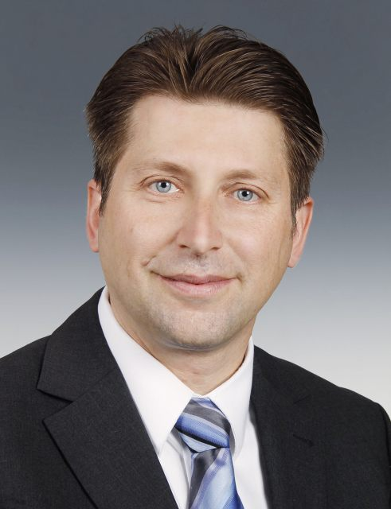

<!--Header-->
<table class="header_table">
	<tr>
		<td class="header_image">
			
		</td>
		<td class="header_paragraph">
			<h1>Scheduling seminar</h1>
			Objective of a virtual seminar on scheduling research and applications is to discuss both the field's newest
			advancements and survey traditional areas. Seminars take place typically on every second Wednesday through
			three different time zones
			(Europe, the Middle East & Africa,
			North America & South America, and
			Asia, Australia & Oceania).
			 
			&nbsp;
			

				<!--                
-->
				<!--                    <a href='https://www.youtube.com/channel/UCUoCNnaAfw5NAntItILFn4A' style="margin-right: 5px">-->
				<!--                        -->
				<!--                    </a>-->

				<!--                    <a href='https://list.iid.ciirc.cvut.cz/mailman3/lists/schedulingseminar.rtime.felk.cvut.cz/'-->
				<!--                       style="margin-right: 5px">-->
				<!--                        -->
				<!--                    </a>-->

				<!--                    <a href='https://twitter.com/ZHanzalek' style="margin-right: 5px">-->
				<!--                        -->
				<!--                    </a>-->

				<!--                    <a href='https://www.linkedin.com/groups/9047074/' style="margin-right: 5px">-->
				<!--                        -->
				<!--                    </a>-->
				<!--                
-->
				

					<!--<a href="https://list.iid.ciirc.cvut.cz/mailman3/lists/schedulingseminar.rtime.felk.cvut.cz/"-->
					<!--class="button3" style="font-weight: bold">Newsletter</a>-->
					<a href='#PC_co-chairs' class="button3">PC co-chairs</a>
					<a href='#Program_committee' class="button3">Program committee</a>
					<a href='#Calendar' class="button3">Calendar</a>
					<a href='#Feedback' class="button3">Feedback</a>
				

			

		</td>
	</tr>
</table>

<!--------------------------------------------------------------------------------------------------------------------->
<!--Messages-->

<!--
-->

<!--If any problem should occur-->
<!--<h2>Due to unforeseen technical problems, problem reason... <a-->
<!--        href="https://cesnet.zoom.us/j/98579414742?pwd=enQxM2wveUowQ3BZenB1QURKVStadz09">https://cesnet.zoom.us/j/98579414742?pwd=enQxM2wveUowQ3BZenB1QURKVStadz09</a>-->
<!--</h2>-->

<!--Zoom connection info-->
<!--
-->
<!--    <h1>ZOOM CONNECTION INFORMATION (for talk 22.6.2022)</h1>-->
<!--    <i>Since the invitation for the next talk might have been flagged as spam by your email provider, below we provide-->
<!--        information for the Zoom connection.</i> -->
<!--    Zoom link: <a href="https://cesnet.zoom.us/j/91083429684?pwd=QlJXcHB4dGtLdE40b1hGaEVMbTNFdz09">https://cesnet.zoom.us/j/91083429684?pwd=QlJXcHB4dGtLdE40b1hGaEVMbTNFdz09</a> -->
<!--    Meeting ID: 910 8342 9684 -->
<!--    Passcode: 190280 -->
<!--
-->

<!--------------------------------------------------------------------------------------------------------------------->
<!--Buttons social-->

	<a href="https://www.youtube.com/channel/UCUoCNnaAfw5NAntItILFn4A/live">
		<h3 class="external_headings">Join us on Youtube</h3>
	</a>
	

		
	

	<a href="https://list.iid.ciirc.cvut.cz/mailman3/lists/schedulingseminar.rtime.felk.cvut.cz/">
		<h3 class="external_headings">Subscribe to mailing list</h3>
	</a>
	

		
	

<!--
-->
<!--    <h2 id="join_us">Join us online</h2>-->
<!--    
-->
<!--        <a href="https://www.youtube.com/channel/UCUoCNnaAfw5NAntItILFn4A/live" class="button3">Youtube Live Stream</a>-->
<!--        &lt;!&ndash;TODO MB will be used in future&ndash;&gt;-->
<!--        &lt;!&ndash;<a href="zoom_information.html" class="button3">Zoom Conference</a>&ndash;&gt;-->
<!--    
-->
<!--
-->

	<a href='https://www.linkedin.com/groups/9047074/'>
		<h3 class="external_headings">Subscribe to LinkedIn group</h3>
	</a>
	

		
	

	<a href='https://twitter.com/ZHanzalek'>
		<h3 class="external_headings">Follow us on Twitter</h3>
	</a>
	

		
	

<!--------------------------------------------------------------------------------------------------------------------->
<!--Talks-->

	<h2>Upcoming talks</h2>

	<table>
		<tbody>

		<!-- Levner postponed talk-------------------------------------------------------------------------------------->
		<!--        &lt;!&ndash;Levner backup&#45;&#45;&#45;&#45;&#45;&#45;&#45;&#45;&#45;&#45;&#45;&#45;&#45;&#45;&#45;&#45;&#45;&#45;&#45;&#45;&#45;&#45;&#45;&#45;&#45;&#45;&#45;&#45;&#45;&#45;&#45;&#45;&#45;&#45;&#45;&#45;&#45;&#45;&#45;&#45;&#45;&#45;&#45;&#45;&#45;&#45;&#45;&#45;&#45;&#45;&#45;&#45;&#45;&#45;&#45;&#45;&#45;&#45;&#45;&#45;&#45;&#45;&#45;&#45;&#45;&#45;&#45;&#45;&#45;&#45;&#45;&#45;&#45;&#45;&#45;&#45;&#45;&#45;&#45;&#45;&#45;&#45;&#45;&#45;&#45;&#45;&#45;&#45;&#45;&#45;&#45;&#45;&#45;&#45;&ndash;&gt;-->
		<!--        <table style="padding-bottom: 12px;" class="europe">-->
		<!--            &lt;!&ndash;Title/Abstract/PDF&ndash;&gt;-->
		<!--            <tr>-->
		<!--                <td colspan="3">-->
		<!--                    <h2 class="talk_title"><b>Scheduling Swarms of Robots and Drones: How Fuzzy Logic Solves a-->
		<!--                        Scheduling Problem-->
		<!--                    </b> -->
		<!--                    </h2>-->
		<!--                    <input type="checkbox" id="abstract_id_19" style="display:none;">-->
		<!--                    <label for="abstract_id_19" class="label_abstract"><a>Abstract</a></label>-->
		<!--                    
-->
		<!--                        
-->
		<!--                        Consider a cyclic process in which a set of several human operators or robots perform m given-->
		<!--                        sequential operations whereas a number of flying unmanned vehicles-drones are used to transfer-->
		<!--                        information gathered by the operators and/or to transfer a load to fixed points. Durations of-->
		<!--                        data collecting and transfer operations are known fuzzy numbers. The aim is to find the schedule-->
		<!--                        for the swarms of drones so that to maximize the system productivity, or to minimize the cycle-->
		<!--                        length, and to avoid collisions of the drones. The fuzzy logic allows to solve the optimization-->
		<!--                        problem under uncertainty. A novel fuzzy algorithm outperforms the earlier-known crisp-->
		<!--                        scheduling algorithms.-->
		<!--                        
-->
		<!--                    
-->
		<!--                    &lt;!&ndash;                    <a href="./presentations/SchedulingSeminar_RubénRuiz.pdf" class="label_abstract" download>&ndash;&gt;-->
		<!--                    &lt;!&ndash;                        Download PDF&ndash;&gt;-->
		<!--                    &lt;!&ndash;                    </a>&ndash;&gt;-->
		<!--                    &lt;!&ndash;Keywords: scheduling of robots, scheduling of unmanned aerial vehicles UAVs (drones), cyclic scheduling, fuzzy operation durations, fuzzy logic, fuzzy algorithm&ndash;&gt;-->
		<!--                </td>-->
		<!--            </tr>-->

		<!--            &lt;!&ndash;Data-&ndash;&gt;-->
		<!--            <tr>-->
		<!--                <td class="presenter_image_container">-->
		<!--                    
-->
		<!--                        <a href="https://www.hit.ac.il/en/faculty_staff/Eugene_Levner">-->
		<!--                            -->
		<!--                        </a> -->
		<!--                    
-->
		<!--                </td>-->
		<!--                <td class="information_upcoming_container">-->
		<!--                    <b>[Presenter]</b> -->
		<!--                    <a href="https://www.hit.ac.il/en/faculty_staff/Eugene_Levner">Eugene Levner</a> -->
		<!--                    (HIT)  -->
		<!--                    <b>[Invited by]</b> -->
		<!--                    <a href="https://rtime.ciirc.cvut.cz/~hanzalek/">Zdeněk Hanzálek</a> -->
		<!--                    (CTU in Prague)-->
		<!--                </td>-->
		<!--                <td class="time_zones_container">-->
		<!--                    <table class="time_table">-->
		<!--                        <tbody>-->
		<!--                        <tr class="utc">-->
		<!--                            <td>UTC</td>-->
		<!--                            <td>Feb 16, 14:00 Wed</td>-->
		<!--                        </tr>-->
		<!--                        <tr class="europe">-->
		<!--                            <td>Prague</td>-->
		<!--                            <td>Feb 16, 15:00 Wed</td>-->
		<!--                        </tr>-->
		<!--                        <tr class="america">-->
		<!--                            <td>New York</td>-->
		<!--                            <td>Feb 16, 09:00 Wed</td>-->
		<!--                        </tr>-->
		<!--                        <tr class="asia">-->
		<!--                            <td>Shanghai</td>-->
		<!--                            <td>Feb 16, 22:00 Wed</td>-->
		<!--                        </tr>-->
		<!--                        </tbody>-->
		<!--                    </table>-->
		<!--                </td>-->
		<!--            </tr>-->
		<!--        </table>-->

		<!--Pause------------------------------------------------------------------------------------------------------>
		<i>Currently, new talks are being planned, and the seminar will start again in January 2023. Consider
			subscribing to the mailing list
			 and Youtube channel  to never miss out on new upcoming seminars.</i>

		<!--Dual talk-------------------------------------------------------------------------------------------------->
		<!--        <table style="padding-bottom: 12px;" class="europe">-->
		<!--            &lt;!&ndash;Title/Abstract-&ndash;&gt;-->
		<!--            <tr class="europe">-->
		<!--                <td colspan="3">-->
		<!--                    <h2 class="talk_title"><b>Elements of Scheduling</b> </h2>-->
		<!--                    <input type="checkbox" id="abstract_id_1" style="display:none;">-->
		<!--                    <label for="abstract_id_1" class="label_abstract"><a>Abstract</a></label>-->
		<!--                    
-->
		<!--                        
-->
		<!--                        During the 1970’s, the area of scheduling developed from a hodge-podge of isolated results into-->
		<!--                        a unified theory. Over the past decades, it has grown to a mature and lively area, which is a-->
		<!--                        meeting point of operations research, mathematics and computer science, and at the same time a-->
		<!--                        sound basis for the allocation of scarce resources to activities over time in many practical-->
		<!--                        situations. We will sketch the early development of scheduling theory, and also discuss the-->
		<!--                        integration of ideas from online analysis, stochastic models, and machine learning in response-->
		<!--                        to the needs of a changing society.-->
		<!--                        
-->
		<!--                    
-->
		<!--                </td>-->
		<!--            </tr>-->

		<!--            &lt;!&ndash;Data-&ndash;&gt;-->
		<!--            <tr>-->
		<!--                <td class="presenter_image_container">-->
		<!--                    
-->
		<!--                        <a href="https://www.cwi.nl/people/jan-karel-lenstra">-->
		<!--                            -->
		<!--                        </a> -->
		<!--                    
-->
		<!--                    
-->
		<!--                        <a href="https://people.orie.cornell.edu/shmoys/">-->
		<!--                            -->
		<!--                        </a> -->
		<!--                    
-->
		<!--                </td>-->
		<!--                <td class="information_upcoming_container">-->
		<!--                    <b>[Presenters] </b>  -->
		<!--                    <a href="https://www.cwi.nl/people/jan-karel-lenstra">Jan Karel Lenstra</a> -->
		<!--                    (CWI) -->
		<!--                    <a href="https://people.orie.cornell.edu/shmoys/">David Shmoys</a>  -->
		<!--                    (Cornell University)  -->
		<!--                    &lt;!&ndash;                    <b>[Panelists]</b>  &ndash;&gt;-->
		<!--                    &lt;!&ndash;<a href="">Name Surname</a> (Affiliation) &ndash;&gt;-->
		<!--                    &lt;!&ndash;                    <a href="">Name Surname</a> (Affiliation)  &ndash;&gt;-->
		<!--                    <b>[Invited by]</b>  -->
		<!--                    <a href="https://www.stern.nyu.edu/faculty/bio/michael-pinedo">Michael Pinedo</a> -->
		<!--                    (New York University)-->
		<!--                </td>-->
		<!--                <td class="time_zones_container">-->
		<!--                    <table class="time_table">-->
		<!--                        <tbody>-->
		<!--                        <tr class="utc">-->
		<!--                            <td>UTC</td>-->
		<!--                            <td>Mar 31, 13:00 Wed</td>-->
		<!--                        </tr>-->
		<!--                        <tr class="europe">-->
		<!--                            <td>Prague</td>-->
		<!--                            <td>Mar 31, 15:00 Wed</td>-->
		<!--                        </tr>-->
		<!--                        <tr class="america">-->
		<!--                            <td>New York</td>-->
		<!--                            <td>Mar 31, 09:00 Wed</td>-->
		<!--                        </tr>-->
		<!--                        <tr class="asia">-->
		<!--                            <td>Shanghai</td>-->
		<!--                            <td>Mar 31, 21:00 Wed</td>-->
		<!--                        </tr>-->
		<!--                        </tbody>-->
		<!--                    </table>-->
		<!--                </td>-->
		<!--            </tr>-->
		<!--        </table>-->

		</tbody>
	</table>

<!--Separate upcoming and past talks if different resolution results in one column only-->

	&nbsp;
	

<!--Past talks-->

	<h2>Past talks (34)</h2>
	<table class="past_talk_table">
		<tbody>

		<!--Single talk------------------------------------------------------------------------------------------------>
		<table style="padding-bottom: 12px;" class="europe">
			<!--Title/Abstract/PDF-->
			<tr>
				<td colspan="3">
					<h2 class="talk_title"><b>Synchronous flow shop scheduling problems</b> 
					</h2>
					<input type="checkbox" id="abstract_id_34" style="display:none;">
					<label for="abstract_id_34" class="label_abstract"><a>Abstract</a></label>
					

						

						A synchronous flow shop is a variant of a non-preemptive permutation flow
						shop where transfers of jobs from one machine to the next take place at
						the same time. The processing is organized in synchronized cycles which
						means that in a cycle all current jobs start at the same time on the
						corresponding machines. Then all jobs are processed and have to wait
						until the last one is finished. Afterwards, all jobs are moved to the
						next machine simultaneously. As a consequence, the processing time of a
						cycle is determined by the maximum processing time of the operations
						contained in it. Furthermore, only permutation schedules are feasible, i.e.,
						the jobs have to be processed in the same order on all machines.
						The goal is to find a permutation of the jobs such that the makespan is
						minimized.

						Motivated by a practical application in production planning at a company
						assembling shelf boards for kitchen elements, we investigate different aspects
						of synchronous flow shop problems. Especially, we consider the situation
						of dominating machines, additional resources, setup times and leaving machines
						idle.
						

					

					<a href="./presentations/SchedulingSeminar_SigridKnust.pdf" class="label_abstract" download>
						Download PDF
					</a>
					<!--Keywords: scheduling, flow shop, synchronized movement, shelf board production -->
				</td>
			</tr>

			<!--Photo and video-->
			<tr>
				<td class="presenter_image_container">
					

						 
					

				</td>

				<td colspan="2">
					

						<iframe width="400" height="250" src="https://www.youtube.com/embed/LbYjskqCiDM"
						        allow="accelerometer; autoplay; clipboard-write; encrypted-media; gyroscope; picture-in-picture"
						        allowfullscreen></iframe>
					

				</td>
			</tr>

			<!--Text description-->
			<tr>
				<td class="presenter_past_info_container"></td>
				<td>
					<table class="panelists_past_container_single">
						<tr>
							<td colspan="2"><b>[Presenter]</b>  </td>
							<td><b>[Invited by]</b>  </td>
						</tr>
						<tr>
							<td>
								<a href="https://www.informatik.uni-osnabrueck.de/knust/">Sigrid Knust</a> 
								(Uni of Osnabrück) 
							</td>
							<td></td>
							<td>
								<a href="https://rtime.ciirc.cvut.cz/~hanzalek/">Zdeněk Hanzálek</a> 
								(CTU in Prague)
							</td>
						</tr>
					</table>
				</td>
			</tr>
		</table>

		<!--Spacing--->
		<table style="margin: 0 0 0 0 !important;">
			<tr>
				<td colspan="100%"></td>
			</tr>
		</table>

		<!--Single talk------------------------------------------------------------------------------------------------>
		<table style="padding-bottom: 12px;" class="europe">
			<!--Title/Abstract/PDF-->
			<tr>
				<td colspan="3">
					<h2 class="talk_title"><b>Scheduling machines subject to unrecoverable failures and other related
						stochastic sequencing problems</b> 
					</h2>
					<input type="checkbox" id="abstract_id_33" style="display:none;">
					<label for="abstract_id_33" class="label_abstract"><a>Abstract</a></label>
					

						

						Typical scheduling problems deal with a set of activities (jobs) requiring various resources
						(machines) to be performed. In most scheduling scenarios, it is assumed that machines are
						continuously avalable (possibly except in some scheduled maintenance intervals), and this gives
						rise to problems in which the typical scheduling objectives (makespan, total weighted completion
						time etc) are pursued. A significantly different scenario arises if machines may actually fail,
						i.e., (i) while performing a job i, a machine becomes unavailable (e.g. breaks down) with
						probability \pi_i, and (ii) such failures are unrecoverable, in the sense that from then onwards
						the machine is lost and so are the jobs already allocated and not yet processed on that machine.
						If a job i is successfully completed, a reward r_i is attained. In this context, the basic
						problem is how to assign the jobs to the machines and how to sequence them so that the expected
						reward is maximized. In this talk we review the main results, discuss relationships with other
						sequencing problems and point out some open problems. We address the following scenarios. 1) m
						parallel (identical) machines. While the single-machine case is easy, for two or more machines
						the problem is hard and various approaches have been proposed to address it. For general m, list
						scheduling yields a 0.8531-approximate solution. The argument of the proof is similar to the one
						used by Schwiegelshohn to prove Kawaguchi and Kyan's bound for the minimization of total
						weighted completion time. 2) In order to hedge against machine failures, one can use job
						replication. In this case, copies of the same job can be scheduled on different machines, and
						the reward r_i is attained if at least one copy is successfully completed. Although also this
						problem is hard for m>=2, relatively simple algorithms provide solutions which are provably
						close to optimality. 3) This class of sequencing problems is also related to testing problems,
						as follows. A system consists of n components, each of which can be either functioning or not.
						Only if all components are functioning, the system is "up". Component i is functioning with
						probability \pi_i, and testing it costs c_i. As soon as a component that is not functioning is
						detected, the testing stops (concluding that the system is "down"). The problem is to decide in
						which order should the components be tested, in order to minimize the expected costs. While the
						single-tester problem is solved by a simple priority rule, various problem variants can be
						considered. In particular, if several testers operate in parallel, under time constraints, the
						problem gets more complicated. While it is NP-hard for three or more testers, its complexity
						with two testers is still open.
						

					

					<a href="./presentations/SchedulingSeminar_AlessandroAgnetis.pdf" class="label_abstract"
					   download>
						Download PDF
					</a>
					<!--Keywords: scheduling, machine breakdowns, testing -->
				</td>
			</tr>

			<!--Photo and video-->
			<tr>
				<td class="presenter_image_container">
					

						 
					

				</td>

				<td colspan="2">
					

						<iframe width="400" height="250" src="https://www.youtube.com/embed/NHsKAVBgACc"
						        allow="accelerometer; autoplay; clipboard-write; encrypted-media; gyroscope; picture-in-picture"
						        allowfullscreen></iframe>
					

				</td>
			</tr>

			<!--Text description-->
			<tr>
				<td class="presenter_past_info_container"></td>
				<td>
					<table class="panelists_past_container_single">
						<tr>
							<td colspan="2"><b>[Presenter]</b>  </td>
							<td><b>[Invited by]</b>  </td>
						</tr>
						<tr>
							<td>
								<a href="https://www3.diism.unisi.it/~agnetis/">Alessandro Agnetis</a> 
								(University of Siena) 
							</td>
							<td></td>
							<td>
								<a href="https://rtime.ciirc.cvut.cz/~hanzalek/">Zdeněk Hanzálek</a> 
								(CTU in Prague)
							</td>
						</tr>
					</table>
				</td>
			</tr>
		</table>

		<!--Spacing--->
		<table style="margin: 0 0 0 0 !important;">
			<tr>
				<td colspan="100%"></td>
			</tr>
		</table>

		<!--Single talk------------------------------------------------------------------------------------------------>
		<table style="padding-bottom: 12px;" class="america">
			<!--Title/Abstract/PDF-->
			<tr>
				<td colspan="3">
					<h2 class="talk_title"><b>Scheduling with Speed Predictions</b> 
					</h2>
					<input type="checkbox" id="abstract_id_32" style="display:none;">
					<label for="abstract_id_32" class="label_abstract"><a>Abstract</a></label>
					

						

						Algorithms with predictions is a recent framework that has been used to overcome pessimistic
						worst-case bounds in incomplete information settings. In the context of scheduling, very recent
						work has leveraged machine-learned predictions to design algorithms that achieve improved
						approximation ratios in settings where the processing times of the jobs are initially unknown.
						We study the speed-robust scheduling problem where the speeds of the machines, instead of the
						processing times of the jobs, are unknown and augment this problem with predictions. In this
						talk, we give an algorithm that simultaneously achieves, for any x < 1, a 1 + x approximation
						when the predictions are accurate and a 2+ 2/x approximation when the predictions are not
						accurate. We also study special cases and evaluate our algorithms performance as a function of
						the error.
						 
						Joint work with Eric Balanski, TingTing Ou and Hao-Ting Wei, all at Columbia.
						

					

					<a href="./presentations/SchedulingSeminar_CliffordStein.pdf" class="label_abstract" download>
						Download PDF
					</a>
					<!--Keywords: ???  -->
				</td>
			</tr>

			<!--Photo and video-->
			<tr>
				<td class="presenter_image_container">
					

						 
					

				</td>

				<td colspan="2">
					

						<iframe width="400" height="250" src="https://www.youtube.com/embed/JrARHkA-voU"
						        allow="accelerometer; autoplay; clipboard-write; encrypted-media; gyroscope; picture-in-picture"
						        allowfullscreen></iframe>
					

				</td>
			</tr>

			<!--Text description-->
			<tr>
				<td class="presenter_past_info_container"></td>
				<td>
					<table class="panelists_past_container_single">
						<tr>
							<td colspan="2"><b>[Presenter]</b>  </td>
							<td><b>[Invited by]</b>  </td>
						</tr>
						<tr>
							<td>
								<a href="https://www.ieor.columbia.edu/faculty/clifford-stein">Clifford Stein</a> 
								(Columbia Uni) 
							</td>
							<td></td>
							<td>
								<a href="https://www.stern.nyu.edu/faculty/bio/michael-pinedo">Michael Pinedo</a> 
								(New York University)
							</td>
						</tr>
					</table>
				</td>
			</tr>
		</table>

		<!--Spacing--->
		<table style="margin: 0 0 0 0 !important;">
			<tr>
				<td colspan="100%"></td>
			</tr>
		</table>

		<!--Single talk------------------------------------------------------------------------------------------------>
		<table style="padding-bottom: 12px;" class="europe">
			<!--Title/Abstract/PDF-->
			<tr>
				<td colspan="3">
					<h2 class="talk_title"><b>Vehicle routing: A focus on heuristic design</b> 
					</h2>
					<input type="checkbox" id="abstract_id_31" style="display:none;">
					<label for="abstract_id_31" class="label_abstract"><a>Abstract</a></label>
					

						

						Local search-based algorithms have tended towards incorporating an ever-increasing number of
						heuristics for different problem classes, for example all sorts of vehicle routing
						generalizations. These heuristics range from all-purpose `swap' and `insert' to complicated
						made-to-measure operators. It has become a challenge to determine the impact of individual
						components on an algorithm's performance. 

						In contrast to targeting generalizing problem extensions, it may be worthwhile to focus on a
						problem's core when designing a basic optimization heuristic. This talk introduces a recently
						published local search operator for vehicle routing problems: SISRs. This heuristic is unique
						insofar as it seeks to induce `spatial' and `capacity' slack during a ruin phase which may
						subsequently be exploited in an almost-greedy recreate phase. SISRs emerged after a dedicated
						attempt towards solving the vehicle routing problem's most basic special case, that is the
						`capacitated VRP'. 

						SISRs' quality is validated by way of demonstrating its performance across a wide and diverse
						range of VRP generalizations. This confirms that the basic CVRP ruin & recreate heuristic is
						also effective when applied to more general vehicle problems, including fleet minimization,
						without the need to design additional problem-specific components.
						

					

					<a href="./presentations/SchedulingSeminar_GreetVandenBerghe.pdf" class="label_abstract" download>
						Download PDF
					</a>
					<!--Keywords: ​vehicle routing,  local search operators, ruin and recreate, spatial slack, capacity slack, fleet minimization  -->
				</td>
			</tr>

			<!--Photo and video-->
			<tr>
				<td class="presenter_image_container">
					

						 
					

				</td>

				<td colspan="2">
					

						<iframe width="400" height="250" src="https://www.youtube.com/embed/jPZu44xJfpk"
						        allow="accelerometer; autoplay; clipboard-write; encrypted-media; gyroscope; picture-in-picture"
						        allowfullscreen></iframe>
					

				</td>
			</tr>

			<!--Text description-->
			<tr>
				<td class="presenter_past_info_container"></td>
				<td>
					<table class="panelists_past_container_single">
						<tr>
							<td colspan="2"><b>[Presenter]</b>  </td>
							<td><b>[Invited by]</b>  </td>
						</tr>
						<tr>
							<td>
								<a href="https://www.kuleuven.be/wieiswie/nl/person/00053376">Greet Vanden
									Berghe</a> 
								(KU Leuven) 
							</td>
							<td></td>
							<td>
								<a href="https://rtime.ciirc.cvut.cz/~hanzalek/">Zdeněk Hanzálek</a> 
								(CTU in Prague)
							</td>
						</tr>
					</table>
				</td>
			</tr>
		</table>

		<!--Spacing--->
		<table style="margin: 0 0 0 0 !important;">
			<tr>
				<td colspan="100%"></td>
			</tr>
		</table>

		<!--Single talk------------------------------------------------------------------------------------------------>
		<table style="padding-bottom: 12px;" class="europe">
			<!--Title/Abstract/PDF-->
			<tr>
				<td colspan="3">
					<h2 class="talk_title"><b>Synchronous DataFlow: A survival guide</b> </h2>
					<input type="checkbox" id="abstract_id_30" style="display:none;">
					<label for="abstract_id_30" class="label_abstract"><a>Abstract</a></label>
					

						

						Synchronous Dataflow (SDF in short) were introduced in 1987
						by Lee and Messerschmitt to model data exchanges in embedded
						systems. A SDF is usually defined by a directed graph, where
						each node is associated to a task that may be executed
						infinetly often. Each arc represents a buffer between two tasks. Moreover, the number of data
						samples produced or consumed by each task on each execution is specified a priori.

						Nowadays, SDF are considered by several scientific communities.
						It allows for example to model the exchanges for the design of
						Digital Signal Processings, or in real-time applications to run on a complex architecture.

						The purpose of this talk is to present a set of mathematical results
						developed on SDF, and to show how to use them to solve
						concrete problems posed by their users. We will also do
						the link with classical cyclic scheduling problems by demonstrating that the buffers can be
						associated to usual precedence constraints
						between successive task executions.
						We will conclude by some challenging open questions.
						

					

					<a href="./presentations/SchedulingSeminar_AlixMunierKordon.pdf" class="label_abstract" download>
						Download PDF
					</a>
					<!--Keywords: Synchronous DataFlow, precedence constraints, normalization, liveness, throughput evaluation -->
				</td>
			</tr>

			<!--Photo and video-->
			<tr>
				<td class="presenter_image_container">
					

						 
					

				</td>

				<td colspan="2">
					

						<iframe width="400" height="250" src="https://www.youtube.com/embed/V0LUV5j180E"
						        allow="accelerometer; autoplay; clipboard-write; encrypted-media; gyroscope; picture-in-picture"
						        allowfullscreen></iframe>
					

				</td>
			</tr>

			<!--Text description-->
			<tr>
				<td class="presenter_past_info_container"></td>
				<td>
					<table class="panelists_past_container_single">
						<tr>
							<td colspan="2"><b>[Presenter]</b>  </td>
							<td><b>[Invited by]</b>  </td>
						</tr>
						<tr>
							<td>
								<a href="https://www.lip6.fr/actualite/personnes-fiche.php?ident=P653">Alix Munier
									Kordon</a> 
								(Sorbonne U., LIP6) 
							</td>
							<td></td>
							<td>
								<a href="https://ufr-segmi.parisnanterre.fr/organisation-et-contacts/espace-reserve-enseignants/site-des-enseignants/les-enseignants-de-segmi/hanen-claire/hanen-claire-93518.kjsp">Claire
									Hanen</a> 
								(Sorbonne Uni)
							</td>
						</tr>
					</table>
				</td>
			</tr>
		</table>

		<!--Spacing--->
		<table style="margin: 0 0 0 0 !important;">
			<tr>
				<td colspan="100%"></td>
			</tr>
		</table>

		<!--Single talk------------------------------------------------------------------------------------------------>
		<table style="padding-bottom: 12px;" class="america">
			<!--Title/Abstract/PDF-->
			<tr>
				<td colspan="3">
					<h2 class="talk_title"><b>Dynamic Interday and Intraday Scheduling</b> 
					</h2>
					<input type="checkbox" id="abstract_id_29" style="display:none;">
					<label for="abstract_id_29" class="label_abstract"><a>Abstract</a></label>
					

						

						The simultaneous consideration of appointment day (interday scheduling) and time of day
						(intraday scheduling) in dynamic scheduling decisions is a theoretical and practical problem
						that has remained open. We introduce a novel dynamic programming framework that incorporates
						jointly these scheduling decisions in two timescales. Our model is designed with the intention
						of bridging the two streams of literature on interday and intraday scheduling and to leverage
						their latest theoretical developments in tackling the joint problem. We establish theoretical
						connections between two recent studies by proving novel theoretical results in discrete convex
						analysis regarding constrained multimodular function minimization. Grounded on our theory, we
						develop a practically implementable and computationally tractable scheduling paradigm with
						performance guarantees. Numerical experiments demonstrate that the optimality gap is less than
						1% for practical instances of the problem.
						

					

					<a href="./presentations/SchedulingSeminar_ChristosZacharias.pdf" class="label_abstract" download>
						Download PDF
					</a>
					<!--Keywords: dynamic programming; discrete convexity; stochastic models;  appointment scheduling -->
				</td>
			</tr>

			<!--Photo and video-->
			<tr>
				<td class="presenter_image_container">
					

						 
					

				</td>

				<td colspan="2">
					

						<iframe width="400" height="250" src="https://www.youtube.com/embed/Z2MBOY7vsC0"
						        allow="accelerometer; autoplay; clipboard-write; encrypted-media; gyroscope; picture-in-picture"
						        allowfullscreen></iframe>
					

				</td>
			</tr>

			<!--Text description-->
			<tr>
				<td class="presenter_past_info_container"></td>
				<td>
					<table class="panelists_past_container_single">
						<tr>
							<td colspan="2"><b>[Presenter]</b>  </td>
							<td><b>[Invited by]</b>  </td>
						</tr>
						<tr>
							<td>
								<a href="http://moya.bus.miami.edu/~czacharias/">Christos Zacharias</a> 
								(University of Miami) 
							</td>
							<td></td>
							<td>
								<a href="https://www.stern.nyu.edu/faculty/bio/michael-pinedo">Michael Pinedo</a> 
								(New York University)
							</td>
						</tr>
					</table>
				</td>
			</tr>
		</table>

		<!--Spacing--->
		<table style="margin: 0 0 0 0 !important;">
			<tr>
				<td colspan="100%"></td>
			</tr>
		</table>

		<!--Single talk------------------------------------------------------------------------------------------------>
		<table style="padding-bottom: 12px;" class="america">
			<!--Title/Abstract/PDF-->
			<tr>
				<td colspan="3">
					<h2 class="talk_title"><b>On Polyhedral Approaches to Scheduling Problems</b> 
					</h2>
					<input type="checkbox" id="abstract_id_28" style="display:none;">
					<label for="abstract_id_28" class="label_abstract"><a>Abstract</a></label>
					

						

						The formulation of scheduling problems as mathematical optimization problems is a useful step in
						deriving exact solutions, or approximate solutions with performance guarantees. We give a brief
						overview of polyhedral approaches, which aim to apply the power of linear and mixed-integer
						optimization to certain classes of scheduling problems, in particular those with min-sum type of
						objectives such as to minimize weighted sums of completion dates.

						The choice of decision variables is the prime determinant of such formulations. Constraints,
						such as facet inducing inequalities for corresponding polyhedra, are often needed, in addition
						to those just required for the validity of the initial formulation, in order to derive useful
						dual bounds and structural insights. Alternative formulations are based on various types of
						decision variables, such as: start date and completion date variables, that simply specify when
						a task is performed; linear ordering variables, that prescribe the relative order of pairs of
						tasks; traveling salesman variables, which capture immediate succession of tasks and
						changeovers; assignment and positional date variables, which specify the assignment of tasks to
						machine or to positions; and time-indexed variables which rely on a discretization of the
						planning horizon, in particular machine switch-on and switch-off variables in production
						planning and unit commitment in power generation. We point out relationship between various
						models, and emphasize the role of supermodular polyhedra and greedy algorithms.
						

					

					<a href="./presentations/SchedulingSeminar_MauriceQueyranne.pdf" class="label_abstract" download>
						Download PDF
					</a>
					<!--Keywords: scheduling, polyhedra, formulations-->
				</td>
			</tr>

			<!--Photo and video-->
			<tr>
				<td class="presenter_image_container">
					

						 
					

				</td>

				<td colspan="2">
					

						<iframe width="400" height="250" src="https://www.youtube.com/embed/Pi_aBHm10-c"
						        allow="accelerometer; autoplay; clipboard-write; encrypted-media; gyroscope; picture-in-picture"
						        allowfullscreen></iframe>
					

				</td>
			</tr>

			<!--Text description-->
			<tr>
				<td class="presenter_past_info_container"></td>
				<td>
					<table class="panelists_past_container_single">
						<tr>
							<td colspan="2"><b>[Presenter]</b>  </td>
							<td><b>[Invited by]</b>  </td>
						</tr>
						<tr>
							<td>
								<a href="https://www.sauder.ubc.ca/people/maurice-queyranne">Maurice Queyranne</a> 
								(Sauder School, UBC) 
							</td>
							<td></td>
							<td>
								<a href="https://www.stern.nyu.edu/faculty/bio/michael-pinedo">Michael Pinedo</a> 
								(New York University)
							</td>
						</tr>
					</table>
				</td>
			</tr>
		</table>

		<!--Spacing--->
		<table style="margin: 0 0 0 0 !important;">
			<tr>
				<td colspan="100%"></td>
			</tr>
		</table>

		<!--Single talk------------------------------------------------------------------------------------------------>
		<table style="padding-bottom: 12px;" class="europe">
			<!--Title/Abstract/PDF-->
			<tr>
				<td colspan="3">
					<h2 class="talk_title"><b>Learning-Augmented Online Algorithms for Scheduling and Routing</b> 
					</h2>
					<input type="checkbox" id="abstract_id_27" style="display:none;">
					<label for="abstract_id_27" class="label_abstract"><a>Abstract</a></label>
					

						

						Online optimization refers to solving problems where an initially unknown input is revealed
						incrementally, and irrevocable decisions must be made not knowing future requests. The
						assumption of not having any prior knowledge about future requests seems overly pessimistic.
						Given the success of machine-learning methods and data-driven applications, one may expect to
						have access to predictions about future requests. However, simply trusting them might lead to
						very poor solutions, as these predictions come with no quality guarantee. In this talk we
						present recent developments in the young line of research that integrates such error-prone
						predictions into algorithm design to break through worst case barriers. We discuss different
						prediction models and algorithmic challenges with a focus on online scheduling and routing and
						give an outlook to network design problems.
						

					

					<a href="./presentations/SchedulingSeminar_NicoleMegow.pdf" class="label_abstract" download>
						Download PDF
					</a>
					<!--Keywords: scheduling under uncertainty, algorithms with predictions, learning-augmented algorithms, non-clairvoyant scheduling, online TSP-->
				</td>
			</tr>

			<!--Photo and video-->
			<tr>
				<td class="presenter_image_container">
					

						 
					

				</td>

				<td colspan="2">
					

						<iframe width="400" height="250" src="https://www.youtube.com/embed/9jDIBfC2TI0"
						        allow="accelerometer; autoplay; clipboard-write; encrypted-media; gyroscope; picture-in-picture"
						        allowfullscreen></iframe>
					

				</td>
			</tr>

			<!--Text description-->
			<tr>
				<td class="presenter_past_info_container"></td>
				<td>
					<table class="panelists_past_container_single">
						<tr>
							<td colspan="2"><b>[Presenter]</b>  </td>
							<td><b>[Invited by]</b>  </td>
						</tr>
						<tr>
							<td>
								<a href="https://www.uni-bremen.de/en/cslog/nmegow">Nicole Megow</a> 
								(Universität Bremen) 
							</td>
							<td></td>
							<td>
								<a href="https://www.stern.nyu.edu/faculty/bio/michael-pinedo">Michael Pinedo</a> 
								(New York University)
							</td>
						</tr>
					</table>
				</td>
			</tr>
		</table>

		<!--Spacing--->
		<table style="margin: 0 0 0 0 !important;">
			<tr>
				<td colspan="100%"></td>
			</tr>
		</table>

		<!--Single talk------------------------------------------------------------------------------------------------>
		<table style="padding-bottom: 12px;" class="europe">
			<!--Title/Abstract/PDF-->
			<tr>
				<td colspan="3">
					<h2 class="talk_title"><b>Past, present and future of time-dependent scheduling</b> 
					</h2>
					<input type="checkbox" id="abstract_id_26" style="display:none;">
					<label for="abstract_id_26" class="label_abstract"><a>Abstract</a></label>
					

						

						In the lecture, we will present a general landscape of time-dependent scheduling which is one of
						the main research domains in modern scheduling theory. This lecture will be divided into three
						parts. In the first part, we will sketch the main dates in time-dependent scheduling
						development, specify the most important forms of time-dependent processing times and formulate
						the basic assumptions of time-dependent scheduling. Next, we will present the main results from
						that area, paying a special attention to applied proof techniques and mutual relations between
						different time-dependent scheduling problems. Finally, we will discuss selected open problems in
						time-dependent scheduling, summarizing known results for each open problem and indicating
						possible ways of its further research.
						

					

					<a href="./presentations/SchedulingSeminar_StanislawGawiejnowicz.pdf" class="label_abstract"
					   download>
						Download PDF
					</a>
					<!--Keywords:-->
				</td>
			</tr>

			<!--Photo and video-->
			<tr>
				<td class="presenter_image_container">
					

						 
					

				</td>

				<td colspan="2">
					

						<iframe width="400" height="250" src="https://www.youtube.com/embed/GqwNmigAOSE"
						        allow="accelerometer; autoplay; clipboard-write; encrypted-media; gyroscope; picture-in-picture"
						        allowfullscreen></iframe>
					

				</td>
			</tr>

			<!--Text description-->
			<tr>
				<td class="presenter_past_info_container"></td>
				<td>
					<table class="panelists_past_container_single">
						<tr>
							<td colspan="2"><b>[Presenter]</b>  </td>
							<td><b>[Invited by]</b>  </td>
						</tr>
						<tr>
							<td>
								<a href="https://algo.wmi.amu.edu.pl/en/staff/prof-uam-dr-hab-stanislaw-gawiejnowicz/">Stanislaw
									Gawiejnowicz</a> 
								(AMU Poznañ) 
							</td>
							<td></td>
							<td>
								<a href="https://rtime.ciirc.cvut.cz/~hanzalek/">Zdeněk Hanzálek</a> 
								(CTU in Prague)
							</td>
						</tr>
					</table>
				</td>
			</tr>
		</table>

		<!--Spacing--->
		<table style="margin: 0 0 0 0 !important;">
			<tr>
				<td colspan="100%"></td>
			</tr>
		</table>

		<!--Single talk------------------------------------------------------------------------------------------------>
		<table style="padding-bottom: 12px;" class="europe">
			<tr>
				<td colspan="3">
					<h2 class="talk_title"><b>Data Science Meets Scheduling</b>&nbsp;&nbsp;&nbsp;&nbsp;&nbsp;&nbsp;&nbsp;&nbsp;&nbsp;&nbsp;&nbsp;&nbsp;&nbsp;&nbsp;&nbsp;&nbsp;&nbsp;&nbsp;&nbsp;&nbsp;&nbsp;&nbsp;&nbsp;&nbsp;&nbsp;&nbsp;&nbsp;&nbsp;&nbsp;&nbsp;&nbsp;&nbsp;&nbsp;&nbsp;&nbsp;&nbsp;&nbsp;&nbsp;&nbsp;&nbsp;&nbsp;&nbsp;&nbsp; 
					</h2>
					<input type="checkbox" id="abstract_id_25" style="display:none;">
					<label for="abstract_id_25" class="label_abstract"><a>Abstract</a></label>
					

						

						The impact of techniques from data science and machine learning on scheduling is investigated.
						We review a number of recently emerged applications of these techniques that can shed a new
						light on combinatorial optimization in general. We give concrete examples for scheduling in
						particular. We distinguish on-line techniques, that is, data science techniques integrated into
						advanced algorithms, off-line techniques which can be used to improve, select of construct
						algorithms as well as techniques that consider the problem as living in a space of which the
						dimensions are set by specific properties of its instances. We give examples of recent results
						obtained for specific problems in the scheduling domain.
						Meeting works in two directions. We give an example where a recent theoretical result for a
						combinatorial optimization problem provides new insights in the structures on which the data
						science techniques can operate. In this case, the theoretical result allowed to locate a region
						of hard problem instances in the instance space.
						

					

					<a href="./presentations/SchedulingSeminar_PatrickDeCausmaecker.pdf" class="label_abstract"
					   download>
						Download PDF
					</a>
					<!--Keywords: Data Science, Machine learning, Combinatorial optimization, Scheduling, Algorithms, Landscape analysis, Automated tuning, Automated construction, Automated selection, Instance hardness-->
				</td>
			</tr>

			<!--Photo and video-->
			<tr>
				<td class="presenter_image_container">
					

						 
					

				</td>

				<td colspan="2">
					

						<iframe width="400" height="250" src="https://www.youtube.com/embed/6rAPaN80-vY"
						        allow="accelerometer; autoplay; clipboard-write; encrypted-media; gyroscope; picture-in-picture"
						        allowfullscreen></iframe>
					

				</td>
			</tr>

			<!--Text description-->
			<tr>
				<td class="presenter_past_info_container"></td>
				<td>
					<table class="panelists_past_container_single">
						<tr>
							<td colspan="2"><b>[Presenter]</b>  </td>
							<td><b>[Invited by]</b>  </td>
						</tr>
						<tr>
							<td>
								<a href="https://www.kuleuven.be/wieiswie/en/person/00003471">Patrick De Causmaecker</a> 
								(KU Leuven) 
							</td>
							<td></td>
							<td>
								<a href="https://rtime.ciirc.cvut.cz/~hanzalek/">Zdeněk Hanzálek</a> 
								(CTU in Prague)
							</td>
						</tr>
					</table>
				</td>
			</tr>
		</table>

		<!--Spacing--->
		<table style="margin: 0 0 0 0 !important;">
			<tr>
				<td colspan="100%"></td>
			</tr>
		</table>

		<!--Single talk------------------------------------------------------------------------------------------------>
		<table style="padding-bottom: 12px;" class="europe">
			<!--Title/Abstract/PDF-->
			<tr>
				<td colspan="3">
					<h2 class="talk_title"><b>Scheduling and Energy – Industrial Challenges and Opportunities</b> 
					</h2>
					<input type="checkbox" id="abstract_id_24" style="display:none;">
					<label for="abstract_id_24" class="label_abstract"><a>Abstract</a></label>
					

						

						Real-life industrial scheduling problems, especially in the process industries, are very complex
						as they contain many problem-specific features or rules that are sometimes even difficult to be
						expressed mathematically. Nonetheless, often the requirement to reach optimality or
						close-to-optimality is critical for the competitiveness and the survival of the company. Due to
						this, mixed-integer linear programming (MILP) has become the most common tool of choice and can
						be said to be the "backbone" for many practical scheduling problems.  
						In this presentation, we take an engineering perspective of selected problems and discuss few
						examples where energy plays a significant role. The role of energy is in fact growing and most
						process industries will in the future be more closely integrated into the energy supply chain.
						We will discuss few MILP formulations and methods to improve their performance in practical
						cases.
						

					

					<a href="./presentations/SchedulingSeminar_IiroHarjunkoski.pdf" class="label_abstract" download>
						Download PDF
					</a>
					<!--Keywords: Energy, MILP, Bilevel optimization, Real-world application, Industry, Sustainability-->
				</td>
			</tr>

			<!--Photo and video-->
			<tr>
				<td class="presenter_image_container">
					

						 
					

				</td>

				<td colspan="2">
					

						<iframe width="400" height="250" src="https://www.youtube.com/embed/0jPDe7Tskfg"
						        allow="accelerometer; autoplay; clipboard-write; encrypted-media; gyroscope; picture-in-picture"
						        allowfullscreen></iframe>
					

				</td>
			</tr>

			<!--Text description-->
			<tr>
				<td class="presenter_past_info_container"></td>
				<td>
					<table class="panelists_past_container_single">
						<tr>
							<td colspan="2"><b>[Presenter]</b>  </td>
							<td><b>[Invited by]</b>  </td>
						</tr>
						<tr>
							<td>
								<a href="https://www.hitachienergy.com/news/testimonials/2021/06/iiro-harjunkoski-germany">Iiro
									Harjunkoski</a> 
								(Hitachi Energy) 
							</td>
							<td></td>
							<td>
								<a href="http://people.ciirc.cvut.cz/~suchap/">Přemysl Šůcha</a> 
								(CTU in Prague)
							</td>
						</tr>
					</table>
				</td>
			</tr>
		</table>

		<!--Spacing--->
		<table style="margin: 0 0 0 0 !important;">
			<tr>
				<td colspan="100%"></td>
			</tr>
		</table>

		<!--Single talk------------------------------------------------------------------------------------------------>
		<table style="padding-bottom: 12px;" class="america">
			<!--Title/Abstract/PDF-->
			<tr>
				<td colspan="3">
					<h2 class="talk_title"><b>Constraint Programming for Scheduling</b>&nbsp;&nbsp;&nbsp;&nbsp;&nbsp;&nbsp;&nbsp;&nbsp;&nbsp;&nbsp;&nbsp;&nbsp;&nbsp;&nbsp;&nbsp;&nbsp;&nbsp;&nbsp;&nbsp;&nbsp;&nbsp;&nbsp;&nbsp;&nbsp;&nbsp; 
					</h2>
					<input type="checkbox" id="abstract_id_23" style="display:none;">
					<label for="abstract_id_23" class="label_abstract"><a>Abstract</a></label>
					

						

						This talk reviews the start of the art in solving scheduling problems
						with constraint programming, and examines novel research directions,
						with a focus on the integration of constraint programming and
						mathematical programming, and the use of machine learning. It reviews
						applications where constraint programming provides an integrated
						approach to complex problems, the hybridization of constraint
						programming and mathematical programming, learning-based constraint
						programming, and optimization proxies.
						

					

					<a href="./presentations/SchedulingSeminar_PascalVanHentenryck.pdf" class="label_abstract" download>
						Download PDF
					</a>
					<!--Keywords: constraint programming, scheduling, machine learning, hybrid optimization-->
				</td>
			</tr>

			<!--Photo and video-->
			<tr>
				<td class="presenter_image_container">
					

						 
					

				</td>

				<td colspan="2">
					

						<iframe width="400" height="250" src="https://www.youtube.com/embed/PzC0FeLO3UA"
						        allow="accelerometer; autoplay; clipboard-write; encrypted-media; gyroscope; picture-in-picture"
						        allowfullscreen></iframe>
					

				</td>
			</tr>

			<!--Text description-->
			<tr>
				<td class="presenter_past_info_container"></td>
				<td>
					<table class="panelists_past_container_single">
						<tr>
							<td colspan="2"><b>[Presenter]</b>  </td>
							<td><b>[Invited by]</b>  </td>
						</tr>
						<tr>
							<td>
								<a href="https://sites.gatech.edu/pascal-van-hentenryck/">Pascal Van Hentenryck</a> 
								(Georgia Tech) 
							</td>
							<td></td>
							<td>
								<a href="https://rtime.ciirc.cvut.cz/~hanzalek/">Zdeněk Hanzálek</a> 
								(CTU in Prague)
							</td>
						</tr>
					</table>
				</td>
			</tr>
		</table>

		<!--Spacing--->
		<table style="margin: 0 0 0 0 !important;">
			<tr>
				<td colspan="100%"></td>
			</tr>
		</table>

		<!--Single talk------------------------------------------------------------------------------------------------>
		<table style="padding-bottom: 12px;" class="europe">
			<!--Title/Abstract/PDF-->
			<tr>
				<td colspan="3">
					<h2 class="talk_title"><b>Mixed integer linear programming for resource-constrained
						scheduling</b> 
					</h2>
					<input type="checkbox" id="abstract_id_22" style="display:none;">
					<label for="abstract_id_22" class="label_abstract"><a>Abstract</a></label>
					

						

						Mixed-Integer linear programming (MILP) is one of the generic modeling and algorithmic solution
						framework for NP-hard scheduling problems, along with Constraint Programming (CP) and SAT
						solvers. However, the literature often reports poor results of MILP solvers for
						resource-constrained scheduling problems compared to CP or SAT-based approaches such as Lazy
						Clause Generation. However, even if this is partly true because of the powerful dedicated
						scheduling algorithms embedded in constraint propagators, MILP approaches can reach very
						good results in terms of primal and dual bounds if the right formulation and specialized MILP
						components such as valid inequalities and column generation are chosen for the problem at hand.
						This talk first reviews the standard MILP formulations for resource-constrained scheduling
						problems and a few recent advances in the field. In particular, we focus on basic polyhedral
						results, on the relative relaxation strength of compact and extended formulations augmented with
						valid inequalities. Finally, we provide examples, including industrial ones where MILP, possibly
						integrated in hybrid CP/SAT/MILP methods, appears as a technique of choice.
						

					

					<a href="./presentations/SchedulingSeminar_ChristianArtigues.pdf" class="label_abstract" download>
						Download PDF
					</a>
					<!--Keywords: Mixed-integer linear programming (MILP), Resource-constrained project scheduling problem (RCPSP), solvers, relaxation, CP, SAT-->
				</td>
			</tr>

			<!--Photo and video-->
			<tr>
				<td class="presenter_image_container">
					

						 
					

				</td>

				<td colspan="2">
					

						<iframe width="400" height="250" src="https://www.youtube.com/embed/3KGLAnIgVuc"
						        allow="accelerometer; autoplay; clipboard-write; encrypted-media; gyroscope; picture-in-picture"
						        allowfullscreen></iframe>
					

				</td>
			</tr>

			<!--Text description-->
			<tr>
				<td class="presenter_past_info_container"></td>
				<td>
					<table class="panelists_past_container_single">
						<tr>
							<td colspan="2"><b>[Presenter]</b>  </td>
							<td><b>[Invited by]</b>  </td>
						</tr>
						<tr>
							<td>
								<a href="https://homepages.laas.fr/artigues/drupal/node/11">Christian Artigues</a> 
								(LAAS - CNRS) 
							</td>
							<td></td>
							<td>
								<a href="https://www.professors.wi.tum.de/om/team/prof-dr-rainer-kolisch/">Rainer
									Kolisch</a> 
								(TU Munich)
							</td>
						</tr>
					</table>
				</td>
			</tr>
		</table>

		<!--Spacing--->
		<table style="margin: 0 0 0 0 !important;">
			<tr>
				<td colspan="100%"></td>
			</tr>
		</table>

		<!--Single talk------------------------------------------------------------------------------------------------>
		<table style="padding-bottom: 12px;" class="europe">
			<!--Title/Abstract/PDF-->
			<tr>
				<td colspan="3">
					<h2 class="talk_title"><b>Scheduling Problems in Semiconductor Wafer Fabrication Facilities: Part 2
					</b> 
					</h2>
					<input type="checkbox" id="abstract_id_21" style="display:none;">
					<label for="abstract_id_21" class="label_abstract"><a>Abstract</a></label>
					

						

						Semiconductors enable the systems and products that we use to work, communicate, travel,
						entertain, harness energy, treat illness, make new scientific discoveries, and more.
						Semiconductor manufacturing is among the most complex manufacturing systems in existence today.
						This complexity makes scheduling semiconductor manufacturing systems extremely difficult.  

						In this two-part seminar, we discuss scheduling problems in this challenging domain. In the
						second part, we discuss batch scheduling problems, multiple orders per job scheduling problems,
						and scheduling problems that include time lags for the jobs. Moreover, scheduling problems
						related to cluster tools will be also briefly considered. Solution techniques, mainly based on
						problem decomposition and metaheuristics, will be also discussed. Finally, future research
						direction for scheduling semiconductor wafer fabrication facilities will be identified.

						

					

					<a href="./presentations/SchedulingSeminar_LarsMoench.pdf" class="label_abstract" download>
						Download PDF
					</a>
					<!--Keywords: scheduling, batching, semiconductor manufacturing, decomposition methods-->
				</td>
			</tr>

			<!--Photo and video-->
			<tr>
				<td class="presenter_image_container">
					

						 
					

				</td>

				<td colspan="2">
					

						<iframe width="400" height="250" src="https://www.youtube.com/embed/3X6SK0OcokM"
						        allow="accelerometer; autoplay; clipboard-write; encrypted-media; gyroscope; picture-in-picture"
						        allowfullscreen></iframe>
					

				</td>
			</tr>

			<!--Text description-->
			<tr>
				<td class="presenter_past_info_container"></td>
				<td>
					<table class="panelists_past_container_single">
						<tr>
							<td colspan="2"><b>[Presenter]</b>  </td>
							<td><b>[Invited by]</b>  </td>
						</tr>
						<tr>
							<td>
								<a href="https://www.fernuni-hagen.de/ess/team/lars.moench.shtml">Lars Mönch</a> 
								(Uni of Hagen) 
							</td>
							<td></td>
							<td>
								<a href="https://rtime.ciirc.cvut.cz/~hanzalek/">Zdeněk Hanzálek</a> 
								(CTU in Prague)
							</td>
						</tr>
					</table>
				</td>
			</tr>
		</table>

		<!--Spacing--->
		<table style="margin: 0 0 0 0 !important;">
			<tr>
				<td colspan="100%"></td>
			</tr>
		</table>

		<!--Single talk------------------------------------------------------------------------------------------------>
		<table style="padding-bottom: 12px;" class="america">
			<!--Title/Abstract/PDF-->
			<tr>
				<td colspan="3">
					<h2 class="talk_title"><b>Scheduling Problems in Semiconductor Wafer Fabrication Facilities: Part 1
					</b> 
					</h2>
					<input type="checkbox" id="abstract_id_20" style="display:none;">
					<label for="abstract_id_20" class="label_abstract"><a>Abstract</a></label>
					

						

						Semiconductors enable the systems and products that we use to work, communicate, travel,
						entertain, harness energy, treat illness, make new scientific discoveries, and more.
						Semiconductor manufacturing is among the most complex manufacturing systems in existence today.
						This complexity makes scheduling semiconductor manufacturing systems extremely difficult. 

						In this two-part seminar, we discuss scheduling problems in this challenging domain. In the
						first part, we describe the manufacturing process and identify typical scheduling problems found
						in semiconductor manufacturing systems at the workstation, work area, factory, and supply chain
						levels. We also discuss approaches for scheduling problems with secondary resources and for
						factory level scheduling.

						

					

					<a href="./presentations/SchedulingSeminar_JohnWFowler.pdf" class="label_abstract" download>
						Download PDF
					</a>
					<!--Keywords: semiconductor manufacturing, scheduling-->
				</td>
			</tr>

			<!--Photo and video-->
			<tr>
				<td class="presenter_image_container">
					

						 
					

				</td>

				<td colspan="2">
					

						<iframe width="400" height="250" src="https://www.youtube.com/embed/5ZCtbU1VR3s"
						        allow="accelerometer; autoplay; clipboard-write; encrypted-media; gyroscope; picture-in-picture"
						        allowfullscreen></iframe>
					

				</td>
			</tr>

			<!--Text description-->
			<tr>
				<td class="presenter_past_info_container"></td>
				<td>
					<table class="panelists_past_container_single">
						<tr>
							<td colspan="2"><b>[Presenter]</b>  </td>
							<td><b>[Invited by]</b>  </td>
						</tr>
						<tr>
							<td>
								<a href="https://isearch.asu.edu/profile/36406">John W. Fowler</a> 
								(Arizona State Univ.) 
							</td>
							<td></td>
							<td>
								<a href="https://www.stern.nyu.edu/faculty/bio/michael-pinedo">Michael Pinedo</a> 
								(New York University)
							</td>
						</tr>
					</table>
				</td>
			</tr>
		</table>

		<!--Spacing--->
		<table style="margin: 0 0 0 0 !important;">
			<tr>
				<td colspan="100%"></td>
			</tr>
		</table>

		<!--Single talk------------------------------------------------------------------------------------------------>
		<table style="padding-bottom: 12px;" class="asia">
			<!--Title/Abstract/PDF-->
			<tr>
				<td colspan="3">
					<h2 class="talk_title"><b>Scheduling Heuristics for Steelmaking Continuous Casting Processes
					</b> 
					</h2>
					<input type="checkbox" id="abstract_id_19" style="display:none;">
					<label for="abstract_id_19" class="label_abstract"><a>Abstract</a></label>
					

						

						Steelmaking-Continuous Casting (SCC) is a bottleneck in the steel production process and its
						scheduling has become more challenging over time. In this paper, we provide an extensive
						literature review that highlights challenges in the SCC scheduling and compares existing
						solution methods. From the literature review, we collect the essential features of an SCC
						process, such as unrelated parallel machine environments, stage skipping, and maximum waiting
						time limits in between successive stages. We consider an SCC scheduling problem with as
						objective the minimisation of the weighted sum of cast break penalties, total waiting time,
						total earliness, and total tardiness. We formulate the problem as a mixed-integer linear
						programming model and develop an iterated greedy matheuristic that solves its subproblems to
						find a near-optimal solution. Through numerical experiments, we show that our algorithm
						outperforms two types of genetic algorithms when applied to test instances.
						

					

					<a href="./presentations/SchedulingSeminar_KangbokLee.pdf" class="label_abstract" download>
						Download PDF
					</a>
					<!--Keywords: steelmaking-continuous casting, hybrid flow shop, mixed-integer programming, matheuristic-->
				</td>
			</tr>

			<!--Photo and video-->
			<tr>
				<td class="presenter_image_container">
					

						 
					

				</td>

				<td colspan="2">
					

						<iframe width="400" height="250" src="https://www.youtube.com/embed/9Kv7jKAbY8Y"
						        allow="accelerometer; autoplay; clipboard-write; encrypted-media; gyroscope; picture-in-picture"
						        allowfullscreen></iframe>
					

				</td>
			</tr>

			<!--Text description-->
			<tr>
				<td class="presenter_past_info_container"></td>
				<td>
					<table class="panelists_past_container_single">
						<tr>
							<td colspan="2"><b>[Presenter]</b>  </td>
							<td><b>[Invited by]</b>  </td>
						</tr>
						<tr>
							<td>
								<a href="https://sites.google.com/site/kangbokstudy/">Kangbok Lee</a> 
								(POSTECH) 
							</td>
							<td></td>
							<td>
								<a href="https://www.stern.nyu.edu/faculty/bio/michael-pinedo">Michael Pinedo</a> 
								(New York University)
							</td>
						</tr>
					</table>
				</td>
			</tr>
		</table>

		<!--Spacing--->
		<table style="margin: 0 0 0 0 !important;">
			<tr>
				<td colspan="100%"></td>
			</tr>
		</table>

		<!--Single talk------------------------------------------------------------------------------------------------>
		<table style="padding-bottom: 12px;" class="asia">
			<!--Title/Abstract/PDF-->
			<tr>
				<td colspan="3">
					<h2 class="talk_title"><b>Public transit planning and scheduling based on AVL data in China</b> 
					</h2>
					<input type="checkbox" id="abstract_id_18" style="display:none;">
					<label for="abstract_id_18" class="label_abstract"><a>Abstract</a></label>
					

						

						The public transit operations planning process commonly includes the following activities:
						network route design, service planning (frequency setting and timetabling) and scheduling
						(vehicle scheduling, crew scheduling and rostering). However, network route design is generally
						the only one widely recognized, whilst service planning and scheduling are often ignored in
						China. This leads to the lack of elaborate timetables and schedules, hence, transit operation is
						often in disorder with high operating costs. To raise the service level and the utilization of
						resources, an applied study for three cities in China has been conducted, focusing on the
						enhancement of the recognition and execution of public transit planning and scheduling. A
						comprehensive framework of public transit planning is first proposed, which is composed of three
						traditional Chinese items (i.e. network route design, land use for depots, and deployment of
						vehicles) and the following newly added items: intelligent public transit system (iPTS)
						planning, service planning, and scheduling. This is pioneering work in China, during which an
						iPTS plan is conceived and a new vehicle scheduling approach based on AVL data is developed.
						Experiments during actual projects show that vehicle schedules with high on-time probability and
						low cost were compiled, while the essential input parameters such as headways and trip times
						were set automatically. It is anticipated that the research fruits and practical experiences
						obtained would be of great benefit in improving service and management levels and resource use
						in public transport in China and some other developing countries.
						

					

					<a href="./presentations/SchedulingSeminar_YindongShen.pdf" class="label_abstract" download>
						Download PDF
					</a>
					<!--Keywords: public transit planning, vehicle scheduling, timetabling, AVL data, public transport-->
				</td>
			</tr>

			<!--Photo and video-->
			<tr>
				<td class="presenter_image_container">
					

						 
					

				</td>

				<td colspan="2">
					

						<iframe width="400" height="250" src="https://www.youtube.com/embed/nTa1tm-y9c8"
						        allow="accelerometer; autoplay; clipboard-write; encrypted-media; gyroscope; picture-in-picture"
						        allowfullscreen></iframe>
					

				</td>
			</tr>

			<!--Text description-->
			<tr>
				<td class="presenter_past_info_container"></td>
				<td>
					<table class="panelists_past_container_single">
						<tr>
							<td colspan="2"><b>[Presenter]</b>  </td>
							<td><b>[Invited by]</b>  </td>
						</tr>
						<tr>
							<td>
								<a href="http://english.aia.hust.edu.cn/info/1030/1279.htm">Yindong Shen</a> 
								(AIA Huazhong Uni) 
							</td>
							<td></td>
							<td>
								<a href="http://www.acem.sjtu.edu.cn/en/faculty/wanguohua.html">Guohua Wan</a> 
								(Shanghai Jiao Tong)
							</td>
						</tr>
					</table>
				</td>
			</tr>
		</table>

		<!--Spacing--->
		<table style="margin: 0 0 0 0 !important;">
			<tr>
				<td colspan="100%"></td>
			</tr>
		</table>

		<!--Single talk------------------------------------------------------------------------------------------------>
		<table style="padding-bottom: 12px;" class="europe">
			<!--Title/Abstract/PDF-->
			<tr>
				<td colspan="3">
					<h2 class="talk_title"><b>On the Parameterized Complexity of Machine Scheduling Problems</b> 
					</h2>
					<input type="checkbox" id="abstract_id_17" style="display:none;">
					<label for="abstract_id_17" class="label_abstract"><a>Abstract</a></label>
					

						

						The main goal of parameterized complexity is to try to design algorithms that are capable of
						solving (in reasonable time) hard problems in cases where some predefined problem parameters are
						of limited size. This theory was developed in the early 90s, contributing to many new techniques
						in
						the area of algorithmic design ever since. In this talk we survey the main aspects of
						parametrized
						complexity, and highlight its applicability to the area of scheduling. We also discuss some
						challenges
						and open problems for future research.
						

					

					<a href="./presentations/SchedulingSeminar_DvirShabtay.pdf" class="label_abstract" download>
						Download PDF
					</a>
					<!--Keywords: scheduling, NP-hard, fixed parameterized tractability (FPT), algorithmic design, optimization-->
				</td>
			</tr>

			<!--Photo and video-->
			<tr>
				<td class="presenter_image_container">
					

						 
					

				</td>

				<td colspan="2">
					

						<iframe width="400" height="250" src="https://www.youtube.com/embed/IayJ9V3BWwQ"
						        allow="accelerometer; autoplay; clipboard-write; encrypted-media; gyroscope; picture-in-picture"
						        allowfullscreen></iframe>
					

				</td>
			</tr>

			<!--Text description-->
			<tr>
				<td class="presenter_past_info_container"></td>
				<td>
					<table class="panelists_past_container_single">
						<tr>
							<td colspan="2"><b>[Presenter]</b>  </td>
							<td><b>[Invited by]</b>  </td>
						</tr>
						<tr>
							<td>
								<a href="https://in.bgu.ac.il/en/engn/iem/pages/staff/Dvir-Shabtay.aspx">Dvir
									Shabtay</a> 
								(Ben Gurion Uni) 
							</td>
							<td></td>
							<td>
								<a href="https://www.stern.nyu.edu/faculty/bio/michael-pinedo">Michael Pinedo</a> 
								(New York University)
							</td>
						</tr>
					</table>
				</td>
			</tr>
		</table>

		<!--Spacing--->
		<table style="margin: 0 0 0 0 !important;">
			<tr>
				<td colspan="100%"></td>
			</tr>
		</table>

		<!--Single talk------------------------------------------------------------------------------------------------>
		<table style="padding-bottom: 12px;" class="europe">
			<!--Title/Abstract/PDF-->
			<tr>
				<td colspan="3">
					<h2 class="talk_title"><b>State-of-the-art flowshop scheduling heuristics: Dos and Don'ts</b> 
					</h2>
					<input type="checkbox" id="abstract_id_16" style="display:none;">
					<label for="abstract_id_16" class="label_abstract"><a>Abstract</a></label>
					

						

						Many scheduling problems are simply too hard to be solved exactly, especially for instances of
						medium or large size or when realistic constraints are present. As a result, the literature on
						heuristics and metaheuristics for scheduling is extensive. More often than not, metaheuristics
						are capable of generating solutions close to optimality or to tight lower bounds for instances
						of realistic size in a matter of minutes. Metaheuristics have been refined over the years and
						there are literally hundreds of papers published every year with applications to most domains in
						many different journals. Most regrettably, some of these methods are complex in the sense that
						they have many parameters that affect performance and hence need careful calibration.
						Furthermore, many times published results are hard to reproduce due to specific speed-ups being
						used or complicated software constructs. These complex methods are difficult to transfer to
						industries in the case of scheduling problems. Another important concern is the recently
						recognized “tsunami” of novel metaheuristics that mimic the most bizarre natural or human
						processes, as for example intelligent water drops, harmony search, firefly algorithms and the
						like. See K. Sörensen “Metaheuristics—The Metaphor exposed” (2015), ITOR 22(1):3-18.

						In this presentation, we briefly review different flowshop problems and variants. From the basic
						flowshop problem with makespan minimization to other objectives like flowtime minimization,
						flowshops with sequence-dependent setup times, no-idle flowshops, all the way up to complex
						hybrid flexible flowline problems. We will show how simple Iterated Greedy (IG) algorithms often
						outperform much more complex approaches. IG methods are inherently simple with very few
						parameters. They are easy to code and results are easy to reproduce. We will show that for all
						tested problems so far they show state-of-the-art performance despite their simplicity. As a
						result, we will defend the choice of simpler, yet good performing approaches over complicated
						metaphor-based algorithms.

						

					

					<a href="./presentations/SchedulingSeminar_RubénRuiz.pdf" class="label_abstract" download>
						Download PDF
					</a>
					<!--Keywords: scheduling, flowshop, heuristics, metaheuristics, iterated greedy-->
				</td>
			</tr>

			<!--Photo and video-->
			<tr>
				<td class="presenter_image_container">
					

						 
					

				</td>

				<td colspan="2">
					

						<iframe width="400" height="250" src="https://www.youtube.com/embed/F3Ykma1eqnY"
						        allow="accelerometer; autoplay; clipboard-write; encrypted-media; gyroscope; picture-in-picture"
						        allowfullscreen></iframe>
					

				</td>
			</tr>

			<!--Text description-->
			<tr>
				<td class="presenter_past_info_container"></td>
				<td>
					<table class="panelists_past_container_single">
						<tr>
							<td colspan="2"><b>[Presenter]</b>  </td>
							<td><b>[Invited by]</b>  </td>
						</tr>
						<tr>
							<td>
								<a href="http://soa.iti.es/rruiz">Rubén Ruiz</a> 
								(UP de València) 
							</td>
							<td></td>
							<td>
								<a href="https://www.kuleuven.be/wieiswie/nl/person/00053376">G. Vanden Berghe</a> 
								(KU Leuven)
							</td>
						</tr>
					</table>
				</td>
			</tr>
		</table>

		<!--Spacing--->
		<table style="margin: 0 0 0 0 !important;">
			<tr>
				<td colspan="100%"></td>
			</tr>
		</table>

		<!--Single talk------------------------------------------------------------------------------------------------>
		<table style="padding-bottom: 12px;" class="europe">
			<!--Title/Abstract/PDF-->
			<tr>
				<td colspan="3">
					<h2 class="talk_title"><b>Three models for scheduling under explorable uncertainty</b> </h2>
					<input type="checkbox" id="abstract_id_15" style="display:none;">
					<label for="abstract_id_15" class="label_abstract"><a>Abstract</a></label>
					

						

						We consider a single machine scheduling problem, where every job has a
						processing time and a priority weight and the objective is to minimize the
						total weighted sum of completion times. The novelty is that the job
						characteristics are initially given in an imprecise manner to the algorithm.
						Tests can be performed for chosen jobs to learn their precise values,
						allowing for a better ordering of the jobs in the schedule. These tests
						however take some time, delaying the subsequent schedule. The algorithm
						needs to produce a schedule consisting of executions of all jobs and tests of
						some jobs. We will present three different models that have been studied in
						this context, as well as the results obtained for each of them.

						The talk covers papers authored by Levi, Magnanti and Shaposhnik, by C.D.,
						Thomas Erlebach, Nicole Megow, Julie Meißner, and by Fanny Dufossé, C.D.,
						Noël Nadal, Denis Trystram and Óscar C. Vásquez.

						

					

					<a href="./presentations/SchedulingSeminar_ChristophDürr.pdf" class="label_abstract" download>
						Download PDF
					</a>
					<!--Keywords: TODO-->
				</td>
			</tr>

			<!--Photo and video-->
			<tr>
				<td class="presenter_image_container">
					

						 
					

				</td>

				<td colspan="2">
					

						<iframe width="400" height="250" src="https://youtube.com/embed/57lVMZ1AhXQ"
						        allow="accelerometer; autoplay; clipboard-write; encrypted-media; gyroscope; picture-in-picture"
						        allowfullscreen></iframe>
					

				</td>
			</tr>

			<!--Text description-->
			<tr>
				<td class="presenter_past_info_container"></td>
				<td>
					<table class="panelists_past_container_single">
						<tr>
							<td colspan="2"><b>[Presenter]</b>  </td>
							<td><b>[Invited by]</b>  </td>
						</tr>
						<tr>
							<td>
								<a href="http://www.lip6.fr/Christoph.Durr">Christoph Dürr</a> 
								(Sorbonne Uni) 
							</td>
							<td></td>
							<td>
								<a href="https://rtime.ciirc.cvut.cz/~hanzalek/">Zdeněk Hanzálek</a> 
								(CTU in Prague)
							</td>
						</tr>
					</table>
				</td>
			</tr>
		</table>

		<!--Spacing--->
		<table style="margin: 0 0 0 0 !important;">
			<tr>
				<td colspan="100%"></td>
			</tr>
		</table>

		<!--Single talk------------------------------------------------------------------------------------------------>
		<table style="padding-bottom: 12px;" class="america">
			<!--Title/Abstract/PDF-->
			<tr>
				<td colspan="3">
					<h2 class="talk_title"><b>Tabu search for the time-dependent vehicle routing problem with time
						windows on a road network</b> </h2>
					<input type="checkbox" id="abstract_id_14" style="display:none;">
					<label for="abstract_id_14" class="label_abstract"><a>Abstract</a></label>
					

						

						Travel times inside cities often vary quite a lot during a day and significantly impact the
						duration of delivery routes. Some authors have proposed time-dependent (TD) variants of several
						vehicle routing problems (VRPs), including the VRP with time windows (VRPTW). In most papers,
						time-dependency is defined on customer-based graphs. Thus, a major impact of travel time
						variations is missed: in an urban environment, not only do travel times change, but also the
						paths used to travel from one customer to another. To address this issue, we work directly with
						the road network and consider travel time (or travel speed) variations on each road segment. We
						present a solution approach, based on tabu search, for a TDVRPTW in which travel speeds are
						associated with segments in the road network. Computational results on instances with up to 200
						nodes and 580 arcs are reported and assessed.

						(Joint work with Maha Gmira, Andrea Lodi, and Jean-Yves Potvin)

						

					

					<a href="./presentations/SchedulingSeminar_MichelGendreau.pdf" class="label_abstract" download>
						Download PDF
					</a>
					<!--Keywords: routing, time windows, time-dependent travel times, road network, tabu search-->
				</td>
			</tr>

			<!--Photo and video-->
			<tr>
				<td class="presenter_image_container">
					

						 
					

				</td>

				<td colspan="2">
					

						<iframe width="400" height="250" src="https://www.youtube.com/embed/B3sLk7mqfno"
						        allow="accelerometer; autoplay; clipboard-write; encrypted-media; gyroscope; picture-in-picture"
						        allowfullscreen></iframe>
					

				</td>
			</tr>

			<!--Text description-->
			<tr>
				<td class="presenter_past_info_container"></td>
				<td>
					<table class="panelists_past_container_single">
						<tr>
							<td colspan="2"><b>[Presenter]</b>  </td>
							<td><b>[Invited by]</b>  </td>
						</tr>
						<tr>
							<td>
								<a href="https://www.polymtl.ca/expertises/en/gendreau-michel">Michel Gendreau</a> 
								(Polytech Montréal) 
							</td>
							<td></td>
							<td>
								<a href="https://rtime.ciirc.cvut.cz/~hanzalek/">Zdeněk Hanzálek</a> 
								(CTU in Prague)  
							</td>
						</tr>
					</table>
				</td>
			</tr>
		</table>

		<!--Spacing--->
		<table style="margin: 0 0 0 0 !important;">
			<tr>
				<td colspan="100%"></td>
			</tr>
		</table>

		<!--Single talk------------------------------------------------------------------------------------------------>
		<table style="padding-bottom: 12px;" class="europe">
			<!--Title/Abstract/PDF-->
			<tr>
				<td colspan="3">
					<h2 class="talk_title"><b>Train Scheduling: Models, decomposition methods and practice</b> </h2>
					<input type="checkbox" id="abstract_id_13" style="display:none;">
					<label for="abstract_id_13" class="label_abstract"><a>Abstract</a></label>
					

						

						Train scheduling is one of the most critical planning tasks required to run a railway, with most
						rail operators and managers having large departments devoted to this task.
						Depending on the time scale, we have two main scheduling problems. At the strategic and tactical
						levels, the train timetabling problem consists in finding feasible, robust schedules that are
						usable for months or years into the future. At the operational level, we have the train
						re-scheduling problem, where one wants to schedule trains in real-time in order to tackle
						deviations from the original timetable, minimizing delays and knock-on effects.
						Both problems share a common core-model, which is a job-shop scheduling model with no-wait and
						blocking constraints. The core problem can be modeled as a disjunctive program.
						After an illustration of the train scheduling application, I will present a basic MILP
						formulation for the disjunctive program. It turns out, however, that even small to medium size
						real-life instances cannot be solved by simply instantiating this formulation and invoking a
						state-of-the-art MILP solver. Next, therefore, I will go through two recent reformulations,
						which allow us to significantly increase the size of tractable instances. The first is obtained
						from the classical Benders' reformulation by strengthening its standard constraints. The second
						is often referred to as "Logic Benders' Reformulation" and exploits a natural, spatial
						decomposition of the railway network. I will finally show the strong link between these
						reformulations.
						I will conclude the talk by presenting a practical application of the described approaches to a
						traffic management system controlling trains in the greater Oslo region network. The system is
						currently undergoing a field-test campaign at Oslo control center.

						

					

					<a href="./presentations/SchedulingSeminar_CarloMannino.pdf" class="label_abstract" download>
						Download PDF
					</a>
					<!--Keywords: train scheduling, job-shop scheduling, combinatorial optimization, integer programming, decomposition methods-->
				</td>
			</tr>

			<!--Photo and video-->
			<tr>
				<td class="presenter_image_container">
					

						 
					

				</td>

				<td colspan="2">
					

						<iframe width="400" height="250" src="https://www.youtube.com/embed/5UUYdg0l-v0"
						        allow="accelerometer; autoplay; clipboard-write; encrypted-media; gyroscope; picture-in-picture"
						        allowfullscreen></iframe>
					

				</td>
			</tr>

			<!--Text description-->
			<tr>
				<td class="presenter_past_info_container"></td>
				<td>
					<table class="panelists_past_container_single">
						<tr>
							<td colspan="2"><b>[Presenter]</b>  </td>
							<td><b>[Invited by]</b>  </td>
						</tr>
						<tr>
							<td>
								<a href="https://www.mn.uio.no/math/english/people/aca/carloman/">Carlo Mannino</a> 
								(SINTEF & Oslo Uni.) 
							</td>
							<td></td>
							<td>
								<a href="https://www3.diism.unisi.it/~agnetis/">Alessandro Agnetis</a> 
								(University of Siena)
							</td>
						</tr>
					</table>
				</td>
			</tr>
		</table>

		<!--Spacing--->
		<table style="margin: 0 0 0 0 !important;">
			<tr>
				<td colspan="100%"></td>
			</tr>
		</table>

		<!--Single talk------------------------------------------------------------------------------------------------>
		<table style="padding-bottom: 12px;" class="america">
			<!--Title/Abstract/PDF-->
			<tr>
				<td colspan="3">
					<h2 class="talk_title"><b>Machine Learning for Scheduling</b>&nbsp;&nbsp;&nbsp;&nbsp;&nbsp;&nbsp;&nbsp;&nbsp;&nbsp;&nbsp;&nbsp;&nbsp;&nbsp;&nbsp;&nbsp;&nbsp;&nbsp;&nbsp;&nbsp;&nbsp;&nbsp;&nbsp;&nbsp;&nbsp;&nbsp;&nbsp;&nbsp;&nbsp;&nbsp;&nbsp;&nbsp;&nbsp;&nbsp;&nbsp;&nbsp;&nbsp;&nbsp;&nbsp; 
					</h2>
					<input type="checkbox" id="abstract_id_12" style="display:none;">
					<label for="abstract_id_12" class="label_abstract"><a>Abstract</a></label>
					

						

						This talk will discuss a model for augmenting algorithms with useful
						predictions that go beyond worst-case bounds on the algorithm
						performance. The model ensures predictions are formally learnable and
						instance robust. Learnability guarantees that predictions can be
						efficiently constructed from past data. Instance robustness formally
						ensures a prediction is robust to modest changes in the problem input.
						This talk will discuss predictions that satisfy these properties for
						scheduling and resource augmentation. Algorithms developed break
						through worst-case barriers with accurate predictions and have a
						graceful degradation in performance when the error in the predictions
						grows.
						

					

					<a href="./presentations/SchedulingSeminar_BenjaminMoseley.pdf" class="label_abstract" download>
						Download PDF
					</a>
					<!--Keywords: scheduling, learning augmented, optimization, sample complexity, robustness, error, competitive, approximation-->
				</td>
			</tr>

			<!--Photo and video-->
			<tr>
				<td class="presenter_image_container">
					

						 
					

				</td>

				<td colspan="2">
					

						<iframe width="400" height="250" src="https://www.youtube.com/embed/TQ2sF0BMTHo"
						        allow="accelerometer; autoplay; clipboard-write; encrypted-media; gyroscope; picture-in-picture"
						        allowfullscreen></iframe>
					

				</td>
			</tr>

			<!--Text description-->
			<tr>
				<td class="presenter_past_info_container"></td>
				<td>
					<table class="panelists_past_container_single">
						<tr>
							<td colspan="2"><b>[Presenter]</b>  </td>
							<td><b>[Invited by]</b>  </td>
						</tr>
						<tr>
							<td>
								<a href="http://www.andrew.cmu.edu/user/moseleyb/  ">Benjamin
									Moseley</a> 
								(Carnegie Mellon) 
							</td>
							<td></td>
							<td>
								<a href="https://www.ieor.columbia.edu/faculty/clifford-stein">Clifford Stein</a>  
								(Columbia Uni)
							</td>
						</tr>
					</table>
				</td>
			</tr>
		</table>

		<!--Spacing--->
		<table style="margin: 0 0 0 0 !important;">
			<tr>
				<td colspan="100%"></td>
			</tr>
		</table>

		<!--Single talk------------------------------------------------------------------------------------------------>
		<table style="padding-bottom: 12px;" class="europe">
			<!--Title/Abstract/PDF-->
			<tr>
				<td colspan="3">
					<h2 class="talk_title"><b>The Longest Processing Time Rule for Identical Parallel Machines
						Revisited</b> </h2>
					<input type="checkbox" id="abstract_id_11" style="display:none;">
					<label for="abstract_id_11" class="label_abstract"><a>Abstract</a></label>
					

						

						We consider the P||Cmax scheduling problem where the goal is to schedule n jobs on m identical
						parallel machines to minimize makespan. We revisit the famous Longest Processing Time (LPT) rule
						proposed by Graham in 1969. LPT requires sorting jobs in non-ascending order of processing times
						and then assigning one job at a time to the machine whose load is smallest so far. We provide
						new insights into LPT and discuss the approximation ratio of a modification of LPT that improves
						Graham’s bound. We use linear programming to analyze the approximation ratio of our approach.
						This performance analysis can be seen as a valid alternative to formal proofs based on
						analytical derivation. Also, we derive from the proposed approach an O(n log n) time complexity
						heuristic called SLACK.
						The heuristic splits the sorted job set in tuples of m consecutive jobs (1,...,m; m+1,...,2m;
						etc.) and sorts the tuples in non-increasing order of the difference (SLACK) between the largest
						and smallest job in the tuple. Given this new ordering of the job set, list scheduling is
						applied. This approach strongly outperforms LPT on benchmark literature instances and is
						competitive with more involved approaches such as COMBINE and LDM.
						

					

					<a href="./presentations/SchedulingSeminar_FedericoDellaCroce.pdf" class="label_abstract" download>
						Download PDF
					</a>
					<!--Keywords: identical parallel machine scheduling; LPT rule; linear programming;  approximation-->
				</td>
			</tr>

			<!--Photo and video-->
			<tr>
				<td class="presenter_image_container">
					

						 
					

				</td>

				<td colspan="2">
					

						<iframe width="400" height="250" src="https://www.youtube.com/embed/Lp4K6rptmfY"
						        allow="accelerometer; autoplay; clipboard-write; encrypted-media; gyroscope; picture-in-picture"
						        allowfullscreen></iframe>
					

				</td>
			</tr>

			<!--Text description-->
			<tr>
				<td class="presenter_past_info_container"></td>
				<td>
					<table class="panelists_past_container_single">
						<tr>
							<td colspan="2"><b>[Presenter]</b>  </td>
							<td><b>[Invited by]</b>  </td>
						</tr>
						<tr>
							<td>
								<a href="https://www.digep.polito.it/en/personale/scheda/(nominativo)/federico.dellacroce">Federico
									Della Croce</a> 
								(DIGEP - Polito.it) 
							</td>
							<td></td>
							<td>
								<a href="https://www.univ-tours.fr/annuaire/m-vincent-tkindt">Vincent T’kindt</a> 
								(Uni de Tours)
							</td>
						</tr>
					</table>
				</td>
			</tr>
		</table>

		<!--Spacing--->
		<table style="margin: 0 0 0 0 !important;">
			<tr>
				<td colspan="100%"></td>
			</tr>
		</table>

		<!--Single talk------------------------------------------------------------------------------------------------>
		<table style="padding-bottom: 12px;" class="europe">
			<!--Title/Abstract-->
			<tr>
				<td colspan="3">
					<h2 class="talk_title"><b>The Benefit of Preemption&nbsp;&nbsp;&nbsp;&nbsp;&nbsp;&nbsp;&nbsp;&nbsp;&nbsp;&nbsp;&nbsp;&nbsp;&nbsp;&nbsp;&nbsp;&nbsp;&nbsp;&nbsp;&nbsp;&nbsp;&nbsp;&nbsp;&nbsp;&nbsp;&nbsp;&nbsp;&nbsp;&nbsp;&nbsp;&nbsp;&nbsp;&nbsp;&nbsp;&nbsp;&nbsp;&nbsp;&nbsp;&nbsp;&nbsp;&nbsp;&nbsp;&nbsp;&nbsp;&nbsp;&nbsp;&nbsp;&nbsp;&nbsp;&nbsp;&nbsp;&nbsp;&nbsp;</b> 
					</h2>
					<input type="checkbox" id="abstract_id_10" style="display:none;">
					<label for="abstract_id_10" class="label_abstract"><a>Abstract</a></label>
					

						

						Given an input of a scheduling problem, any non-preemptive solution for it can be used as a
						preemptive solution. Thus, the optimal cost of a preemptive solution is not larger than that of
						an optimal non-preemptive solution. As preemption comes at a cost in real-life applications, it
						is of interest to find the worst-case ratio between the two costs. For a given problem, the
						supremum ratio over all possible inputs of the ratio between the two costs (of an optimal
						solution without preemption and an optimal solution that possibly uses preemption) is called the
						power or benefit of preemption. While many scheduling variants can be studied with respect to
						this measure, we will focus on the cases of a single machine, parallel identical machines, and
						uniformly related machines, and we will discuss the objectives of makespan and total (weighted)
						completion time. We will exhibit how one can benefit from preemption, and we will analyze the
						resulting worst case ratios for several basic models.
						

					

					<a href="./presentations/SchedulingSeminar_LeahEpstein.pdf" class="label_abstract" download>
						Download PDF
					</a>
					<!--Keywords: preemptive scheduling, uniformly related machines, total completion time, makespan-->
				</td>
			</tr>

			<!--Photo and video-->
			<tr>
				<td class="presenter_image_container">
					

						 
					

				</td>

				<td colspan="2">
					

						<iframe width="400" height="250" src="https://www.youtube.com/embed/Ik7106Ul9Uw"
						        allow="accelerometer; autoplay; clipboard-write; encrypted-media; gyroscope; picture-in-picture"
						        allowfullscreen></iframe>
					

				</td>
			</tr>

			<!--Text description-->
			<tr>
				<td class="presenter_past_info_container"></td>
				<td>
					<table class="panelists_past_container_single">
						<tr>
							<td colspan="2"><b>[Presenter]</b>  </td>
							<td><b>[Invited by]</b>  </td>
						</tr>
						<tr>
							<td>
								<a href="http://math.haifa.ac.il/lea/">Leah Epstein</a> 
								(University of Haifa) 
							</td>
							<td></td>
							<td>
								<a href="https://in.bgu.ac.il/en/engn/iem/pages/staff/Dvir-Shabtay.aspx">Dvir
									Shabtay</a>  
								(Ben Gurion Uni)
							</td>
						</tr>
					</table>
				</td>
			</tr>
		</table>

		<!--Spacing--->
		<table style="margin: 0 0 0 0 !important;">
			<tr>
				<td colspan="100%"></td>
			</tr>
		</table>

		<!--Single talk------------------------------------------------------------------------------------------------>
		<table style="padding-bottom: 12px;" class="america">
			<!--Title/Abstract-->
			<tr>
				<td colspan="3">
					<!--REMOVE nbsp hackaround-->
					<h2 class="talk_title"><b>Dynamic Opponent Choice in Tournaments&nbsp;&nbsp;&nbsp;&nbsp;&nbsp;&nbsp;&nbsp;&nbsp;&nbsp;&nbsp;&nbsp;&nbsp;&nbsp;&nbsp;&nbsp;&nbsp;&nbsp;&nbsp;&nbsp;&nbsp;</b> 
					</h2>
					<input type="checkbox" id="abstract_id_9" style="display:none;">
					<label for="abstract_id_9" class="label_abstract"><a>Abstract</a></label>
					

						

						We propose an alternative design for tournaments that use a preliminary stage, followed by
						several rounds of single elimination play. Most U.S. major sports, for example, are organized in
						this way. However, the conventional "bracket" design of these tournaments suffers from several
						deficiencies. First, top ranked players randomly incur unfortunate matchups against other
						players, which introduces an unnecessary element of luck. Second, as documented in the
						tournament design literature, various reasonable criteria such as stronger ranked players having
						a higher probability of winning, are not satisfied. Third, the probability that the top two
						players meet is not maximized. Fourth, there is the widely observed issue of shirking at the
						preliminary stage, where a player loses deliberately to obtain an easier path through the
						tournament. Finally, the use of a conventional fixed bracket fails to allow players to consider
						information that develops during the tournament, such as injuries to other players. To address
						all these issues, we allow higher ranked players at the single elimination stage to choose their
						next opponent at each round. We allow each player's ranking either to remain static, or to
						improve from beating a higher ranked player. Using data from 1,902 men's professional tennis
						tournaments from 2001-2016, we demonstrate the reasonableness of the results obtained. We also
						perform sensitivity analysis for the effect of increasing irregularity in the pairwise win
						probability matrix on three traditional performance measures. Finally, we show that our opponent
						choice design reduces shirking, and could have eliminated it in some notorious situations. In
						summary, compared with the conventional design, the opponent choice design provides higher
						probabilities that the best player wins and also that the two best players meet, reduces
						shirking, and performs well for preservation of ranking.
						

					

					<a href="presentations/SchedulingSeminar_NicholasHall.pdf" class="label_abstract" download>
						Download PDF
					</a>
					<!--Keywords: multiple round sports tournament, choice of opponent, performance criteria, professional tennis-->
				</td>
			</tr>

			<!--Photo and video-->
			<tr>
				<td class="presenter_image_container">
					

						 
					

				</td>

				<td colspan="2">
					

						<iframe width="400" height="250" src="https://www.youtube.com/embed/h_wXHo83in0"
						        allow="accelerometer; autoplay; clipboard-write; encrypted-media; gyroscope; picture-in-picture"
						        allowfullscreen></iframe>
					

				</td>
			</tr>

			<!--Text description-->
			<tr>
				<td class="presenter_past_info_container"></td>
				<td>
					<table class="panelists_past_container_single">
						<tr>
							<td colspan="2"><b>[Presenter]</b>  </td>
							<td><b>[Invited by]</b>  </td>
						</tr>
						<tr>
							<td>
								<a href="">Nicholas G. Hall</a> 
								(The Ohio State Uni) 
							</td>
							<td></td>
							<td>
								<a href="https://www.or-as.be">Mario Vanhoucke</a>  
								(Ghent University)
							</td>
						</tr>
					</table>
				</td>
			</tr>
		</table>

		<!--Spacing--->
		<table style="margin: 0 0 0 0 !important;">
			<tr>
				<td colspan="100%"></td>
			</tr>
		</table>

		<!--Single talk------------------------------------------------------------------------------------------------>
		<table style="padding-bottom: 12px;" class="europe">
			<!--Title/Abstract-->
			<tr>
				<td colspan="3">
					<h2 class="talk_title"><b>Educational Timetabling: Problems, Benchmarks, Algorithms, and Practical
						Issues</b> </h2>
					<input type="checkbox" id="abstract_id_8" style="display:none;">
					<label for="abstract_id_8" class="label_abstract"><a>Abstract</a></label>
					

						

						Educational timetabling problems consist in scheduling a
						sequence of events (lectures, seminars, or exams) involving teachers and
						students in a prefixed period of time, satisfying a set of constraints
						of various types. In this talk, we critically review different
						formulations, public datasets, and search methods. In particular, we
						illustrate local search methods, their parameter tuning procedure, and
						their results. Finally, we discuss practical issues involved in the
						actual solution of timetabling problems.
						

					

					<a href="presentations/SchedulingSeminar_AndreaSchaerf.pdf" class="label_abstract" download>
						Download PDF
					</a>
					<!--Keywords: Timetabling, Scheduling, Optimization, Metaheuristics, Local Search-->
				</td>
			</tr>

			<!--Photo and video-->
			<tr>
				<td class="presenter_image_container">
					

						 
					

				</td>

				<td colspan="2">
					

						<iframe width="400" height="250" src="https://www.youtube.com/embed/GLZ_X1i51Vk"
						        allow="accelerometer; autoplay; clipboard-write; encrypted-media; gyroscope; picture-in-picture"
						        allowfullscreen></iframe>
					

				</td>
			</tr>

			<!--Text description-->
			<tr>
				<td class="presenter_past_info_container"></td>
				<td>
					<table class="panelists_past_container_single">
						<tr>
							<td colspan="2"><b>[Presenter]</b>  </td>
							<td><b>[Invited by]</b>  </td>
						</tr>
						<tr>
							<td>
								<a href="http://www.dpia.uniud.it/schaerf/">Andrea Schaerf</a> 
								(Uni of Udine) 
							</td>
							<td></td>
							<td>
								<a href="https://rtime.ciirc.cvut.cz/~hanzalek/">Zdeněk Hanzálek</a>  
								(CTU in Prague)
							</td>
						</tr>
					</table>
				</td>
			</tr>
		</table>

		<!--Spacing--->
		<table style="margin: 0 0 0 0 !important;">
			<tr>
				<td colspan="100%"></td>
			</tr>
		</table>

		<!--Single talk------------------------------------------------------------------------------------------------>
		<table style="padding-bottom: 12px;" class="america">
			<!--Title/Abstract-->
			<tr>
				<td colspan="3">
					<!--REMOVE NBSP HACKAROUND-->
					<h2 class="talk_title"><b>Challenges in Healthcare Scheduling Applications&nbsp;&nbsp;&nbsp;&nbsp;&nbsp;&nbsp;&nbsp;&nbsp;</b> 
					</h2>
					<input type="checkbox" id="abstract_id_7" style="display:none;">
					<label for="abstract_id_7" class="label_abstract"><a>Abstract</a></label>
					

						

						In the immortal words of Monty Python, “… and now for something completely different!”
						Over the past three decades, I have spent much of my time working on practical healthcare
						applications.
						Typically, the projects are done with healthcare collaborators. Virtually all of the scheduling
						problems are
						highly stochastic, and scheduling approaches focus on managing variability. In this talk, I will
						describe
						several healthcare applications including: diagnostic imaging, cancer treatment (chemotherapy
						and radiation),
						nurse/physician scheduling, surgical scheduling, 911 call centres, home care routing, medical
						resident
						scheduling and primary care appointments (e.g. advanced access). In each case, I will describe
						the underlying
						uncertainties and briefly review recent approaches.
						

					

					<a href="./presentations/SchedulingSeminar_MichaelCarter.pdf" class="label_abstract" download>
						Download PDF
					</a>
					<!--Keywords: healthcare scheduling applications, diagnostic imaging, cancer treatment (chemotherapy and-->
					<!--radiation),-->
					<!--nurse/physician scheduling, surgical scheduling, 911 call centres, home-->
					<!--care routing, medical resident scheduling and primary care appointments-->
				</td>
			</tr>

			<!--Photo and video-->
			<tr>
				<td class="presenter_image_container">
					

						 
					

				</td>

				<td colspan="2">
					

						<iframe width="400" height="250" src="https://www.youtube.com/embed/QtjRK465S28"
						        allow="accelerometer; autoplay; clipboard-write; encrypted-media; gyroscope; picture-in-picture"
						        allowfullscreen></iframe>
					

				</td>
			</tr>

			<!--Text description-->
			<tr>
				<td class="presenter_past_info_container"></td>
				<td>
					<table class="panelists_past_container_single">
						<tr>
							<td colspan="2"><b>[Presenter]</b>  </td>
							<td><b>[Invited by]</b>  </td>
						</tr>
						<tr>
							<td>
								<a href="https://che.utoronto.ca/professor-michael-w-carter/">Michael Carter</a> 
								(Uni of Toronto) 
							</td>
							<td></td>
							<td>
								<a href="https://www.stern.nyu.edu/faculty/bio/michael-pinedo">Michael Pinedo</a>  
								(New York University)
							</td>
						</tr>
					</table>
				</td>
			</tr>
		</table>

		<!--Spacing--->
		<table style="margin: 0 0 0 0 !important;">
			<tr>
				<td colspan="100%"></td>
			</tr>
		</table>

		<!--Single talk------------------------------------------------------------------------------------------------>
		<table style="padding-bottom: 12px;" class="asia">
			<!--Title/Abstract-->
			<tr>
				<td colspan="3">
					<h2 class="talk_title"><b>Updated complexity results in single-machine primary-secondary sched.
						for min. two regular criteria</b> </h2>
					<input type="checkbox" id="abstract_id_6" style="display:none;">
					<label for="abstract_id_6" class="label_abstract"><a>Abstract</a></label>
					

						

						In the primary-secondary scheduling problem, we have a primary scheduling criterion and a
						secondary scheduling criterion. The goal of the problem is to find a schedule which minimizes
						the second criterion, subject to the restriction that the primary criterion is minimized. Lee
						and Vairaktarakis [LV1993] presented a comprehensive review for the computational complexity of
						the single-machine primary-secondary scheduling problems, where all the jobs are released at
						time zero. When both of the two criteria are regular, more than twenty problems were posed as
						open in [LV1993]. This talk will report the research progress of these open problems.
						

					

					<!--Keywords: Single-machine scheduling; Promary-secondary criteria; Computational complexity.-->

					<input type="checkbox" id="bio_id_7" style="display:none;">
					<label for="bio_id_7" class="label_abstract"><a>Biography</a></label>
					

						

						Jinjiang Yuan (J.J. Yuan) is a Professor in the School of Mathematics and Statistics, Zhengzhou
						University, Zhengzhou, Henan, The People's Republic of China. He received his doctorate in
						science from Sichuan University in 1995. His principal research interests include Scheduling,
						Graph Theory, and Combinatorial Optimization. He has published more than 200 papers in
						Mathematical Programming, European Journal of Operational Research, Journal of Scheduling,
						Journal of Graph Theory, Operations Research Letters, and other journals. He has presided over 8
						projects of National Natural Science Foundation of China.
						

					

					<a href="./presentations/SchedulingSeminar_JinjiangYuan.pdf" class="label_abstract" download>
						Download PDF
					</a>
				</td>
			</tr>

			<!--Photo and video-->
			<tr>
				<td class="presenter_image_container">
					

						 
					

				</td>

				<td colspan="2">
					

						<iframe width="400" height="250" src="https://www.youtube.com/embed/H3WGVooUmqA"
						        allow="accelerometer; autoplay; clipboard-write; encrypted-media; gyroscope; picture-in-picture"
						        allowfullscreen></iframe>
					

				</td>
			</tr>

			<!--Text description-->
			<tr>
				<td class="presenter_past_info_container"></td>
				<td>
					<table class="panelists_past_container_single">
						<tr>
							<td colspan="2"><b>[Presenter]</b>  </td>
							<td><b>[Invited by]</b>  </td>
						</tr>
						<tr>
							<td>
								<a href="https://www.researchgate.net/profile/Jinjiang-Yuan">Jinjiang Yuan</a> 
								(Zhengzhou Univ.) 
							</td>
							<td></td>
							<td>
								<a href="http://www.acem.sjtu.edu.cn/en/faculty/wanguohua.html">Guohua Wan</a> 
								(Shanghai Jiao Tong)
							</td>
						</tr>
					</table>
				</td>
			</tr>
		</table>

		<!--Spacing--->
		<table style="margin: 0 0 0 0 !important;">
			<tr>
				<td colspan="100%"></td>
			</tr>
		</table>

		<!--Single talk------------------------------------------------------------------------------------------------>
		<table style="padding-bottom: 12px;" class="europe">
			<!--Title/Abstract-->
			<tr>
				<td colspan="3">
					<h2 class="talk_title"><b>On the State of the Art in Proactive/Reactive Project Scheduling
					</b> </h2>
					<input type="checkbox" id="abstract_id_5" style="display:none;">
					<label for="abstract_id_5" class="label_abstract"><a>Abstract</a></label>
					

						

						The majority of publications in the extensive literature on resource-constrained project
						scheduling focus on a static deterministic setting for which a so-called baseline schedule is
						computed prior to project execution. In the real world, however, a project may be subject to
						considerable uncertainty. During the actual execution of a project, the baseline schedule may
						indeed suffer from disruptive events, causing the actually realized activity start times to
						deviate from the predicted baseline start times. This presentation focuses on robust project
						scheduling, in particular the development of effective and efficient proactive and reactive
						scheduling procedures. Proactive scheduling aims at generating robust baseline schedules that
						carry sufficient protection against possible schedule disruptions that may occur during project
						execution. Reactive scheduling procedures aim at repairing the baseline schedule when the
						built-in protection fails during the execution of the project. We discuss the fundamentals of
						state of the art proactive/reactive project scheduling approaches and discuss key directions for
						future research.
						

					

					<a href="./presentations/SchedulingSeminar_ErikDemeulemeester.pdf" class="label_abstract" download>
						Download PDF
					</a>

				</td>
			</tr>

			<!--Photo and video-->
			<tr>
				<td class="presenter_image_container">
					

						 
					

				</td>

				<td colspan="2">
					

						<iframe width="400" height="250" src="https://www.youtube.com/embed/yUfvCgNTe08"
						        allow="accelerometer; autoplay; clipboard-write; encrypted-media; gyroscope; picture-in-picture"
						        allowfullscreen></iframe>
					

				</td>
			</tr>

			<!--Text description-->
			<tr>
				<td class="presenter_past_info_container"></td>
				<td>
					<table class="panelists_past_container_single">
						<tr>
							<td colspan="2"><b>[Presenter]</b>  </td>
							<td><b>[Invited by]</b>  </td>
						</tr>
						<tr>
							<td>
								<a href="https://www.kuleuven.be/wieiswie/en/person/00008606">Erik
									Demeulemeester</a> 
								(FEB-KBI, KU Leuven) 
							</td>
							<td></td>
							<td>
								<a href="https://rtime.ciirc.cvut.cz/~hanzalek/">Zdeněk Hanzálek</a>  
								(CTU in Prague)
							</td>
						</tr>
					</table>
				</td>
			</tr>
		</table>

		<!--Spacing--->
		<table style="margin: 0 0 0 0 !important;">
			<tr>
				<td colspan="100%"></td>
			</tr>
		</table>

		<!--Single talk------------------------------------------------------------------------------------------------>
		<table style="padding-bottom: 12px;" class="europe">
			<!--Title/Abstract-->
			<tr>
				<td colspan="3">
					<h2 class="talk_title"><b>Efficient Algorithms and Provably Good Solutions for NP-hard Scheduling
						Problems</b> </h2>
					<input type="checkbox" id="abstract_id_4" style="display:none;">
					<label for="abstract_id_4" class="label_abstract"><a>Abstract</a></label>
					

						

						Machine scheduling problems are among the first optimization problems for which approximation
						algorithms have been analyzed. An approximation algorithm is a polynomial-time algorithm which
						always finds a feasible solution whose objective function value is within an a priori known
						factor (performance ratio) of the optimum solution value. In this talk we focus on identical
						parallel machine scheduling with total weighted completion time objective. We present, among
						other things, a refined analysis of the performance ratio for the weighted shortest processing
						time first (WSPT) rule. This is joint work with Sven Jäger.
						

					

					<a href="./presentations/SchedulingSeminar_MartinSkutella.pdf" class="label_abstract" download>
						Download PDF
					</a>
				</td>
			</tr>

			<!--Photo and video-->
			<tr>
				<!--Can be copied whole-->
				<td class="presenter_image_container">
					

						 
					

				</td>

				<!--Just add link-->
				<td colspan="2">
					

						<iframe width="400" height="250" src="https://www.youtube.com/embed/4JQ2nSHiwlc"
						        allow="accelerometer; autoplay; clipboard-write; encrypted-media; gyroscope; picture-in-picture"
						        allowfullscreen></iframe>
					

				</td>
			</tr>

			<!--Text description-->
			<tr>
				<td class="presenter_past_info_container"></td>
				<td>
					<table class="panelists_past_container_single">
						<tr>
							<td colspan="2"><b>[Presenter]</b>  </td>
							<td><b>[Invited by]</b>  </td>
						</tr>
						<tr>
							<!--Only this gets edited-->
							<td>
								<a href="https://www.coga.tu-berlin.de/v_menue/mitarbeitende/prof_dr_martin_skutella/prof_dr_martin_skutella/parameter/en/">Martin
									Skutella</a> 
								(TU Berlin) 
							</td>
							<td></td>
							<td>
								<a href="https://rtime.ciirc.cvut.cz/~hanzalek/">Zdeněk Hanzálek</a>  
								(CTU in Prague)
							</td>
						</tr>
					</table>
				</td>
			</tr>
		</table>

		<!--Spacing--->
		<table style="margin: 0 0 0 0 !important;">
			<tr>
				<td colspan="100%"></td>
			</tr>
		</table>

		<!--Single talk------------------------------------------------------------------------------------------------>
		<table style="padding-bottom: 12px;" class="asia">
			<!--Title/Abstract-->
			<tr class="asia">
				<td colspan="3">
					<h2 class="talk_title"><b>Data Analytics and Optimization for Production, Logistics and Energy
						Scheduling</b> </h2>
					<input type="checkbox" id="abstract_id_3" style="display:none;">
					<label for="abstract_id_3" class="label_abstract"><a>Abstract</a></label>
					

						

						This talk discusses some interesting topics on scheduling and data analytics of production,
						logistics and energy in the steel industry, including: 1) production batching and scheduling in
						steelmaking/continuous casting, and hot/cold rolling operations; 2) logistics scheduling in
						storage/stowage, shuffling, transportation and (un)loading operations; 3) energy optimization
						including energy allocation, coordinated planning and scheduling of production and energy; 4)
						data based analytics, including dynamic analytics of BOF steelmaking process based on
						multi-stage modeling; temperature prediction of blast furnace; temperature prediction of molten
						iron in transportation process; energy analytics for estimation, prediction of generation and
						consumption, diagnosis and benchmarking; temperature prediction of reheat furnace based on
						mechanism and data; strip quality analytics of continuous annealing based on multi-objective
						ensemble learning; process monitoring and diagnosis of continuous annealing based on mechanism
						and data.
						

					

					<a href="./presentations/SchedulingSeminar_LixinTang.pdf" class="label_abstract" download>
						Download PDF
					</a>

					<input type="checkbox" id="biography_id_3" style="display:none;">
					<label for="biography_id_3" class="label_abstract"><a>Biography</a></label>
					

						

						Professor Lixin Tang is the Vice President of Northeastern University, China, a member of
						Chinese Academy of Engineering, the Director of Key Laboratory of Data Analytics and
						Optimization for Smart Industry, Ministry of Education, China, the Head of Centre for Artificial
						Intelligence and Data Science, and the Chair Professor of Centre for Industrial Intelligence
						and Systems Optimization. He is also a member of the discipline review group of the State
						Council for Control Science & Engineering, a member of review group of National Natural Science
						Foundation, the Vice President of Operations Research Society of China (ORSC), and the Founding
						Director of Data Analytics and Optimization Society for Smart Industry for ORSC.
						

					

				</td>
			</tr>

			<!--Photo and video-->
			<tr class="asia">
				<td class="presenter_image_container">
					

						 
					

				</td>
				<td colspan="2">
					

						<iframe width="400" height="250" src="https://www.youtube.com/embed/E9m0AZqJRTw"
						        allow="accelerometer; autoplay; clipboard-write; encrypted-media; gyroscope; picture-in-picture"
						        allowfullscreen></iframe>
					

				</td>
			</tr>

			<tr>
				<td class="presenter_past_info_container"></td>
				<td>
					<table class="panelists_past_container_single">
						<tr>
							<td colspan="2"><b>[Presenter]</b>  </td>
							<td><b>[Invited by]</b>  </td>
						</tr>
						<tr>
							<!--                    Only this gets edited-->
							<td>
								<a href="http://dao.neu.edu.cn/">Lixin Tang</a> 
								(North. Uni, Shenyang) 
							</td>
							<td></td>
							<td>
								<a href="http://www.acem.sjtu.edu.cn/en/faculty/wanguohua.html">Guohua Wan</a> 
								(Shanghai Jiao Tong)
							</td>
						</tr>
					</table>
				</td>
			</tr>
		</table>

		<!--Spacing--->
		<table style="margin: 0 0 0 0 !important;">
			<tr>
				<td colspan="100%"></td>
			</tr>
		</table>

		<!--Single talk------------------------------------------------------------------------------------------------>
		<table style="padding-bottom: 12px;" class="america">
			<!--Title/Abstract-->
			<tr class="america">
				<td colspan="3">
					<h2 class="talk_title"><b>Recent Breakthroughs in Stochastic Scheduling Theory</b> </h2>
					<input type="checkbox" id="abstract_id_2" style="display:none;">
					<label for="abstract_id_2" class="label_abstract"><a>Abstract</a></label>
					

						

						This talk considers stochastic scheduling, where job sizes and arrival times are drawn from a
						distribution. As empirical job size variability has skyrocketed, stochastic scheduling research
						has grown increasingly important. What scheduling policies should we use to keep response times
						low? How should we schedule when job sizes are unknown or only partially known? What scheduling
						policies should we use in a multi-server (M/G/k) setting, as compared with a single-server
						(M/G/1) setting? How can we analyze the response times of scheduling policies in single-server
						and multi-server settings? In this talk, we discuss recent breakthroughs over the last 3 years
						in the area of stochastic scheduling. These include:
						(1) The SOAP scheduling framework, which greatly expands the class of scheduling policies whose
						response times we can now analyze in the M/G/1 setting.
						(2) The first response time analysis of common scheduling policies in the M/G/k.
						(3) Asymptotically optimal scheduling in the M/G/k.

						Joint work with: Ziv Scully, Isaac Grosof
						

					

					<a href="/presentations/SchedulingSeminar_HarcholBalter.pdf" class="label_abstract" download>
						Download PDF
					</a>
				</td>
			</tr>

			<!--Photo and video-->
			<tr>
				<td class="presenter_image_container">
					

						 
					

				</td>

				<td colspan="2">
					

						<iframe width="400" height="250" src="https://www.youtube.com/embed/Fwa4y3R0-wo"
						        allow="accelerometer; autoplay; clipboard-write; encrypted-media; gyroscope; picture-in-picture"
						        allowfullscreen></iframe>
					

				</td>
			</tr>

			<!--Text description-->
			<tr>
				<td class="presenter_past_info_container">
				</td>
				<td>
					<table class="panelists_past_container_single">
						<tr>
							<td colspan="2"><b>[Presenter]</b>  </td>
							<td><b>[Invited by]</b>  </td>
						</tr>
						<tr>
							<td>
								<a href="http://www.cs.cmu.edu/~harchol/">Mor Harchol-Balter</a> 
								(CMU) 
							</td>
							<td></td>
							<td>
								<a href="https://www.stern.nyu.edu/faculty/bio/michael-pinedo">Michael Pinedo</a> 
								(New York University)
							</td>
						</tr>
					</table>
				</td>
			</tr>
		</table>

		<!--Spacing--->
		<table style="margin: 0 0 0 0 !important;">
			<tr>
				<td colspan="100%"></td>
			</tr>
		</table>

		<!--Dual talk-------------------------------------------------------------------------------------------------->
		<table style="padding-bottom: 12px;" class="europe">
			<tr class="europe">
				<td colspan="3">
					<h2 class="talk_title"><b>Elements of Scheduling</b> </h2>
					<input type="checkbox" id="abstract_id_1" style="display:none;">
					<label for="abstract_id_1" class="label_abstract"><a>Abstract</a></label>
					

						

						During the 1970’s, the area of scheduling developed from a hodge-podge of isolated results into
						a unified theory. Over the past decades, it has grown to a mature and lively area, which is a
						meeting point of operations research, mathematics and computer science, and at the same time a
						sound basis for the allocation of scarce resources to activities over time in many practical
						situations. We will sketch the early development of scheduling theory, and also discuss the
						integration of ideas from online analysis, stochastic models, and machine learning in response
						to the needs of a changing society.
						

					

					<a href="/presentations/SchedulingSeminar_ElementsofScheduling-JKLDBS.pdf" class="label_abstract"
					   download>
						Download PDF
					</a>
				</td>
			</tr>

			<!--Photo and video-->
			<tr>
				<td class="presenter_image_container">
					

						 
					

					

						 
					

				</td>
				<td colspan="2">
					

						<iframe width="400" height="250" src="https://www.youtube.com/embed/dSX3rmXSLlo"
						        allow="accelerometer; autoplay; clipboard-write; encrypted-media; gyroscope; picture-in-picture"
						        allowfullscreen></iframe>
					

				</td>
			</tr>

			<!--Text description-->
			<tr>
				<td class="presenter_past_info_container">
				</td>
				<td>
					<table class="panelists_past_container_double">
						<tr>
							<td colspan="2"><b>[Presenters]</b>  </td>
							<td><b>[Invited by]</b>  </td>
						</tr>
						<tr>
							<td><a href="https://www.cwi.nl/people/jan-karel-lenstra">Jan Karel Lenstra</a> 
								(CWI) </td>
							<td>
								<a href="https://people.orie.cornell.edu/shmoys/">David Shmoys</a>  
								(Cornell University) </td>
							<td><a href="https://www.stern.nyu.edu/faculty/bio/michael-pinedo">Michael Pinedo</a> 
								(New York University)
							</td>
						</tr>
					</table>
				</td>
			</tr>
		</table>

		<!--Spacing--->
		<table style="margin: 0 0 0 0 !important;">
			<tr>
				<td colspan="100%"></td>
			</tr>
		</table>

		</tbody>
	</table>

<!--Clear both columns-->

<!--------------------------------------------------------------------------------------------------------------------->
<!--PC co-chairs-->
&nbsp;

	<h2>PC co-chairs</h2>
	<table class="people_table">
		<tbody>
		<tr>
			<!--Person-->
			<td class="europe" style="margin: 0 10px 0 0;">
				<a href="https://rtime.ciirc.cvut.cz/~hanzalek/">
					 
					Zdeněk Hanzálek 
					CTU in Prague</a>
			</td>

			<!--Person-->
			<td class="america" style="margin: 0 10px 0 0;">
				<a href="https://www.stern.nyu.edu/faculty/bio/michael-pinedo">
					 
					Michael Pinedo 
					New York University </a>
			</td>

			<!--Person-->
			<td class="asia">
				<a href="http://www.acem.sjtu.edu.cn/en/faculty/wanguohua.html">
					 
					Guohua Wan 
					Shanghai Jiao Tong</a>
			</td>
		</tr>
		</tbody>
	</table>

<!--Program committee-->
&nbsp;

	<h2>Program committee</h2>
	<table class="people_table">
		<tbody>
		<tr>
			<!--Alessandro Agnetis-->
			<td>
				<a href="https://www3.diism.unisi.it/~agnetis/">
					 
					Alessandro Agnetis 
					University of Siena</a>
			</td>

			<!--M. Selim Akturk-->
			<td>
				<a href="//akturk.bilkent.edu.tr">
					 
					M. Selim Akturk 
					Bilkent University</a>
			</td>

			<!--Christian Artigues-->
			<td>
				<a href="https://homepages.laas.fr/artigues/drupal/node/11">
					 
					Christian Artigues 
					LAAS - CNRS</a>
			</td>

			<!--Sanjoy Baruah-->
			<td>
				<a href="https://engineering.wustl.edu/faculty/Sanjoy-Baruah.html ">
					 
					Sanjoy Baruah 
					Washington U, STL</a>
			</td>

			<!--Edmund Burke-->
			<td>
				<a href="https://le.ac.uk/about/senior-management/profiles/deputy-vice-chancellor">
					 
					Edmund Burke 
					Uni of Leicester</a>
			</td>

			<!--Zhi-Long Chen-->
			<td>
				<a href="https://scholar.google.com/citations?hl=en&user=AWOfe_QAAAAJ&view_op=list_works&sortby=pubdate">
					 
					Zhi-Long Chen 
					Uni of Maryland</a>
			</td>

			<!--Liang Gao-->
			<td>
				<a href="https://scholar.google.com/citations?user=NqIi8_8AAAAJ&hl=en">
					 
					Liang Gao 
					HUST, Wuhan</a>
			</td>

			<!--Nicholas G. Hall-->
			<td>
				<a href="https://fisher.osu.edu/people/hall.33">
					 
					Nicholas G. Hall 
					The Ohio State Uni</a>
			</td>

			<!--Claire Hanen-->
			<td>
				<a href="https://ufr-segmi.parisnanterre.fr/organisation-et-contacts/espace-reserve-enseignants/site-des-enseignants/les-enseignants-de-segmi/hanen-claire/hanen-claire-93518.kjsp">
					 
					Claire Hanen 
					Sorbonne Uni</a>
			</td>

			<!--Sigrid Knust-->
			<td>
				<a href="https://www.informatik.uni-osnabrueck.de/knust/">
					 
					Sigrid Knust 
					Uni of Osnabrück</a>
			</td>

			<!--Rainer Kolisch-->
			<td>
				<a href="https://www.professors.wi.tum.de/om/team/prof-dr-rainer-kolisch/">
					 
					Rainer Kolisch 
					TU Munich</a>
			</td>

			<!--Mikhail Kovalyov-->
			<td>
				<a href="http://uiip.bas-net.by/eng/contacts.php">
					 
					Mikhail Kovalyov 
					UIIP NAS Belarus</a>
			</td>

			<!--KANGBOK LEE-->
			<td>
				<a href="https://sites.google.com/site/kangbokstudy/">
					 
					Kangbok Lee 
					POSTECH</a>
			</td>

			<!--Chung-Lun Li-->
			<td>
				<a href="https://lms.polyu.edu.hk/people/academic-staff/prof-chung-lun-li/">
					 
					Chung-Lun Li 
					Hong Kong PolyU</a>
			</td>

			<!--Bertrand Lin-->
			<td>
				<a href="https://www.iim.nctu.edu.tw/en/teacher/Lin-Bertrand%20M.T.">
					 
					Bertrand Lin 
					NCTU, Taiwan</a>
			</td>

			<!--TODO-->
			<!--            &lt;!&ndash;Xiwen Lun&ndash;&gt;-->
			<!--            <td>-->
			<!--                <a href="https://www.iim.nctu.edu.tw/en/teacher/Lin-Bertrand%20M.T.">-->
			<!--                     -->
			<!--                    Xiwen Lu -->
			<!--                    East China U. of Sci. & Tech</a>-->
			<!--            </td>-->

			<!--Hirofumi Matsuo-->
			<td>
				<a href="https://scholar.google.com/citations?user=VQwcdN4AAAAJ&hl=en">
					 
					Hirofumi Matsuo 
					TIU, Tokyo</a>
			</td>

			<!--Erwin Pesch-->
			<td>
				<a href="https://www.wiwi.uni-siegen.de/mis/team/">
					 
					Erwin Pesch 
					Uni of Siegen</a>
			</td>

			<!--Marc E. Posner-->
			<td>
				<a href="">
					 
					Marc Posner 
					The Ohio State Uni</a>
			</td>

			<!--Chris Potts-->
			<td>
				<a href="https://www.southampton.ac.uk/maths/about/staff/cnp1.page">
					 
					Chris Potts 
					Southhampton Uni</a>
			</td>

			<!-- Xiangtong Qi-->
			<td>
				<a href="https://seng.ust.hk/about/people/faculty/xiangtong-qi">
					 
					Xiangtong Qi 
					HKUST</a>
			</td>

			<!--Rhonda Righter-->
			<td>
				<a href="https://rrighter.ieor.berkeley.edu/">
					 
					Rhonda Righter 
					UC Berkeley</a>
			</td>

			<!--Rubén Ruiz García-->
			<td>
				<a href="http://soa.iti.es/rruiz">
					 
					Rubén Ruiz 
					UP València</a>
			</td>

			<!--Andrea Schaerf-->
			<td>
				<a href="http://www.dpia.uniud.it/schaerf/">
					 
					Andrea Schaerf 
					Uni of Udine</a>
			</td>

			<!--Dvir Shabtay-->
			<td>
				<a href="https://in.bgu.ac.il/en/engn/iem/pages/staff/Dvir-Shabtay.aspx">
					 
					Dvir Shabtay 
					Ben Gurion Uni</a>
			</td>

			<!--Roman Słowiński-->
			<td>
				<a href="http://idss.cs.put.poznan.pl/site/rslowinski.html">
					 
					Roman Słowiński 
					Poznań Uni Tech.</a>
			</td>

			<!--Stephen F. Smith-->
			<td>
				<a href="https://www.ri.cmu.edu/ri-faculty/stephen-smith/">
					 
					Stephen Smith 
					CMU</a>
			</td>

			<!--Clifford Stein-->
			<td>
				<a href="https://www.ieor.columbia.edu/faculty/clifford-stein">
					 
					Clifford Stein 
					Columbia Uni</a>
			</td>

			<!--Přemysl Šůcha-->
			<td>
				<a href="http://people.ciirc.cvut.cz/~suchap/">
					 
					Přemysl Šůcha 
					CTU in Prague</a>
			</td>

			<!--Vincent T'kindt-->
			<td>
				<a href="https://www.univ-tours.fr/annuaire/m-vincent-tkindt">
					 
					Vincent T'kindt 
					Uni de Tours</a>
			</td>

			<!--Li-Xin Tang-->
			<td>
				<a href="http://dao.neu.edu.cn/">
					 
					Li-Xin Tang 
					NEU, Shenyang</a>
			</td>

			<!--Reza Tavakkoli-Moghaddam-->
			<td>
				<a href="https://scholar.google.com/citations?user=gqVUx4cAAAAJ&hl=en">
					 
					Reza Tavakkoli 
					Uni of Tehran</a>
			</td>

			<!--Marc Uetz-->
			<td>
				<a href="https://people.utwente.nl/m.uetz">
					 
					Marc Uetz 
					Uni of Twente</a>
			</td>

			<!--Greet Vanden Berghe-->
			<td>
				<a href="https://www.kuleuven.be/wieiswie/nl/person/00053376">
					 
					G. Vanden Berghe 
					KU Leuven</a>
			</td>

			<!--Mario Vanhoucke-->
			<td>
				<a href="https://www.or-as.be">
					 
					Mario Vanhoucke 
					Ghent University</a>
			</td>

			<!--Yakov Zinder-->
			<td>
				<a href="https://profiles.uts.edu.au/Yakov.Zinder">
					 
					Yakov Zinder 
					UT Sydney</a>
			</td>

			<!--            &lt;!&ndash;Person&ndash;&gt;-->
			<!--            <td>-->
			<!--                <a href="https://schedulingseminar.com/">-->
			<!--                     -->
			<!--                    Name Surname Affiliation</a>-->
			<!--            </td>-->

		</tr>
		</tbody>
	</table>

<!--------------------------------------------------------------------------------------------------------------------->
<!--Calendar-->
&nbsp;

	<h2>Calendar (time zone conversion)</h2>
	<i>Might not work properly if location is unrecognized or VPN is used.</i>
	

		<iframe src="https://calendar.google.com/calendar/embed?height=600&amp;wkst=2&amp;bgcolor=%234285F4&amp;ctz=Europe%2FPrague&amp;src=Mml0YXVjNmdhZGZsNjRsZWZxdDhiczgzZmtAZ3JvdXAuY2FsZW5kYXIuZ29vZ2xlLmNvbQ&amp;color=%23039BE5&amp;showTitle=0&amp;showNav=1&amp;showDate=1&amp;showPrint=1&amp;showTabs=0&amp;showCalendars=0&amp;mode=AGENDA"
		        style="border:solid 1px #777" width="100%" height="400" frameborder="0" scrolling="no"></iframe>
	

<!--Separate calendar and feedback if different resolution results in one column only-->

	&nbsp;
	

<!--Google form-->

	<h2>Feedback form</h2>
	

		<iframe src="https://docs.google.com/forms/d/e/1FAIpQLSfRk8Nv2J7RvGk-z7Gl5KLWMO5hoZC1Sd-ZFDvgzI97mZe6nw/viewform?embedded=true"
		        width="100%" height="430" frameborder="0" marginheight="0" marginwidth="0">Loading…
		</iframe>
	

<!--------------------------------------------------------------------------------------------------------------------->
<!--Footer-->
&nbsp;

<footer id="Subscribe">
	<!--    
-->
	<!--        Subscribe to our <a href="https://list.iid.ciirc.cvut.cz/mailman3/lists/schedulingseminar.rtime.felk.cvut.cz/">-->
	<!--        <b>mailing list</b></a> and <a href="https://www.youtube.com/channel/UCUoCNnaAfw5NAntItILFn4A">-->
	<!--        <b>youtube channel</b></a>-->
	<!--        to never miss new interesting seminars.-->
	<!--         -->
	<!--    
-->
	<!--    
-->

	

		

		

		

		
	

	

	

		<a href="https://schedseminar.github.io">schedulingseminar.com</a> is maintained by
		<a href="https://iid.ciirc.cvut.cz/">CTU in Prague</a>.
	

</footer>
